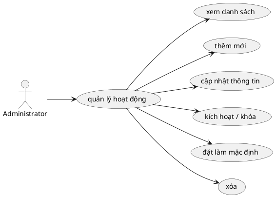

# Use Case: Quản lý Hoạt động thời gian (Activities)

Cấu hình các loại hoạt động để ghi nhận thời gian (Development, Design, Meeting...).

```plantuml
@startuml
left to right direction
actor "Administrator" as Admin

usecase "quản lý hoạt động" as UC_ManageActivity

' Các use case con
usecase "xem danh sách" as UC01
usecase "thêm mới" as UC02
usecase "cập nhật thông tin" as UC03
usecase "kích hoạt / khóa" as UC04
usecase "đặt làm mặc định" as UC05
usecase "xóa" as UC06

Admin --> UC_ManageActivity

UC_ManageActivity --> UC01
UC_ManageActivity --> UC02
UC_ManageActivity --> UC03
UC_ManageActivity --> UC04
UC_ManageActivity --> UC05
UC_ManageActivity --> UC06

@enduml
```
