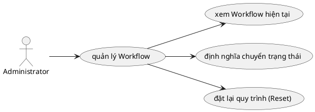

# Use Case: Quản lý Quy trình (Workflow)

Thiết lập luồng trạng thái công việc.

## Đặc tả Use Case: Quản lý Quy trình (UC-008)

| Mục | Nội dung |
| :--- | :--- |
| **Tên Use Case** | Quản lý Quy trình (Workflow Management) |
| **Mô tả** | Cho phép Administrator định nghĩa các quy tắc chuyển đổi trạng thái (Transitions) của công việc, dựa trên sự kết hợp giữa **Vai trò (Role)** của người thực hiện và **Loại công việc (Tracker)** tương ứng. |
| **Tác nhân chính** | Administrator (Quản trị viên) |
| **Tác nhân phụ** | Hệ thống (Database) |
| **Tiền điều kiện** | - Đã đăng nhập tài khoản Administrator. - Các danh mục `Role`, `Tracker` và `Status` đã được định nghĩa sẵn trong hệ thống. |
| **Đảm bảo tối thiểu** | - Không làm mất dữ liệu workflow hiện tại nếu người dùng hủy hoặc chưa bấm lưu. |
| **Đảm bảo thành công** | - Các quy tắc chuyển đổi trạng thái (cho từng cặp Tracker-Role) mới được cập nhật vào bảng `WorkflowTransition` trong CSDL. - Người dùng bị giới hạn ngay lập tức bởi các quy tắc mới khi thao tác cập nhật trạng thái công việc. |

### Chuỗi sự kiện chính (Main Flow)

**Ngữ cảnh:** Admin truy cập trang Administration -> Workflow.

#### A. Xem và Lọc ma trận Workflow
1.  **Administrator** truy cập trang cấu hình Workflow (`/settings/workflow`).
2.  **Hệ thống** hiển thị bộ lọc bắt buộc ở đầu trang:
    *   Dropdown chọn **Loại công việc (Tracker)**: Mặc định chọn tracker đầu tiên.
    *   Dropdown chọn **Vai trò (Role)**: Mặc định chọn "Tất cả Vai trò" (All Roles `roleId = null`).
3.  **Administrator** thay đổi lựa chọn Role hoặc Tracker.
4.  **Hệ thống (Frontend)** tự động lọc lại danh sách transitions hiện tại trên RAM và render **Ma trận chuyển đổi (Matrix)** trạng thái tương ứng ngay lập tức (không cần truy vấn CSDL):
    *   **Hàng ngang (Rows):** Danh sách "Trạng thái hiện tại" (From).
    *   **Cột dọc (Columns):** Danh sách "Trạng thái muốn chuyển đến" (To).
    *   **Giao điểm (Cells):** Các ô giao điểm được click có màu Xanh (thể hiện "Được phép chuyển") hoặc Trắng (không được phép).

#### B. Cấu hình chuyển đổi trạng thái (Define Transitions)
5.  **Administrator** thực hiện click vào các ô giao điểm trên ma trận để chốt (allow) hoặc chặn (deny) quá trình chuyển đổi.
    *   *Ví dụ:* Click vào ô giao diện biến thành màu Xanh: Cho phép chuyển từ New sang In Progress.
6.  **Hệ thống** lưu trữ cấu trúc Map này vào State tạm thời. Cờ thay đổi chưa được lưu vào Backend.
7.  **Administrator** nhấn nút **"Lưu thay đổi"**.
8.  **Hệ thống (API POST /api/workflow)**:
    *   Xóa toàn bộ các transition cũ của cặp `Tracker` - `Role` hiển thị tương đối (`roleId` có thể là `null` nếu áp dụng tất cả).
    *   Bulk Insert (Thêm mới) hàng loạt các transition mới từ thông tin ma trận.
9.  **Hệ thống** hiển thị thông báo "Đã lưu quy trình thành công".

#### C. Đặt lại toàn bộ Quy trình (Reset)
10. **Administrator** nhấn vào nút **"Đặt lại"** (Reset).
11. **Hệ thống** hiển thị cảnh báo từ confirm hook: "Bạn có chắc muốn đặt lại về trạng thái cho phép tất cả các chuyển đổi? Các thay đổi chưa lưu sẽ không bị mất cho đến khi bạn nhấn Lưu."
12. **Administrator** chọn "Đặt lại".
13. **Hệ thống** vẽ lại ma trận Front-end thành tất cả ô màu xanh (lấp đầy toàn bộ các cho phép chuyển đổi). Người dùng phải nhấn "Lưu thay đổi" để áp dụng lên Database.

### Luồng thay thế (Alternate Flows)

*(Không có luồng thay thế phức tạp nào khác trong phiên bản hiện tại)*

### Luồng ngoại lệ (Exception Flows)

**E1. Không có dữ liệu cấu hình**
*   Nếu hệ thống chưa có Status nào, ma trận sẽ trống rỗng. Hệ thống hiển thị thông báo: "Please define Statuses first".

**E2. Lỗi lưu dữ liệu**
*   Tại bước 9, nếu có lỗi kết nối database, API trả về lỗi 500. Frontend hiển thị thông báo "Failed to save workflow". Dữ liệu trên màn hình giữ nguyên để Admin thử lại.

### Quy tắc nghiệp vụ (Business Rules)
*   Quy tắc Workflow là **cụ thể cho từng cặp Role và Tracker**. Nếu một user có Role "Manager", họ sẽ tuân theo workflow của Manager. Nếu là "Developer", họ tuân theo workflow của Developer.
*   Nếu trong ma trận không có ô nào được chọn cho một dòng trạng thái (ví dụ: dòng "Closed" không có ô nào được check), nghĩa là khi công việc đạt đến trạng thái đó, nó sẽ không thể chuyển đi đâu được nữa (Trạng thái kết thúc).
