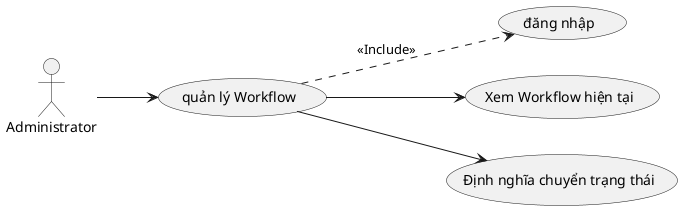

# Use Case: Quản lý Quy trình (Workflow)

Thiết lập luồng trạng thái công việc.

## Đặc tả Use Case: Quản lý Quy trình (UC-008)

| Mục | Nội dung |
| :--- | :--- |
| **Tên Use Case** | Quản lý Quy trình (Workflow Management) |
| **Mô tả** | Cho phép Administrator định nghĩa các quy tắc chuyển đổi trạng thái (Transitions) của công việc, dựa trên sự kết hợp giữa **Vai trò (Role)** của người thực hiện và **Loại công việc (Tracker)** tương ứng. |
| **Tác nhân chính** | Administrator (Quản trị viên) |
| **Tác nhân phụ** | Hệ thống (Database) |
| **Tiền điều kiện** | - Đã đăng nhập tài khoản Administrator (`is_admin = true`). - Các danh mục `Role`, `Tracker` và `Status` đã được định nghĩa sẵn trong hệ thống. |
| **Đảm bảo tối thiểu** | - Không làm mất dữ liệu workflow hiện tại nếu người dùng hủy thao tác. |
| **Đảm bảo thành công** | - Các quy tắc chuyển đổi trạng thái mới được cập nhật vào bảng `WorkflowTransition` trong CSDL. - Người dùng bị giới hạn ngay lập tức bởi các quy tắc mới khi thao tác cập nhật trạng thái công việc. |

### Chuỗi sự kiện chính (Main Flow)

**Ngữ cảnh:** Admin truy cập trang Administration -> Workflow.

#### A. Xem và Lọc ma trận Workflow
1.  **Administrator** truy cập trang cấu hình Workflow.
2.  **Hệ thống** hiển thị bộ lọc bắt buộc ở đầu trang:
    *   Dropdown chọn **Role** (Vai trò).
    *   Dropdown chọn **Tracker** (Loại công việc).
3.  **Administrator** chọn một Role (ví dụ: `Developer`) và một Tracker (ví dụ: `Bug`).
4.  **Administrator** nhấn nút **"Edit"** (hoặc Load).
5.  **Hệ thống** truy vấn bảng `WorkflowTransition` và hiển thị **Ma trận chuyển đổi (Matrix)**:
    *   **Hàng ngang (Rows):** Danh sách "Trạng thái hiện tại" (Current Status).
    *   **Cột dọc (Columns):** Danh sách "Trạng thái mới được phép chuyển đến" (New Status allowed).
    *   **Giao điểm (Cells):** Checkbox thể hiện quyền chuyển đổi (Checked = Được phép, Unchecked = Bị chặn).

#### B. Cấu hình chuyển đổi trạng thái (Define Transitions)
6.  **Administrator** thực hiện tích chọn (Check) hoặc bỏ chọn (Uncheck) vào các ô trong ma trận để định nghĩa quy trình.
    *   *Ví dụ:* Tích vào ô giao giữa hàng "New" và cột "In Progress" có nghĩa là: Role Developer được phép chuyển Tracker Bug từ trạng thái New sang In Progress.
7.  **Administrator** bỏ chọn các ô không hợp lệ theo quy trình nghiệp vụ (ví dụ: không cho phép Developer chuyển thẳng từ New sang Closed).
8.  **Administrator** nhấn nút **"Save"** (Lưu).
9.  **Hệ thống (Backend API)**:
    *   Xóa toàn bộ các transition cũ của cặp Role-Tracker hiện tại.
    *   Thêm mới các transition tương ứng với các ô Checkbox được chọn.
10. **Hệ thống** hiển thị thông báo "Workflow updated successfully".

### Luồng thay thế (Alternate Flows)

*(Không có luồng thay thế phức tạp nào khác trong phiên bản hiện tại)*

### Luồng ngoại lệ (Exception Flows)

**E1. Không có dữ liệu cấu hình**
*   Nếu hệ thống chưa có Status nào, ma trận sẽ trống rỗng. Hệ thống hiển thị thông báo: "Please define Statuses first".

**E2. Lỗi lưu dữ liệu**
*   Tại bước 9, nếu có lỗi kết nối database, API trả về lỗi 500. Frontend hiển thị thông báo "Failed to save workflow". Dữ liệu trên màn hình giữ nguyên để Admin thử lại.

### Quy tắc nghiệp vụ (Business Rules)
*   Quy tắc Workflow là **cụ thể cho từng cặp Role và Tracker**. Nếu một user có Role "Manager", họ sẽ tuân theo workflow của Manager. Nếu là "Developer", họ tuân theo workflow của Developer.
*   Nếu trong ma trận không có ô nào được chọn cho một dòng trạng thái (ví dụ: dòng "Closed" không có ô nào được check), nghĩa là khi công việc đạt đến trạng thái đó, nó sẽ không thể chuyển đi đâu được nữa (Trạng thái kết thúc).
