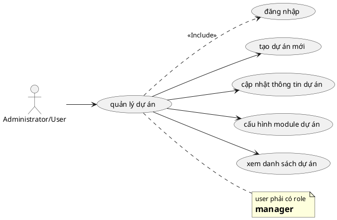

# Use Case: Quản lý Dự án

Các thao tác với Dự án.

## Đặc tả Use Case: Quản lý Dự án (UC-009)

| Mục | Nội dung |
| :--- | :--- |
| **Tên Use Case** | Quản lý Dự án (Project Management) |
| **Mô tả** | Cho phép người dùng tạo lập dự án mới, thiết lập các thuộc tính cơ bản (tên, mô tả, định danh), cấu hình các module chức năng được phép sử dụng (như theo dõi công việc, chấm công, wiki...) và quản lý trạng thái hoạt động của dự án. |
| **Tác nhân chính** | Administrator, Project Manager (Người dùng có quyền tạo/quản lý) |
| **Tác nhân phụ** | Hệ thống (Validations, Storage) |
| **Tiền điều kiện** | - Đã đăng nhập. - Để tạo dự án: Phải là Admin hoặc có quyền `create_project`. - Để sửa dự án: Phải là thành viên dự án với Role có quyền `edit_project` (thường là Manager). |
| **Đảm bảo tối thiểu** | - Không cho phép tạo dự án có `Identifier` (Mã định danh) trùng lặp. - Dự án lưu lại lịch sử người tạo. |
| **Đảm bảo thành công** | - Dự án mới được lưu vào CSDL. - Các module chức năng được kích hoạt theo cấu hình. |

### Chuỗi sự kiện chính (Main Flow)

**Ngữ cảnh:** Trang danh sách dự án (`/projects`).

#### A. Xem danh sách dự án
1.  **Người dùng** truy cập trang `/projects`.
2.  **Hệ thống** hiển thị danh sách các dự án:
    *   Với Admin: Thấy toàn bộ, bao gồm cả dự án đã đóng (Closed).
    *   Với User thường: Chỉ thấy dự án Public và dự án Private mà mình là thành viên.
3.  **Hệ thống** hiển thị trạng thái từng dự án (Active/Closed).

#### B. Tạo dự án mới
4.  **Người dùng** nhấn nút **"New Project"**.
5.  **Hệ thống** hiển thị Form tạo mới:
    *   **Name** (Tên dự án - Bắt buộc).
    *   **Identifier** (Mã định danh - Bắt buộc, dùng trên URL, ví dụ: `my-project-1`).
    *   **Description** (Mô tả - Tùy chọn).
    *   **Public** (Công khai?): Checkbox (Nếu chọn, ai cũng xem được).
    *   **Modules** (Tính năng): Checkbox list (Issue tracking, Time tracking, News, Documents, Wiki...).
6.  **Người dùng** nhập thông tin và chọn các module muốn sử dụng.
7.  **Người dùng** nhấn **"Create"**.
8.  **Hệ thống (Backend)**:
    *   Validate: Name không rỗng, Identifier đúng định dạng (a-z, 0-9, dashboard).
    *   Check Unique: Identifier chưa tồn tại.
    *   Lưu Project vào DB.
    *   Thêm người tạo vào làm thành viên đầu tiên với Role quản trị (Manager).
    *   Bật các Module đã chọn (`enabled_modules`).
9.  **Hệ thống** thông báo thành công và chuyển hướng về trang Overview của dự án vừa tạo.

#### C. Cập nhật thông tin & Cấu hình Module
10. **Project Manager** truy cập vào dự án -> Tab **"Settings"** (Cài đặt).
11. **Hệ thống** load thông tin hiện tại.
12. **Project Manager** thực hiện thay đổi:
    *   Sửa Tên, Mô tả.
    *   Bật/Tắt các Module (Ví dụ: Tắt Wiki nếu không dùng).
13. **Project Manager** nhấn **"Save"**.
14. **Hệ thống** cập nhật bản ghi Project.

#### D. Đóng / Lưu trữ dự án (Close/Archive)
15. **Project Manager** tại trang Settings nhấn nút **"Close Project"** hoặc **"Archive"**.
16. **Hệ thống** hiển thị xác nhận.
17. **Project Manager** xác nhận.
18. **Hệ thống** cập nhật trạng thái `status = closed`.
    *   *Hệ quả:* Dự án chuyển sang chế độ "Chỉ xem" (Read-only), không thể thêm task, log time hay sửa đổi gì nữa.

### Luồng ngoại lệ (Exception Flows)

**E1. Mã định danh trùng lặp**
*   *Tại bước B8:* Nếu Identifier đã được sử dụng bởi một dự án khác, API trả về lỗi. Frontend hiển thị: "Identifier has already been taken".

**E2. Identifier sai định dạng**
*   *Tại bước B8:* Nếu nhập ký tự đặc biệt, viết hoa hoặc khoảng trắng. Frontend/Backend báo lỗi: "Identifier is invalid (only lowercase letters, numbers, dashes)".

**E3. Không có quyền truy cập Settings**
*   Nếu user không phải Manager cố truy cập `/projects/[id]/settings`, Middleware chặn và trả về 403 Forbidden.

### Quy tắc nghiệp vụ (Business Rules)
*   **Module Activation:** Chỉ những Module được bật (`enabled_modules`) mới hiển thị tab tương ứng trên giao diện dự án. Ví dụ: Nếu tắt "Time tracking", tab "Spent time" và nút "Log time" sẽ ẩn đi.
*   **Public vs Private:** Dự án Public cho phép mọi user đã đăng nhập đều xem được (nhưng quyền sửa xóa vẫn cần phải là thành viên). Dự án Private ẩn hoàn toàn với người ngoài.
