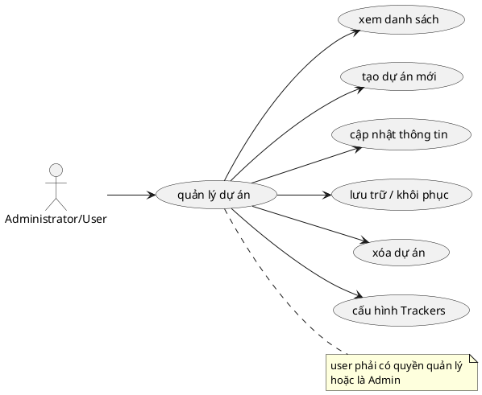

# Use Case: Quản lý Dự án

Các thao tác với Dự án.

## Đặc tả Use Case: Quản lý Dự án (UC-009)

| Mục | Nội dung |
| :--- | :--- |
| **Tên Use Case** | Quản lý Dự án (Project Management) |
| **Mô tả** | Cho phép người dùng tạo lập dự án mới, cập nhật thông tin tên dự án và định danh, lưu trữ/xóa các dự án không hoạt động và cấu hình loại công việc (Trackers) cho dự án. |
| **Tác nhân chính** | Administrator, Người dùng có quyền quản lý dự án (thành viên được gán Role có quyền tương ứng). |
| **Tác nhân phụ** | Hệ thống (Database) |
| **Tiền điều kiện** | - Đã đăng nhập. - Để tạo dự án: Phải có quyền hệ thống `projects.create` (Administrator hoặc được cấp quyền). - Để sửa/xóa/lưu trữ/cấu hình: Phải có quyền tương ứng trong dự án (`projects.edit`, `projects.delete`). |
| **Đảm bảo tối thiểu** | - Không cho phép tạo/cập nhật dự án có mã định danh (`identifier`) bị trùng lặp. |
| **Đảm bảo thành công** | - Dự án mới được lưu vào CSDL, người tạo mặc định được gán cho một Vai trò có quyền quản lý (ưu tiên Role tên "Manager" hoặc Role mặc định). Các thông tin thay đổi được áp dụng ngay lập tức. |

### Chuỗi sự kiện chính (Main Flow)

**Ngữ cảnh:** Trang danh sách dự án (`/projects`).

#### A. Xem danh sách dự án
1.  **Người dùng** truy cập trang `/projects`.
2.  **Hệ thống** hiển thị bộ lọc: Theo từ khóa tìm kiếm (Search) và theo trạng thái (Đang hoạt động, Đã lưu trữ, Tất cả).
3.  **Hệ thống** hiển thị danh sách dạng Card theo dữ liệu đã lọc tương ứng với quyền của người dùng (Chỉ thấy dự án mình tham gia hoặc là Admin thì thấy hết).

#### B. Thêm Dự án mới
4.  **Người dùng** nhấn nút **"Tạo dự án mới"**.
5.  **Hệ thống** mở Modal tạo dự án.
6.  **Người dùng** điền Form:
    *   **Tên dự án** (Bắt buộc): Khi nhập tên, hệ thống tự động sinh `identifier` theo dạng slug.
    *   **Định danh** (Bắt buộc): `identifier` (Định danh URL).
    *   **Mô tả**: Ghi chú tóm tắt (Tùy chọn).
7.  **Người dùng** nhấn **"Tạo dự án"**.
8.  **Hệ thống (Backend API)**:
    *   Kiểm tra tính hợp lệ và duy nhất của `identifier`.
    *   Tạo mới dự án vào DB trong Transaction. Gán User hiện tại làm thành viên dự án và tự động cấp cho User này một Role quản lý (hệ thống sẽ tìm kiếm Role có tên "Manager", "Project Manager" hoặc lấy Role bất kỳ đầu tiên làm mặc định).
    *   Tự động bật tất cả các Trackers mặc định cho dự án.
9.  **Hệ thống** đóng Modal, tối ưu hóa (Optimistic UI) hiển thị card mới lên danh sách và hiện thông báo thành công.

#### C. Sửa thông tin dự án
10. Tại Card dự án, **Người dùng** nhấn vào menu "Ba dấu chấm" -> Chọn **"Chỉnh sửa"**.
11. **Hệ thống** hiển thị cửa sổ Modal "Chỉnh sửa dự án" với dữ liệu Tên, Định danh, Mô tả hiện tại.
12. **Người dùng** chỉnh sửa và nhấn **"Lưu thay đổi"**.
13. **Hệ thống** gửi API `PUT /api/projects/[id]`, cập nhật trong database và refresh danh sách UI.

#### D. Thay đổi Trạng thái Lưu trữ (Archive/Restore)
14. Tại Card dự án, **Người dùng** nhấn vào menu dropdown -> Chọn **"Lưu trữ"** (Hoặc "Khôi phục" nếu dự án đang ẩn).
15. **Hệ thống** tự động thay đổi cờ `isArchived` của Project mà không cần qua Modal xác nhận.
16. *Hệ quả:* Dự án bị lưu trữ sẽ có thẻ màu cam hiển thị "Đã lưu trữ" trên Grid và bị loại bỏ khỏi danh sách Filter "Đang hoạt động".

#### E. Xóa dự án (Delete)
17. Tại Card dự án, **Người dùng** nhấn vào menu dropdown -> Chọn thao tác cuối cùng **"Xóa dự án"** (chữ màu đỏ).
18. **Hệ thống** hiển thị Alert cảnh báo: "Tất cả tasks, comments và dữ liệu liên quan sẽ bị xóa vĩnh viễn!".
19. **Người dùng** nhấn "Xóa ngay".
20. **Hệ thống** gửi API `DELETE /api/projects/[id]`. Toàn bộ dữ liệu của dự án sẽ bị gỡ bỏ theo logic Cascade bằng Transaction và ghi Audit logs. Dự án dọn sạch khỏi Frontend.

#### F. Cấu hình Trackers (Loại công việc)
21. Tại Card dự án, **Người dùng** nhấn vào menu dropdown -> Chọn **"Cài đặt"**.
22. **Hệ thống** điều hướng sang trang Cài đặt dự án (`/projects/[id]/settings`).
23. **Hệ thống** hiển thị danh sách tất cả các Trackers có trong hệ thống dạng Checkbox:
    * Nếu dự án chưa được cấu hình các Tracker cụ thể (chưa lưu lần nào/mảng rỗng), hệ thống tự động đánh dấu Tất cả Trackers đều khả dụng (được Check xanh toàn bộ).
24. **Người dùng** tích chọn hoặc bỏ chọn (Check/Uncheck) các loại công việc muốn áp dụng riêng cho Project của mình.
25. **Người dùng** nhấn **"Lưu thay đổi"**.
26. **Hệ thống (Backend API)** lưu danh sách ID các Tracker đã chọn xuống Database.
27. **Hệ thống** hiển thị nhãn "Đã lưu" (màu xanh lá) cạnh nút lưu và thông báo dạng Toast "Đã lưu cấu hình trackers".

### Luồng ngoại lệ (Exception Flows)

**E1. Mã định danh trùng lặp**
*   *Tại bước B8 hoặc C13:* Nếu Identifier đã được sử dụng bởi một dự án khác, API trả về lỗi code 400. Frontend hiển thị thông báo ngay trên Modal: "Định danh dự án đã tồn tại". Không cho phép lưu cho đến khi đổi giá trị hợp lệ.

**E2. Không có cấu hình Role**
*   *Tại bước B8:* Nếu hệ thống WorkSphere chưa từng tạo Role nào dưới database, API sẽ không thể gán User làm quản lý cho dự án. Quá trình tạo dự án bị hủy (rollback transaction) và trả lỗi 500 yêu cầu Admin cấu hình Role trước. 

**E3. Chế độ truy cập**
*   *Về tính bảo mật:* Không tồn tại dự án "Public" (Cho phép toàn thế giới xem chung) trong hệ thống như hệ thống cũ. Thay vào đó, API Backend kiểm tra policy người dùng: user là Administrator hoặc user có thẻ Project Member trong dự án liên quan thì dự án mới được hiện ra. Do đó tránh được các lỗi phơi bày dữ liệu ra ngoài.
