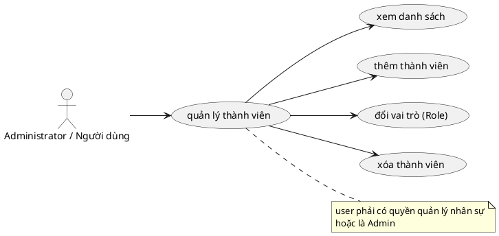

# Use Case: Quản lý Thành viên

Thao tác nhân sự trong dự án.

## Đặc tả Use Case: Quản lý Thành viên (UC-010)

| Mục | Nội dung |
| :--- | :--- |
| **Tên Use Case** | Quản lý Thành viên (Project Member Management) |
| **Mô tả** | Cho phép người quản lý dự án (Project Manager) thêm người dùng vào dự án và phân quyền cho họ thông qua việc gán một hoặc nhiều Vai trò (Roles). |
| **Tác nhân chính** | Administrator, Người dùng có quyền quản trị thành viên dự án. |
| **Tác nhân phụ** | Hệ thống (Database) |
| **Tiền điều kiện** | - Đã đăng nhập. - Đang truy cập trang Cài đặt (Settings) của một dự án. - Người dùng có quyền Manage Members trên dự án hiện tại. |
| **Đảm bảo tối thiểu** | - Không thể thêm một người dùng đã là thành viên của dự án (hệ thống tự lọc bỏ). - Không được phép gỡ bỏ người dùng tạo ra dự án. |
| **Đảm bảo thành công** | - Quan hệ giữa User và Project được thiết lập/cập nhật. - Quyền hạn tương ứng với Role mới được áp dụng ngay lập tức cho thành viên đó. |

### Chuỗi sự kiện chính (Main Flow)

**Ngữ cảnh:** Tab "Members" trong trang Settings của dự án (`/projects/[id]/settings/members`).

#### A. Xem danh sách thành viên hiện tại
1.  **Người dùng có quyền (Manager)** truy cập tab Members.
2.  **Hệ thống** hiển thị bảng danh sách thành viên gồm: Avatar, Tên User, Email, Dropdown danh sách các Role hiện tại cài đặt cho User đó và Nút Delete (Thùng rác).
3.  Cạnh Tên User, nếu là Người tạo dự án sẽ có **Icon Vương miện** (Crown).

#### B. Thêm thành viên mới (Add Member)
4.  **Người dùng** nhấn nút **"Thêm thành viên"** góc trên bên phải.
5.  **Hệ thống** hiển thị Modal "Thêm thành viên".
6.  **Người dùng** thực hiện chọn:
    *   **Vai trò (Role):** Chọn 1 Role duy nhất từ dropdown (Role này sẽ áp dụng cho tất cả những người được chọn bên dưới).
    *   **Người dùng:** Tìm qua thanh Search theo tên hoặc Email. Hệ thống hiển thị list gồm các user khả dụng chưa nằm trong dự án.
7.  **Người dùng** tích chọn (Multiple Checkbox) vào những User muốn gán vào Project.
8.  **Người dùng** nhấn **"Thêm X thành viên"**.
9.  **Hệ thống (API POST /members)**:
    *   Tạo bản ghi liên kết `ProjectMember` cho tất cả User mong muốn và gán chung một `roleId`.
    *   Sử dụng UI Optimistic Update để hiển thị list luôn mà không chờ fetch.
10. **Hệ thống** gửi notification ngầm báo cho những người đó biết họ được add vào (Audit logs).

#### C. Cập nhật Vai trò (Role)
11. Ngay trên dòng Tên thành viên ở danh sách (Không cần ấn nút Edit), **Người dùng** bấm vào Dropdown Role.
12. **Người quản lý** chọn Vai trò mới khác Vai trò hiện tại.
13. **Hệ thống (API PUT /members/[id])** tự động cập nhật Vai trò mà không cần ấn lưu thao tác lại.
14. Hệ thống hiện thông báo "Đã cập nhật vai trò". Trạng thái được đồng bộ dưới local React State.

#### D. Xóa thành viên (Remove Member)
15. **Người dùng** nhấn icon **"Thùng rác" (Delete)** ở cuối hàng tên người muốn xoá.
16. **Hệ thống** gọi hook hộp thoại xác nhận (Confirm modal).
17. **Người dùng** bấm "Xóa khỏi dự án" (Màu đỏ).
18. **Hệ thống (API DELETE /members/[id])**:
    *   Kiểm tra Validations chống xoá bậy.
    *   Xóa bản ghi `ProjectMember`.
19. **Hệ thống** báo "Đã xóa thành viên" và bốc hàng người đó ra khỏi List.

### Luồng ngoại lệ (Exception Flows)

**E1. Thao tác trên Founder (Người tạo)**
*   *Tại bước C11 và D15:* Nếu cố tình đổi Role hoặc Xóa thành viên có ID trùng với `project.creatorId` (Có icon Vương miện), Frontend sẽ vô hiệu hoá (Disable/Hide) các nút hành động đối với người quản lý dự án thông thường. Nếu cố tình vượt rào, API backend cũng chặn cứng bằng việc trả về 400: "Không thể xóa người tạo dự án khỏi danh sách thành viên". 
*   *Ngoại lệ:* Admin hệ thống (System Administrator) có thẩm quyền tối cao, được phép điều chỉnh Role hoặc xóa bỏ Founder khỏi dự án.

**E2. Xóa thành viên đang cầm việc (Assigned Tasks)**
*   *Tại bước D18:* Khi người dùng gỡ một người khỏi dự án, API Backend gọi lệnh Count task của user này. Nếu lớn hơn 0, tiến trình xóa bị ngắt, API trả mã lỗi 400: "Không thể xóa thành viên đang được gán X công việc. Vui lòng reassign trước".

**E3. Administrator lạm quyền (Bảo vệ Server Admin)**
*   *Tại bước B9, C13, D18:* Một người dùng (Role không phải System Admin nhưng có quyền trong Dự án) không thể can thiệp thêm/sửa/xoá các User đang là **Server Administrator** vào dự án của mình (API sẽ phản hồi code 403: "Không thể thêm / gỡ bỏ / cập nhật nhân sự Quản trị viên"). Điều này chống phân quyền lạm dụng từ cấp dưới lên cấp trên.

### Quy tắc nghiệp vụ (Business Rules)
*   Mỗi một **Người dùng** trong 1 Dự Án chỉ nắm giữ đúng **1 Vai trò (Role)** (Khác quy tắc Multiple Role cũ).
*   Administrator luôn có quyền thay đổi thông tin dự án kể cả khi ẩn danh hoặc chỉ thao tác ngoài Grid. Mọi thay đổi đều lưu Log Cảnh báo ở API.
