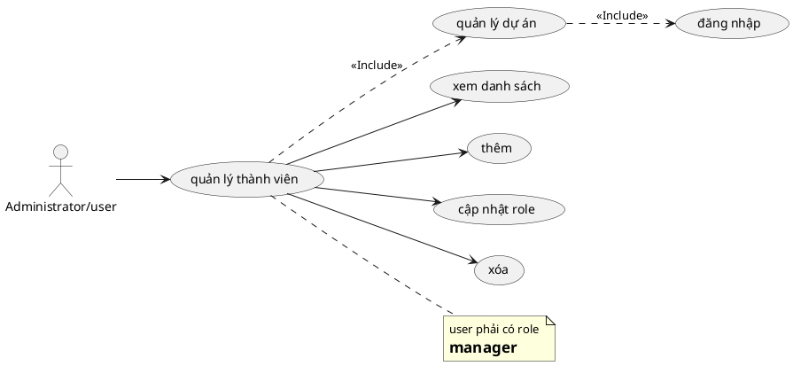

# Use Case: Quản lý Thành viên

Thao tác nhân sự trong dự án.

## Đặc tả Use Case: Quản lý Thành viên (UC-010)

| Mục | Nội dung |
| :--- | :--- |
| **Tên Use Case** | Quản lý Thành viên (Project Member Management) |
| **Mô tả** | Cho phép người quản lý dự án (Project Manager) thêm người dùng vào dự án và phân quyền cho họ thông qua việc gán một hoặc nhiều Vai trò (Roles). |
| **Tác nhân chính** | Project Manager (Thành viên có quyền quản lý nhân sự) |
| **Tác nhân phụ** | Hệ thống (Database) |
| **Tiền điều kiện** | - Đã đăng nhập. - Đang truy cập trang Cài đặt (Settings) của một dự án. - Người dùng có quyền `manage_members` trong dự án hiện tại. |
| **Đảm bảo tối thiểu** | - Không thể thêm một người dùng đã là thành viên của dự án. - Một thành viên phải có ít nhất một Role (tùy logic validate). |
| **Đảm bảo thành công** | - Quan hệ giữa User và Project được thiết lập/cập nhật. - Quyền hạn tương ứng với Role mới được áp dụng ngay lập tức cho thành viên đó. |

### Chuỗi sự kiện chính (Main Flow)

**Ngữ cảnh:** Tab "Members" trong trang Settings của dự án (`/projects/[id]/settings/members`).

#### A. Xem danh sách thành viên hiện tại
1.  **Project Manager** truy cập tab Members.
2.  **Hệ thống** hiển thị bảng danh sách thành viên gồm: Avatar, Tên User, Các Role hiện tại, Ngày tham gia, Nút Edit/Delete.

#### B. Thêm thành viên mới (Add Member)
3.  **Project Manager** nhấn nút **"New Member"**.
4.  **Hệ thống** hiển thị ô tìm kiếm "Search for a user".
5.  **Project Manager** nhập tên hoặc email.
6.  **Hệ thống** tìm trong bảng User toàn cục và hiển thị danh sách gợi ý (đã loại bỏ những người đang là thành viên dự án).
7.  **Project Manager** chọn một (hoặc nhiều) User từ danh sách gợi ý.
8.  **Project Manager** tích chọn các **Role** muốn gán (Ví dụ: Developer, Reporter).
    *   *Lưu ý: Có thể chọn nhiều Role cùng lúc.*
9.  **Project Manager** nhấn **"Add"**.
10. **Hệ thống (API POST /members)**:
    *   Tạo bản ghi liên kết `Member` cho từng User được chọn.
    *   Lưu danh sách `member_roles` tương ứng.
11. **Hệ thống** làm mới danh sách hiển thị thành viên vừa thêm.

#### C. Cập nhật Role (Edit Roles)
12. **Project Manager** nhấn nút **"Edit"** trên dòng của một thành viên.
13. **Hệ thống** hiển thị danh sách Checkbox các Role, với các Role hiện tại đang được tích.
14. **Project Manager** thay đổi lựa chọn (tích thêm hoặc bỏ bớt Role).
15. **Project Manager** nhấn **"Save"**.
16. **Hệ thống (API PATCH /members/[id])**:
    *   Xóa các Role cũ không còn được chọn.
    *   Thêm các Role mới được chọn.
17. **Hệ thống** thông báo thành công.

#### D. Xóa thành viên (Remove Member)
18. **Project Manager** nhấn nút **"Delete"** (icon thùng rác) cạnh tên thành viên.
19. **Hệ thống** hiển thị Confirm Dialog.
20. **Project Manager** xác nhận.
21. **Hệ thống (API DELETE /members/[id])**:
    *   Xóa bản ghi `Member`.
    *   *Hệ quả:* User đó không còn quyền truy cập vào các tài nguyên nội bộ của dự án này nữa.
22. **Hệ thống** cập nhật lại danh sách.

### Luồng ngoại lệ (Exception Flows)

**E1. Không tìm thấy User**
*   *Tại bước B6:* Nếu từ khóa không khớp với User nào trong hệ thống, dropdown hiển thị "No users found".

**E2. User đã tồn tại (Race condition)**
*   Nếu 2 Manager cùng thêm 1 người vào 1 thời điểm. Người thứ 2 nhấn Add sẽ bị Backend chặn lại do ràng buộc Unique (ProjectID + UserID). Hệ thống báo lỗi "User is already a member".

### Quy tắc nghiệp vụ (Business Rules)
*   User phải có tài khoản hệ thống (System User) trước (được tạo bởi Admin ở UC-002) thì mới có thể được tìm thấy và thêm vào Dự án ở UC này.
*   Quyền hạn thực tế của thành viên là **tập hợp (Union)** của tất cả các quyền (Permissions) thuộc về các Role mà họ đang nắm giữ trong dự án.
