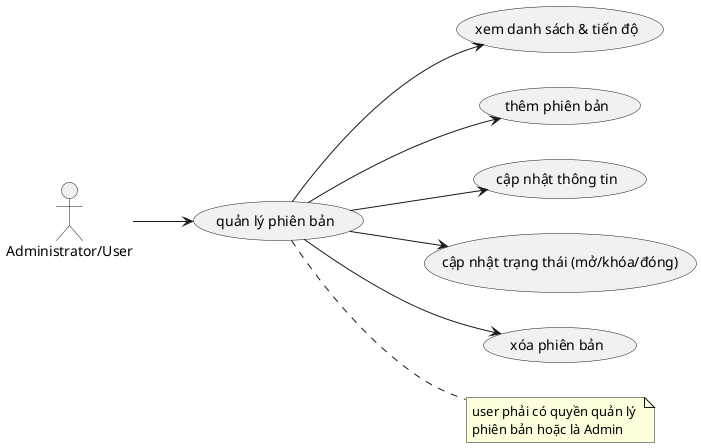

# Use Case: Quản lý Phiên bản (Version/Roadmap)

Thiết lập, theo dõi và quản lý các Version (Phiên bản phát hành) của dự án.

### Quy tắc nghiệp vụ (Business Rules)
*   Tiến độ (Progress) của một Phiên bản hoàn toàn thuộc dạng Logic "Đọc động" (Computed Reading), nó không lưu % cứng dưới db mà được API tính toán trực tiếp vào thời điểm Load data: `Progress = ClosedTasks / TotalTasks`
*   Xóa Version là kiểu hành vi **Unlink (Gỡ bỏ liên kết)**, các Tasks trực thuộc nó sẽ không bị xóa Cascade theo. Mất Version thì task bị trạng thái trở thành tác vụ tự do (Bảo vệ tính toàn vẹn).
