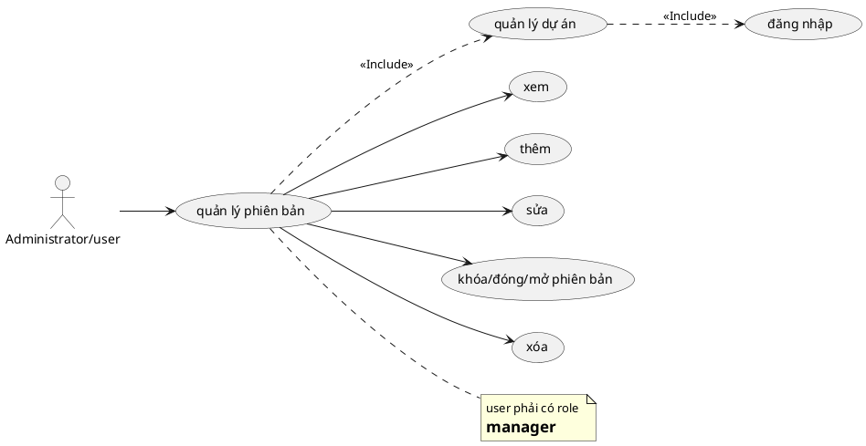

# Use Case: Quản lý Phiên bản

Quản lý lộ trình (Roadmap).

```plantuml
@startuml
left to right direction
actor "Administrator/user" as User

usecase "đăng nhập" as UC_Login
usecase "quản lý dự án" as UC_ManageProject
usecase "quản lý phiên bản" as UC_ManageVersion

' Các use case con
usecase "xem" as UC01
usecase "thêm" as UC02
usecase "sửa" as UC03
usecase "khóa/đóng/mở phiên bản" as UC04
usecase "xóa" as UC05

' Note
note "user phải có role \n= manager" as N1

User --> UC_ManageVersion
UC_ManageVersion .. N1

UC_ManageVersion --> UC01
UC_ManageVersion --> UC02
UC_ManageVersion --> UC03
UC_ManageVersion --> UC04
UC_ManageVersion --> UC05

' Includes
UC_ManageVersion ..> UC_ManageProject : <<Include>>
UC_ManageProject ..> UC_Login : <<Include>>

@enduml
```
