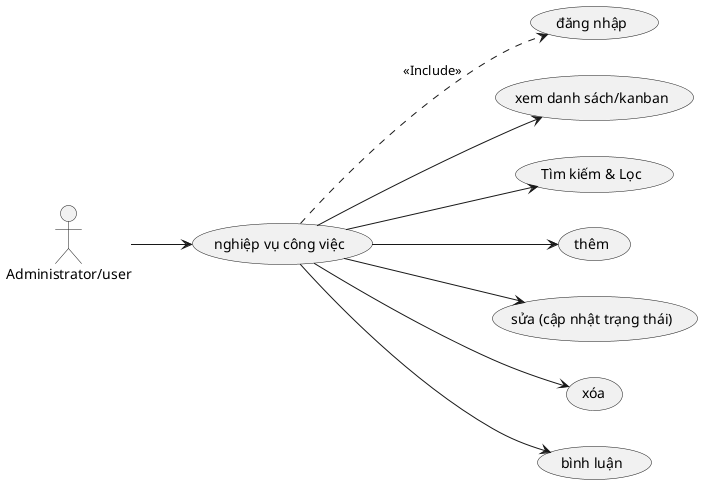

# Use Case: Quản lý & Cộng tác Công việc

Các nghiệp vụ chính liên quan đến xử lý công việc và cộng tác.

## Đặc tả Use Case: Quản lý & Cộng tác Công việc (UC-012)

| Mục | Nội dung |
| :--- | :--- |
| **Tên Use Case** | Quản lý & Cộng tác Công việc (Task Management & Collaboration) |
| **Mô tả** | Cung cấp toàn bộ các chức năng để quản lý vòng đời công việc trong dự án: Tạo mới, cập nhật tiến độ, kéo thả Kanban, phân cấp cha-con (Subtasks) và trao đổi thông tin. |
| **Tác nhân chính** | Administrator, User (Thành viên dự án) |
| **Tác nhân phụ** | Hệ thống (Tính toán Roll-up, Kiểm tra Workflow) |
| **Tiền điều kiện** | - Người dùng đã đăng nhập. - Người dùng có quyền truy cập vào dự án chứa task. |
| **Đảm bảo tối thiểu** | - Không cho phép tạo Subtask quá 5 cấp độ sâu (để tránh lỗi đệ quy). - Không cho phép sửa đổi dữ liệu nếu phiên bản (lockVersion) đã cũ. |
| **Đảm bảo thành công** | - Trạng thái task được cập nhật đúng quy trình Workflow. - Các thuộc tính của Task cha (tiến độ, ngày tháng) được tự động tính toán lại dựa trên các Task con (Roll-up). |

### Chuỗi sự kiện chính (Main Flow)

**Ngữ cảnh:** Người dùng truy cập vào module Công việc của dự án.

#### A. Xem và Thao tác (List & Kanban View)
1.  **Người dùng** chọn chế độ xem: **Danh sách (List)** hoặc **Bảng (Kanban)**.
2.  **Hệ thống** hiển thị dữ liệu:
    *   *List View:* Bảng phân cấp (Hierarchical), hiển thị task cha và các task con thụt dòng.
    *   *Kanban View:* Các cột tương ứng với Trạng thái (Status), các thẻ task (Card) nằm trong cột.
3.  **Người dùng** thực hiện lọc dữ liệu (Filter) theo Assignee, Tracker, Status,...

#### B. Thêm Công việc (Create Task)
4.  **Người dùng** nhấn **"New Task"**.
5.  **Hệ thống** hiển thị Form tạo mới.
6.  **Người dùng** nhập các thông tin (Tiêu đề, Tracker, Status, Priority, Assignee, Parent ID...).
7.  **Người dùng** nhấn **"Create"**.
8.  **Hệ thống (Backend)** validate và lưu vào DB.
    *   Nếu có Parent ID: Tính toán `path` và `level` (độ sâu) cho task mới.

#### C. Cập nhật Trạng thái trên Kanban (Drag & Drop Workflow)
9.  **Người dùng** (tại giao diện Kanban) nhấn giữ chuột vào một thẻ Task và kéo sang cột Trạng thái khác (Ví dụ: Kéo từ New -> In Progress).
10. **Người dùng** thả chuột.
11. **Hệ thống (Client)** gọi API cập nhật trạng thái (`PUT /api/tasks/[id]`).
12. **Hệ thống (Backend)** kiểm tra Workflow:
    *   Nếu Role của User cho phép chuyển từ cột cũ sang cột mới -> Cập nhật thành công.
    *   Nếu không cho phép -> Trả về lỗi, thẻ Task bật ngược trở lại cột cũ (Revert UI).

#### D. Cập nhật chi tiết & Roll-up Logic
13. **Người dùng** vào chi tiết task, cập nhật **% Hoàn thành (Done Ratio)** hoặc **Estimated Hours** của một Sub-task.
14. **Hệ thống** lưu Sub-task.
15. **Hệ thống (Backend Service)** tự động kích hoạt logic **Roll-up**:
    *   Tìm Task cha của task hiện tại.
    *   Tính lại % hoàn thành và tổng giờ ước lượng của Task cha bằng cách cộng dồn/trung bình cộng từ các con.
    *   Tiếp tục đệ quy lên Task ông/bà (nếu có).

#### E. Xóa Công việc
16. **Người dùng** nhấn nút **"Delete"**.
17. **Hệ thống** kiểm tra:
    *   Nếu task có con (Subtasks): Hệ thống sẽ chuyển các task con đó về cấp Root (Parent = NULL) trước khi xóa task cha, để tránh mất dữ liệu con.
18. **Hệ thống** xóa task và các dữ liệu liên quan (Comment, Watcher, Attachment).

### Luồng ngoại lệ (Exception Flows)

**E1. Xung đột dữ liệu (Optimistic Locking)**
*   *Khi cập nhật:* Backend kiểm tra trường `lockVersion`. Nếu version trong DB lớn hơn version gửi lên (nghĩa là có người khác vừa sửa xong), hệ thống từ chối cập nhật và báo lỗi: "Dữ liệu đã bị thay đổi bởi người khác. Vui lòng tải lại trang."

**E2. Vượt quá độ sâu**
*   Nếu người dùng cố gắng gán task cha sao cho độ sâu (Level) > 5. Backend báo lỗi: "Vượt quá độ sâu tối đa của công việc con".

**E3. Circular Dependency**
*   Người dùng gán Task A là con của Task B, trong khi Task B đang là con của Task A. Hệ thống phát hiện vòng lặp và báo lỗi.

### Quy tắc nghiệp vụ
*   **Workflow:** Logic chuyển cột Kanban tuân thủ chặt chẽ cấu hình trong bảng `WorkflowTransition`.
*   **Default Done Ratio:** Khi chuyển trạng thái sang "Closed" (hoặc trạng thái có `isClosed=true`), hệ thống tự động set `% Done` lên 100%. Nếu mở lại (Open), set về 0% hoặc giá trị mặc định.
