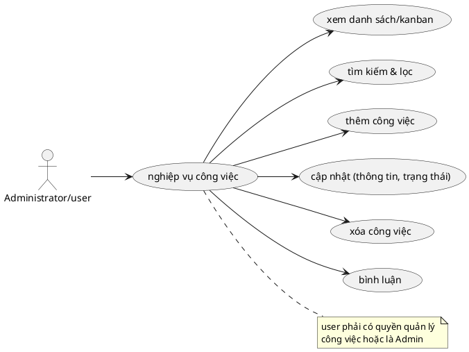

# Use Case: Quản lý & Cộng tác Công việc

Các nghiệp vụ chính liên quan đến xử lý công việc và cộng tác.

## Đặc tả Use Case: Quản lý & Cộng tác Công việc (UC-012)

| Mục | Nội dung |
| :--- | :--- |
| **Tên Use Case** | Quản lý & Cộng tác Công việc (Task Management & Collaboration) |
| **Mô tả** | Cung cấp toàn bộ các chức năng để quản lý vòng đời công việc trong dự án: Tạo mới, cập nhật tiến độ, kéo thả Kanban, phân cấp cha-con (Subtasks) và trao đổi thông tin. |
| **Tác nhân chính** | Administrator, User (Thành viên dự án) |
| **Tác nhân phụ** | Hệ thống (Tính toán Roll-up, Kiểm tra Workflow) |
| **Tiền điều kiện** | - Người dùng đã đăng nhập. - Người dùng có quyền truy cập vào dự án chứa task. |
| **Đảm bảo tối thiểu** | - **Giới hạn độ sâu:** Chỉ cho phép 1 cấp độ công việc con (Subtask), không cho phép tạo công việc con của công việc con. - Không cho phép sửa đổi dữ liệu nếu phiên bản (lockVersion) đã cũ. |
| **Đảm bảo thành công** | - Trạng thái task được cập nhật đúng quy trình Workflow. - Các thuộc tính của Task cha (tiến độ, giờ ước lượng, start/due date) được tự động tính toán lại dựa trên các Task con (Bottom-up). |

### Chuỗi sự kiện chính (Main Flow)

**Ngữ cảnh:** Người dùng truy cập vào module Công việc của dự án.

#### A. Xem và Thao tác (List & Kanban View)
1.  **Người dùng** chọn chế độ xem: **Danh sách (List)** hoặc **Bảng (Kanban)**.
2.  **Hệ thống** hiển thị dữ liệu:
    *   *List View:* Bảng phân cấp (Hierarchical), hiển thị task cha và các task con thụt dòng.
    *   *Kanban View:* Các cột tương ứng với Trạng thái (Status), các thẻ task (Card) nằm trong cột.
3.  **Người dùng** thực hiện lọc dữ liệu (Filter) theo Assignee, Tracker, Status,...

#### B. Thêm Công việc (Create Task)
4.  **Người dùng** nhấn **"New Task"**.
5.  **Hệ thống** hiển thị Form tạo mới.
6.  **Người dùng** nhập các thông tin (Tiêu đề, Tracker, Status, Priority, Assignee, Parent ID...).
7.  **Người dùng** nhấn **"Create"**.
8.  **Hệ thống (Backend)** validate và lưu vào DB.
    *   Nếu có Parent ID: Tính toán `path` và `level` (độ sâu) cho task mới.

#### C. Cập nhật & Kiểm SOÁT Quyền (Update Task)
9.  **Người dùng** nhấn cập nhật thông tin (hoặc kéo thả Kanban, đổi trạng thái).
10. **Hệ thống (Backend API)** kiểm tra quyền lực:
    *   Nếu user chỉ được cấp quyền `edit_assigned` (Chỉ cập nhật việc được giao): Hệ thống chỉ cho phép sửa `% Hoàn thành` và `Trạng thái`. Bất cứ trường nào khác sửa đổi sẽ bị API chặn (Lỗi 403).
    *   Nếu user có quyền `edit_all` (Toàn quyền): Cho phép cập nhật tất cả.
11. **Hệ thống** kiểm tra sự phù hợp của luồng công việc (WorkflowTransition).

#### D. Tự động tính toán Công việc cha (Bottom-Up Roll-up)
12. **Người dùng** vào chi tiết task con, cập nhật **% Hoàn thành (Done Ratio)**, **Ngày**, hoặc **Estimated Hours**.
13. **Hệ thống (Backend API)** tự động kích hoạt logic `updateParentTaskAggregates`:
    *   Gom toàn bộ anh em Sub-task của Task con này lại.
    *   Cộng dồn Giờ ước lượng tổng (Sum).
    *   Tính \% Của Task Cha theo trung bình cộng hoặc trung bình theo tỉ trọng khối lượng giờ.
    *   Lấy `min(StartDate)` và `max(DueDate)` của cả bầy con để tự gán lại ngày bắt đầu/kết thúc cho Task Cha.

#### E. Xóa Công việc (An toàn Dữ liệu)
14. **Người dùng** (có quyền xóa) thực hiện lệnh xóa trên một công việc.
15. **Hệ thống (API)** kiểm tra xem công việc bị xóa có chứa các công việc con (Subtasks) hay không.
16. Nếu có, **Hệ thống** thực hiện xóa đồng loạt công việc cha cùng tất cả các công việc con dựa trên quan hệ phân cấp. Việc này đảm bảo dọn dẹp sạch sẽ các tác vụ phụ thuộc khi tác vụ chính không còn cần thiết.

### Luồng ngoại lệ (Exception Flows)

**E1. Vi phạm phân quyền & Chức vụ (RBAC & Policy)**
*   *Lỗi truy cập:* Người dùng bị tước quyền `tasks.create` hoặc không có quyền `edit` sẽ bị API chặn lại ngay lập tức (Lỗi 403).
*   *Lỗi cập nhật vượt cấp:* Nhân viên thụ hưởng (chỉ có quyền `edit_assigned`) nếu cố ý chỉnh sửa nội dung, tiêu đề, ngày tháng thay vì chỉ sửa Trạng thái / Tiến độ, hệ thống sẽ báo lỗi 403: "Bạn chỉ được cập nhật trạng thái và % hoàn thành".
*   *Lỗi lạm quyền giao việc:* Nếu cố ý chỉ định/đổi `Assignee` cho một người khác (không phải mình) nhưng chưa được cấp cờ `canAssignOthers`, API báo lỗi 403: "Bạn không có quyền giao việc cho người khác".

**E2. Dữ liệu đầu vào không hợp lệ (Validation & Integrity)**
*   *Trống người thực hiện:* Đặc thù hệ thống bắt buộc công việc phải có chủ. Khi "Tạo mới" mà không chọn `Assignee`, API báo lỗi 400: "Người thực hiện không được để trống".
*   *Người hoặc Việc ngoài dự án:* Nếu chọn `Assignee` không có trong dự án, hoặc chọn `Parent Task` thuộc dự án khác, API sẽ báo mã lỗi 400 từ chối tạo/cập nhật.
*   *Cấu hình Tracker lệch pha:* Cố tạo công việc bằng loại Tracker không được bật cho dự án hoặc Role không hỗ trợ (Lỗi 400/403).

**E3. Chuyển trạng thái sai quy trình (Workflow Transition)**
*   Khi người dùng kéo thẻ Kanban hoặc đổi status sang một Trạng thái không tồn tại trong cấu hình `WorkflowTransition` của Vai trò đó, API báo lỗi 403: "Không được phép chuyển sang trạng thái này theo quy trình làm việc".

**E4. Vi phạm cấu trúc phân cấp (Hierarchy Constraint)**
*   *Lỗi giới hạn độ sâu:* Hệ thống chỉ cho phép 1 cấp Subtask. Nếu gán `Parent` vào một Subtask khác (Level >= 1), API báo lỗi 400: "Không thể tạo công việc con của công việc con".
*   *Lỗi tự tham chiếu (Vòng lặp):* Nếu chỉ định công việc cha là chính bản thân nó (`parentId === id`), API chặn lỗi 400 để tránh sập hệ thống.

**E5. Xung đột đồng thời (Optimistic Locking)**
*   *Tại bước cập nhật:* API so khớp trường `lockVersion`. Nếu CSDL có version cao hơn dữ liệu Client gửi lên (có người khác vừa "nhanh tay" lưu thành công trước), hệ thống từ chối cập nhật và báo lỗi 409: "Dữ liệu đã bị thay đổi bởi người khác...".

### Quy tắc nghiệp vụ (Business Rules)
*   **Workflow Tracking:** Logic chuyển cột Kanban phải thỏa mãn Role được mapping tại bảng `WorkflowTransition`.
*   **Trạng thái đóng (Done Ratio Default):** Khi một Task không có Task con được chuyển sang trạng thái "Đóng" (Closed), hệ thống tự động ép `% Hoàn Thành = 100%`.
*   **Quyền thay mặt:** Một User nhân viên không được tự tiện tạo task mà Assignee (người gánh vác) là người khác, trừ khi Role của họ có check cờ quyền `canAssignOthers`. (Giam quyền điều phối chỉ dành cho quản trị).
