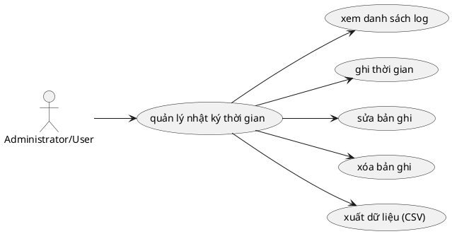

# Use Case: Quản lý Thời gian

Ghi nhận giờ làm việc.

## Đặc tả Use Case: Quản lý Thời gian (UC-013)

| Mục | Nội dung |
| :--- | :--- |
| **Tên Use Case** | Quản lý Thời gian (Time Management / Time Tracking) |
| **Mô tả** | Cho phép thành viên dự án ghi nhận thời gian làm việc (log time) cho các công việc cụ thể, chỉnh sửa hoặc xóa các bản ghi thời gian của mình, và xuất báo cáo chấm công. |
| **Tác nhân chính** | User (Thành viên dự án) |
| **Tác nhân phụ** | Hệ thống (Tính tổng thời gian) |
| **Tiền điều kiện** | - Người dùng đã đăng nhập. - Người dùng là thành viên của dự án. - Công việc (Task) cần log time đang ở trạng thái cho phép ghi nhận (chưa bị khóa/Archive). |
| **Đảm bảo tối thiểu** | - Không cho phép nhập thời gian âm hoặc phi lý (ví dụ: > 24h/ngày). - Không cho phép log time vào dự án mà mình không tham gia. |
| **Đảm bảo thành công** | - Bản ghi thời gian (Time Entry) được lưu vào hệ thống. - Tổng thời gian thực hiện (Spent Time) của công việc được cập nhật tự động. |

### Chuỗi sự kiện chính (Main Flow)

**Ngữ cảnh:** Người dùng đang xem chi tiết một công việc hoặc bảng danh sách log time.

#### A. Ghi thời gian (Log Time)
1.  **Người dùng** nhấn nút "Ghi thời gian" (Log time).
2.  **Hệ thống** hiển thị Form ghi nhận gồm:
    *   Công việc (Tự động điền nếu mở từ trang chi tiết task).
    *   Ngày thực hiện (Mặc định là hôm nay).
    *   Số giờ (Hours).
    *   Hoạt động (Activity: Design, Development,...).
    *   Ghi chú (Comment).
3.  **Người dùng** nhập thông tin và nhấn "Lưu".
4.  **Hệ thống (Frontend)** kiểm tra dữ liệu:
    *   Số giờ phải là số dương lớn hơn 0.
    *   Ngày thực hiện, Hoạt động và Dự án là bắt buộc.
5.  **Hệ thống (Backend)**:
    *   Tiến hành kiểm tra phân quyền bảo mật (`canLogTime`).
    *   Lưu bản ghi thời gian vào cơ sở dữ liệu (Bảng `TimeLog`).
6.  **Hệ thống** hiển thị thông báo thành công và Client tự động tổng hợp lại (Aggregate) tổng số giờ đã làm cho công việc đó ngay trên giao diện.

#### B. Sửa/Xóa Log thời gian
7.  **Người dùng** xem danh sách các bản ghi thời gian ("Spent time" tab).
8.  **Người dùng** chọn biểu tượng "Sửa" hoặc "Xóa" trên một bản ghi do mình tạo.
    *   *Lưu ý: Người dùng thường chỉ được sửa/xóa log của chính mình, trừ khi là Admin/Manager.*
9.  **Hệ thống** thực hiện cập nhật hoặc xóa bản ghi trong CSDL.
10. **Hệ thống** tính toán lại tổng thời gian cho công việc và cập nhật giao diện.

#### C. Xuất dữ liệu (Export CSV)
11. **Người dùng** truy cập trang Báo cáo hoặc Time Logs.
12. **Người dùng** sử dụng bộ lọc (Dự án, Ngày tháng, Thành viên, Hoạt động) để chọn vùng dữ liệu cần xuất.
13. **Người dùng** nhấn nút "Xuất dữ liệu" (Export).
14. **Hệ thống (API: GET `/api/time-logs/export`)** xác thực quyền (`canViewAll` hoặc `canViewOwn`) và tiến hành truy vấn lọc dữ liệu từ CSDL.
15. **Hệ thống** tạo ra file dữ liệu định dạng `.CSV` (đã nhúng BOM để xuất tiếng Việt chuẩn trên Excel) và đẩy về trình duyệt của người dùng để tải xuống tự động.

### Luồng ngoại lệ (Exception Flows)

**E1. Dữ liệu đầu vào không hợp lệ (Validation & Integrity)**
*   *Thông tin bắt buộc bị thiếu:* Nếu một trong các thuộc tính cần thiết (`Ngày thực hiện`, `Hoạt động` hoặc `Dự án`) bị gửi lên rỗng, API lập tức từ chối và trả về lỗi 400 tương ứng.
*   *Khối lượng công việc vi phạm logic:* Nếu `Số giờ (hours)` là số âm hoặc bằng 0, hệ thống chặn lại và báo mã lỗi 400: "Số giờ phải lớn hơn 0".

**E2. Vi phạm phân quyền xử lý Nhật ký thời gian (Authorization & RBAC)**
*   *Lỗi không có quyền ghi:* API tạo mới kiểm tra quyền `timelogs.log_time`. Nếu User không có cờ này, trả về lỗi 403: "Bạn không có quyền ghi nhận thời gian cho dự án này".
*   *Lỗi rò rỉ khi truy cập dữ liệu (Xem/Lọc danh sách):* Nếu User truy xuất danh sách chung mà thiếu cả chốt chặn `view_all` lẫn `view_own`, API từ chối toàn bộ request với lỗi 403: "Không có quyền xem nhật ký thời gian".
*   *Lỗi xâm phạm bản ghi người khác:* Khi thực hiện sửa hoặc xóa bản ghi do đồng nghiệp tạo, nếu User không được cấp đặc quyền can thiệp cấp cao (`edit_all` hoặc `delete_all`), hàm Check Policy sẽ từ chối và báo lỗi 403: "Không có quyền chỉnh sửa/xóa bản ghi thời gian này".

**E3. Bản ghi không còn tồn tại (Not Found)**
*   Nếu cố gắng xem, cập nhật hoặc xóa một nhật ký dựa trên một dãy ID giả hoặc bị người khác xóa đi tước đó, hệ thống văng ra lỗi 404: "Không tìm thấy bản ghi thời gian".

### Ghi chú (Notes)
*   **Roll-up Calculations:** Khi log time vào một Sub-task (công việc con), thời gian này cũng nên được cộng dồn (roll-up) lên Parent Task (công việc cha) để phản ánh tổng thể tiến độ.
