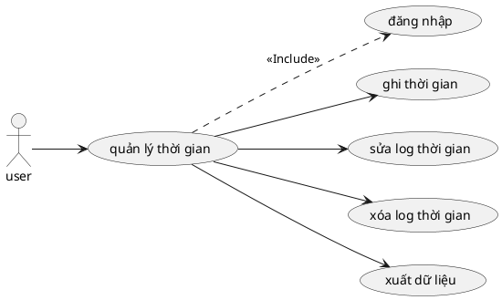

# Use Case: Quản lý Thời gian

Ghi nhận giờ làm việc.

## Đặc tả Use Case: Quản lý Thời gian (UC-013)

| Mục | Nội dung |
| :--- | :--- |
| **Tên Use Case** | Quản lý Thời gian (Time Management / Time Tracking) |
| **Mô tả** | Cho phép thành viên dự án ghi nhận thời gian làm việc (log time) cho các công việc cụ thể, chỉnh sửa hoặc xóa các bản ghi thời gian của mình, và xuất báo cáo chấm công. |
| **Tác nhân chính** | User (Thành viên dự án) |
| **Tác nhân phụ** | Hệ thống (Tính tổng thời gian) |
| **Tiền điều kiện** | - Người dùng đã đăng nhập. - Người dùng là thành viên của dự án. - Công việc (Task) cần log time đang ở trạng thái cho phép ghi nhận (chưa bị khóa/Archive). |
| **Đảm bảo tối thiểu** | - Không cho phép nhập thời gian âm hoặc phi lý (ví dụ: > 24h/ngày). - Không cho phép log time vào dự án mà mình không tham gia. |
| **Đảm bảo thành công** | - Bản ghi thời gian (Time Entry) được lưu vào hệ thống. - Tổng thời gian thực hiện (Spent Time) của công việc được cập nhật tự động. |

### Chuỗi sự kiện chính (Main Flow)

**Ngữ cảnh:** Người dùng đang xem chi tiết một công việc hoặc bảng danh sách log time.

#### A. Ghi thời gian (Log Time)
1.  **Người dùng** nhấn nút "Ghi thời gian" (Log time).
2.  **Hệ thống** hiển thị Form ghi nhận gồm:
    *   Công việc (Tự động điền nếu mở từ trang chi tiết task).
    *   Ngày thực hiện (Mặc định là hôm nay).
    *   Số giờ (Hours).
    *   Hoạt động (Activity: Design, Development,...).
    *   Ghi chú (Comment).
3.  **Người dùng** nhập thông tin và nhấn "Lưu".
4.  **Hệ thống (Frontend)** kiểm tra dữ liệu:
    *   Số giờ phải là số dương.
    *   Hoạt động là bắt buộc.
5.  **Hệ thống (Backend)**:
    *   Lưu bản ghi vào bảng `TimeLog`.
    *   Tính toán lại tổng thời gian đã làm cho công việc đó.
6.  **Hệ thống** hiển thị thông báo thành công và cập nhật hiển thị tổng giờ trên giao diện.

#### B. Sửa/Xóa Log thời gian
7.  **Người dùng** xem danh sách các bản ghi thời gian ("Spent time" tab).
8.  **Người dùng** chọn biểu tượng "Sửa" hoặc "Xóa" trên một bản ghi do mình tạo.
    *   *Lưu ý: Người dùng thường chỉ được sửa/xóa log của chính mình, trừ khi là Admin/Manager.*
9.  **Hệ thống** thực hiện cập nhật hoặc xóa bản ghi trong CSDL.
10. **Hệ thống** tính toán lại tổng thời gian cho công việc và cập nhật giao diện.

#### C. Xuất dữ liệu (Export)
11. **Người dùng** truy cập trang Báo cáo hoặc Time Logs.
12. **Người dùng** sử dụng bộ lọc (Dự án, Ngày tháng, Thành viên) để chọn dữ liệu cần xuất.
13. **Người dùng** nhấn nút "Xuất dữ liệu" (Export CSV/Excel).
14. **Hệ thống** tổng hợp dữ liệu và tạo file tải xuống.
15. **Hệ thống** gửi file về trình duyệt của người dùng.

### Luồng ngoại lệ (Exception Flows)

**E1. Dữ liệu thời gian không hợp lệ**
*   *Rẽ nhánh tại Bước 4:*
    *   **E1.1.** Người dùng nhập số giờ là ký tự chữ hoặc số âm.
    *   **E1.2.** Frontend báo lỗi: "Định dạng thời gian không hợp lệ".

**E2. Không có quyền sửa/xóa**
*   *Rẽ nhánh tại Bước 8:*
    *   **E2.1.** Người dùng cố gắng sửa log time của người khác (thông qua API hoặc thủ thuật).
    *   **E2.2.** Backend kiểm tra quyền sở hữu (`user_id` của log phải trùng với `currentr_user_id`).
    *   **E2.3.** Trả về lỗi 403 Forbidden.

**E3. Dự án đã đóng (Closed)**
*   *Rẽ nhánh tại Bước 5:*
    *   **E3.1.** Backend kiểm tra trạng thái dự án là "Archived" hoặc "Closed".
    *   **E3.2.** Từ chối ghi nhận thêm thời gian.
    *   **E3.3.** Hiển thị thông báo: "Dự án này đã đóng, không thể ghi nhận thời gian."

### Ghi chú (Notes)
*   **Roll-up Calculations:** Khi log time vào một Sub-task (công việc con), thời gian này cũng nên được cộng dồn (roll-up) lên Parent Task (công việc cha) để phản ánh tổng thể tiến độ.
