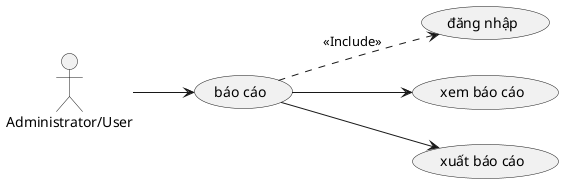

# Use Case: Báo cáo & Thống kê

Theo dõi số liệu và xuất dữ liệu.

## Đặc tả Use Case: Báo cáo & Thống kê (UC-014)

| Mục | Nội dung |
| :--- | :--- |
| **Tên Use Case** | Báo cáo & Thống kê (Reporting & Analytics) |
| **Mô tả** | Cung cấp cái nhìn tổng quan về tiến độ dự án, hiệu suất làm việc của thành viên và thống kê thời gian thông qua các biểu đồ và tính năng xuất dữ liệu. |
| **Tác nhân chính** | Project Manager, Administrator, User |
| **Tiền điều kiện** | - Đã đăng nhập và là thành viên dự án. - Có quyền xem báo cáo (`view_report` hoặc tương đương). |
| **Đảm bảo thành công** | - Số liệu hiển thị chính xác dựa trên dữ liệu thực tế tại thời điểm truy vấn. |

### Chuỗi sự kiện chính (Main Flow)

#### A. Xem Báo cáo Tổng quan (Overview)
1.  **Người dùng** truy cập tab "Overview" của dự án.
2.  **Hệ thống** tính toán và hiển thị các widget:
    *   Tiến độ dự án (Task Open vs Closed).
    *   Phân bố công việc theo Tracker.
    *   Phân bố công việc theo Thành viên.
    *   Tổng thời gian đã log (Spent time) so với Ước lượng (Estimated time).

#### B. Báo cáo Chi tiết & Xuất dữ liệu
3.  **Người dùng** truy cập menu "Báo cáo" (Reports).
4.  **Người dùng** chọn loại báo cáo: "Chi tiết công việc" hoặc "Log thời gian".
5.  **Người dùng** thiết lập bộ lọc (Ngày bắt đầu/kết thúc, Trạng thái, Người thực hiện).
6.  **Hệ thống** hiển thị bảng dữ liệu xem trước (Preview).
7.  **Người dùng** nhấn "Xuất báo cáo" (Export).
8.  **Hệ thống** cung cấp tùy chọn định dạng: PDF hoặc CSV.
9.  **Người dùng** chọn định dạng và xác nhận.
10. **Hệ thống** tạo file và kích hoạt tải xuống trình duyệt.

### Luồng ngoại lệ (Exception Flows)

**E1. Không có dữ liệu**
*   Nếu không có bản ghi nào khớp với bộ lọc, hệ thống hiển thị thông báo "Không tìm thấy dữ liệu" thay vì bảng trống.

**E2. Lỗi tạo PDF**
*   Nếu dữ liệu quá lớn gây lỗi font hoặc layout PDF, hệ thống bắt lỗi và gợi ý người dùng xuất CSV thay thế hoặc thu hẹp phạm vi báo cáo.

### Quy tắc nghiệp vụ
*   **Quyền truy cập dữ liệu:** Người dùng chỉ xem được báo cáo của các dự án mà họ là thành viên.
