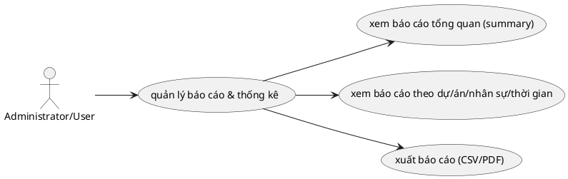

# Use Case: Báo cáo & Thống kê

Theo dõi số liệu và xuất dữ liệu.

## Đặc tả Use Case: Báo cáo & Thống kê (UC-014)

| Mục | Nội dung |
| :--- | :--- |
| **Tên Use Case** | Báo cáo & Thống kê (Reporting & Analytics) |
| **Mô tả** | Cung cấp cái nhìn tổng quan về tiến độ dự án, hiệu suất làm việc của thành viên và thống kê thời gian thông qua các biểu đồ và tính năng xuất dữ liệu. |
| **Tác nhân chính** | Project Manager, Administrator, User |
| **Tiền điều kiện** | - Đã đăng nhập vào hệ thống. - Đảm bảo tài khoản đang trong trạng thái kích hoạt (isActive = true). |
| **Đảm bảo thành công** | - Số liệu hiển thị chính xác dựa trên dữ liệu thực tế tại thời điểm truy vấn. |

### Chuỗi sự kiện chính (Main Flow)

#### A. Xem Báo cáo Tổng quan (Overview)
1.  **Người dùng** truy cập tab "Overview" của dự án.
2.  **Hệ thống** tính toán và hiển thị các widget:
    *   Tiến độ dự án (Task Open vs Closed).
    *   Phân bố công việc theo Tracker.
    *   Phân bố công việc theo Thành viên.
    *   Tổng thời gian đã log (Spent time) so với Ước lượng (Estimated time).

#### B. Xem Báo cáo Chi tiết (Bảng dữ liệu)
3.  **Người dùng** chọn các tab báo cáo chi tiết: "Theo dự án" (by-project), "Nhân sự" (by-user), hoặc "Thời gian" (by-time).
4.  **Người dùng** thiết lập bộ lọc (Ngày bắt đầu/kết thúc, Dự án).
5.  **Hệ thống (API)** kiểm tra chính sách hiển thị (Visibility Scope) dựa trên vai trò của User đối với dự án (VD: có quyền `projects.edit` hay truy cập với tư cách nhân viên).
6.  **Hệ thống** trả về dữ liệu đã được cô lập theo chính sách (ví dụ: nhân viên chỉ thấy dữ liệu `SELF`, Quản lý thấy dữ liệu `PROJECT_MEMBERS`, Admin thấy toàn bộ).

#### C. Xuất dữ liệu báo cáo (Export)
7.  **Người dùng** truy cập trang Xuất dữ liệu (Export) và chọn tab loại dữ liệu: "Công việc" (Tasks) hoặc "Thời gian" (Time Logs).
8.  **Người dùng** thiết lập bộ lọc (Dự án, Người thực hiện, Khoảng thời gian cụ thể hoặc chọn nhanh theo Tuần/Tháng/Quý).
9.  **Người dùng** nhấn trực tiếp nút "Xuất CSV" (Nút màu xanh) hoặc "Xuất PDF" (Nút màu đỏ).
10. **Hệ thống** xử lý tải file tùy theo nút được chọn:
    *   **Nút Xuất CSV (Qua Backend):** Giao diện gọi API `GET /api/reports/export`, Backend xác thực quyền hạn chặn tải chéo đối với user, sau đó nhúng mã BOM UTF-8 và trả file dữ liệu dạng Text thẳng về trình duyệt.
    *   **Nút Xuất PDF (Qua Frontend):** Giao diện gọi API `GET /api/tasks` hoặc `GET /api/time-logs` lấy danh sách các bản ghi thông thường, sau đó dùng thư viện `pdfMake` với font chữ Tiếng Việt nhúng sẵn để tự vẽ bảng biểu PDF layout ngang (Landscape) và lưu thành file trực tiếp trên trình duyệt.
11. **Hệ thống** tự động tải file xuống với tên `<loại>_yyyy-mm-dd.<csv/pdf>`.

### Luồng ngoại lệ (Exception Flows)

**E1. Vi phạm phân quyền xử lý (Authorization & RBAC)**
*   *Giới hạn quyền chuyên sâu:* Nếu User là nhân viên bình thường (không có quyền `projects.edit` hoặc quản trị) và cố tình truy cập xem báo cáo nhân sự, API sẽ chặn lại (Lỗi 403): "Không có quyền truy cập báo cáo nhân sự".
*   *Lỗi xuất dữ liệu chéo (Data Isolation):* Nếu cố tình can thiệp biến `userId` thông qua HTTP Request để tải báo cáo CSV của thành viên khác nhưng Role chỉ giới hạn xem chính mình (Scope = `SELF`), API sẽ báo lỗi 403: "Không có quyền xuất dữ liệu của người khác". Trong một số API, hệ thống tự động khóa biến `userId = user.id` để triệt tiêu lỗ hổng tải chéo dữ liệu.

**E2. Tham số chức năng không hợp lệ (Bad Request)**
*   Nếu User truyền thông số yêu cầu loại báo cáo không hợp lệ, API từ chối xử lý và báo lỗi 400.

**E3. Lỗi tạo PDF do giới hạn bộ nhớ**
*   Vì quy trình xuất PDF chạy `pdfMake` trực tiếp bằng bộ nhớ (RAM) của trình duyệt người dùng, nếu dữ liệu truy vấn từ bộ lọc quá lớn (vài nghìn bản ghi), Tab trình duyệt có thể bị treo hoặc xuất ra file lỗi. Biện pháp là khuyên dùng xuất CSV cho dữ liệu lớn.

### Quy tắc nghiệp vụ
*   **Quyền truy cập dữ liệu:** Người dùng chỉ xem được báo cáo của các dự án mà họ là thành viên.
