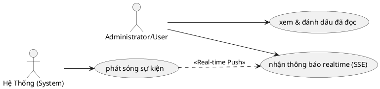

# Use Case: Thông báo (Notifications)

Hệ thống tự động gửi thông báo đến người dùng về các sự kiện quan trọng.

## Đặc tả Use Case: Thông báo (UC-015)

| Mục | Nội dung |
| :--- | :--- |
| **Tên Use Case** | Thông báo (Notifications) |
| **Mô tả** | Hệ thống tự động phát hiện các sự kiện quan trọng và gửi thông báo đến những người dùng liên quan để họ nắm bắt thông tin kịp thời. |
| **Tác nhân chính** | Tác nhân kích hoạt: Hệ thống (System) Tác nhân nhận: User |
| **Tiền điều kiện** | - Các sự kiện nghiệp vụ (Tạo task, Comment, Đổi trạng thái) xảy ra thành công. |
| **Đảm bảo thành công** | - Thông báo xuất hiện trong danh sách của người nhận. - Số lượng thông báo chưa đọc (Badge count) tăng lên. |

### Chuỗi sự kiện chính (Main Flow)

#### A. Phát sóng thông báo và Đẩy Realtime (Server-Sent Events)
1.  **Hệ thống** ghi nhận một sự kiện nghiệp vụ. Hiện tại có **8 loại sự kiện** đang được kích hoạt trong code:
    *   `task_assigned` — Được gán công việc mới.
    *   `task_status_changed` — Trạng thái công việc thay đổi.
    *   `task_updated` — Đặc tính công việc được cập nhật (tiêu đề, mô tả, ưu tiên...).
    *   `task_comment_added` — Có bình luận mới trên công việc.
    *   `task_watcher_added` — Được thêm vào danh sách theo dõi công việc.
    *   `project_created` — Dự án mới được tạo (gửi cho tất cả Admin, trừ người tạo).
    *   `project_member_added` — Được thêm vào dự án.
    *   `project_member_removed` — Bị xóa khỏi dự án.
2.  **Hệ thống** xác định danh sách người nhận. Đối với các sự kiện liên quan đến Task, hàm `notifyTaskWatchers` thực hiện:
    *   Truy vấn danh sách *Watchers* (bảng `Watcher`) của Công việc **hiện tại** VÀ cả Công việc **Cha (Parent Task)** nếu có.
    *   Tự động thêm *Người tạo (Creator)* và *Người được giao (Assignee)* vào tập hợp người nhận.
    *   Loại trừ chính người đang thực hiện hành động (`actorId`) để tránh tự Spam.
    *   Đối với sự kiện dự án (`project_created`), hệ thống gửi cho tất cả tài khoản Administrator đang hoạt động, trừ người tạo.
3.  **Hệ thống** thực thi **tuần tự** 2 bước:
    *   **Bước 1 — Lưu DB:** Gọi `prisma.notification.create` lưu nội dung và Metadata (taskId, projectId, commentId) vào cơ sở dữ liệu.
    *   **Bước 2 — Đẩy SSE:** Sau khi lưu DB thành công, gọi `sseManager.emit` bắn gói tin Real-time tới đường truyền SSE đang mở của trình duyệt Client (nếu user đang Online). Nếu user Offline, bước này được bỏ qua mà không báo lỗi (best-effort).

#### B. Xem và Xử lý thông báo (User Action)
4.  **Trình duyệt** khi vào ứng dụng tự động mở kết nối SSE tới `GET /api/sse` và đồng thời gọi `GET /api/notifications?limit=10` để lấy danh sách thông báo ban đầu.
5.  **Người dùng** thấy biểu tượng chuông trên Header hiển thị Badge đỏ với số đếm chưa đọc (tối đa hiển thị `9+`).
6.  **Người dùng** nhấn vào biểu tượng chuông → Dropdown hiển thị tối đa **10 thông báo** gần nhất (mỗi tin có icon khác nhau tuỳ loại sự kiện).
7.  **Người dùng** tương tác với thông báo theo các cách sau:
    *   **Nhấn vào nội dung tin:** Hệ thống đánh dấu đã đọc (API `PUT /api/notifications`) bằng kỹ thuật **Optimistic UI** (cập nhật giao diện ngay, rollback nếu API lỗi), sau đó điều hướng User tới trang Task hoặc Project tương ứng dựa trên Metadata.
    *   **Nhấn nút Toggle đọc/chưa đọc** (icon thư): Cho phép đánh dấu lại thông báo chưa đọc nếu muốn (`isRead: false`).
    *   **Nhấn "Đánh dấu tất cả đã đọc":** Gọi API `PUT /api/notifications` với tham số `{ markAll: true }`.
    *   **Nhấn "Xem tất cả thông báo":** Chuyển hướng tới trang `/notifications` để xem danh sách đầy đủ.

### Luồng ngoại lệ (Exception Flows)

**E1. Mất kết nối SSE (Exponential Backoff Reconnect)**
*   Khi đường truyền SSE bị lỗi (server restart, mất mạng), Frontend tự động đóng kết nối lỗi và thực hiện **Reconnect với Exponential Backoff**: bắt đầu từ 2 giây, tăng dần mỗi lần gấp 1.5 lần, tối đa 30 giây. Khi kết nối lại thành công, delay được reset về 2 giây.

**E2. SSE bị miss thông báo (Fallback Polling)**
*   Ngoài cơ chế SSE, Client còn chạy **Fallback Polling mỗi 5 phút** gọi `GET /api/notifications` để đồng bộ lại danh sách. Đảm bảo không bỏ sót thông báo khi máy tính vào chế độ Sleep rồi Wake up.

**E3. API đánh dấu đọc thất bại (Optimistic Rollback)**
*   Khi User nhấn đánh dấu đã đọc, giao diện cập nhật ngay lập tức (Optimistic). Nếu API `PUT /api/notifications` trả về lỗi, component tự động gọi lại `fetchNotifications` để rollback trạng thái về đúng thực tế từ Database.

### Ghi chú
*   **Heartbeat (SSE):** Backend gửi mã `: heartbeat\n\n` mỗi 25 giây để giữ kết nối SSE sống qua Load Balancer / Nginx Proxy (Header `X-Accel-Buffering: no`).
*   **Multi-tab:** Mỗi user có thể mở nhiều tab, SSEManager dùng `Map<userId, Set<controller>>` để quản lý và gửi thông báo tới **tất cả tab** đang mở của user đó.
