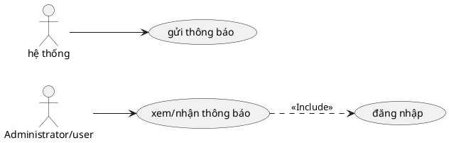

# Use Case: Thông báo (Notifications)

Hệ thống tự động gửi thông báo đến người dùng về các sự kiện quan trọng.

## Đặc tả Use Case: Thông báo (UC-015)

| Mục | Nội dung |
| :--- | :--- |
| **Tên Use Case** | Thông báo (Notifications) |
| **Mô tả** | Hệ thống tự động phát hiện các sự kiện quan trọng và gửi thông báo đến những người dùng liên quan để họ nắm bắt thông tin kịp thời. |
| **Tác nhân chính** | Tác nhân kích hoạt: Hệ thống (System) Tác nhân nhận: User |
| **Tiền điều kiện** | - Các sự kiện nghiệp vụ (Tạo task, Comment, Đổi trạng thái) xảy ra thành công. |
| **Đảm bảo thành công** | - Thông báo xuất hiện trong danh sách của người nhận. - Số lượng thông báo chưa đọc (Badge count) tăng lên. |

### Chuỗi sự kiện chính (Main Flow)

#### A. Gửi thông báo (System Trigger)
1.  **Hệ thống** ghi nhận một sự kiện nghiệp vụ (Ví dụ: User A bình luận vào Task X).
2.  **Hệ thống** xác định danh sách người nhận (Watchers):
    *   Người tạo task.
    *   Người được gán (Assignee).
    *   Những người đã từng bình luận trước đó.
    *   *(Trừ người thực hiện hành động để tránh spam chính mình).*
3.  **Hệ thống** tạo bản ghi `Notification` trong CSDL với nội dung tóm tắt và liên kết (Link) đến đối tượng.

#### B. Xem và Xử lý thông báo (User Action)
4.  **Người dùng** thấy biểu tượng chuông trên Header có chấm đỏ/số đếm.
5.  **Người dùng** nhấn vào biểu tượng chuông.
6.  **Hệ thống** hiển thị danh sách các thông báo mới nhất.
7.  **Người dùng** nhấn vào một thông báo cụ thể.
8.  **Hệ thống**:
    *   Đánh dấu thông báo đó là "Đã đọc" (`readAt = now`).
    *   Chuyển hướng người dùng đến trang chi tiết công việc liên quan.

### Ghi chú
*   **Email Notification:** Ngoài thông báo in-app (trên web), hệ thống thường gửi kèm email notification (nếu được cấu hình SMTP), nhưng trong phạm vi Use Case này ta tập trung vào in-app.
