# Use Case Diagram 0: Tổng quan Hệ thống (System Overview)

> **Hệ thống**: Worksphere - Hệ thống Quản lý Công việc & Dự án  
> **Phiên bản**: 1.0  
> **Ngày cập nhật**: 2026-01-15

---

## 1. Thông tin chung

| Thuộc tính | Giá trị |
|------------|---------|
| **Tên sơ đồ** | UC Diagram - System Overview |
| **Loại** | Overview (Tổng quan) |
| **Mô tả** | Sơ đồ tổng quát thể hiện toàn bộ hệ thống Worksphere với các Actors chính và 23 Subsystems/Packages chức năng |
| **Tổng số Use Cases** | 79 UC |
| **Tổng số Modules** | 23 Modules |

---

## 2. Actors (Tác nhân)

| Actor | Loại | Mô tả |
|-------|------|-------|
| **User** | Primary | Người dùng đã đăng nhập. Quyền được xác định bởi Role trong từng Project. Có thể có các vai trò: Developer, Tester, Manager, etc. |
| **Administrator** | Primary | Quản trị viên hệ thống (`isAdministrator = true`). Bypass tất cả permission checks, có toàn quyền quản lý hệ thống. |

---

## 3. Use Case Diagram (PlantUML)

```plantuml
@startuml
left to right direction
skinparam packageStyle rectangle
skinparam actorStyle awesome
skinparam backgroundColor #FEFEFE

' ===== TITLE =====
title Worksphere - Use Case Diagram: System Overview

' ===== ACTORS =====
actor "Project Member" as Member #3498DB
actor "Project Manager" as Manager #27AE60
actor "Administrator" as Admin #E74C3C

' Inheritance: Manager "is a" Member
Manager -up-|> Member

' ===== SYSTEM BOUNDARY =====
rectangle "Worksphere System" as System #F8F9FA {
  
  ' --- Authentication & User ---
  package "Authentication" as PKG1 #E8F6FF {
    usecase "Đăng nhập" as UC_AUTH
  }
  
  package "User Management" as PKG2 #FFEBEE {
    usecase "Quản lý Người dùng" as UC_USER
  }
  
  ' --- Project Management ---
  package "Project Management" as PKG3 #E8F5E9 {
    usecase "Quản lý Dự án" as UC_PROJECT
  }
  
  package "Project Members" as PKG4 #E8F5E9 {
    usecase "Quản lý Thành viên" as UC_MEMBER
  }
  
  package "Versions" as PKG5 #E8F5E9 {
    usecase "Quản lý Phiên bản" as UC_VERSION
  }
  
  ' --- Task Management ---
  package "Task Management" as PKG6 #FFF3E0 {
    usecase "Quản lý Công việc" as UC_TASK
  }
  
  package "Comments" as PKG7 #FFF3E0 {
    usecase "Bình luận" as UC_COMMENT
  }
  
  package "Attachments" as PKG8 #FFF3E0 {
    usecase "File đính kèm" as UC_ATTACH
  }
  
  package "Watchers" as PKG9 #FFF3E0 {
    usecase "Theo dõi" as UC_WATCH
  }
  
  package "Task Copy" as PKG10 #FFF3E0 {
    usecase "Sao chép Công việc" as UC_COPY
  }
  
  ' --- Communication & Search ---
  package "Notifications" as PKG11 #F3E5F5 {
    usecase "Thông báo" as UC_NOTIFY
  }
  
  package "Global Search" as PKG12 #F3E5F5 {
    usecase "Tìm kiếm" as UC_SEARCH
  }
  
  package "Saved Queries" as PKG13 #F3E5F5 {
    usecase "Bộ lọc đã lưu" as UC_QUERY
  }
  
  ' --- Reporting ---
  package "Dashboard & Reports" as PKG14 #E0F7FA {
    usecase "Báo cáo" as UC_REPORT
  }
  
  package "Workload" as PKG16 #E0F7FA {
    usecase "Phân bổ Công việc" as UC_WORKLOAD
  }
  
  package "Activity Log" as PKG23 #E0F7FA {
    usecase "Nhật ký Hoạt động" as UC_ACTIVITY
  }
  
  ' --- Admin Configuration ---
  package "Trackers Config" as PKG15 #FCE4EC {
    usecase "Cấu hình Trackers" as UC_TRACKER
  }
  
  package "Statuses Config" as PKG17 #FCE4EC {
    usecase "Cấu hình Statuses" as UC_STATUS
  }
  
  package "Priorities Config" as PKG18 #FCE4EC {
    usecase "Cấu hình Priorities" as UC_PRIORITY
  }
  
  package "Roles Config" as PKG19 #FCE4EC {
    usecase "Cấu hình Roles" as UC_ROLE
  }
  
  package "Workflow Config" as PKG20 #FCE4EC {
    usecase "Cấu hình Workflow" as UC_WORKFLOW
  }
  
  ' --- Project Settings ---
  package "Project Issue Settings" as PKG21 #FFFDE7 {
    usecase "Cấu hình Issue Tracking" as UC_ISSUE_SETTING
  }
  
  package "Project Trackers" as PKG22 #FFFDE7 {
    usecase "Trackers Dự án" as UC_PROJ_TRACKER
  }
}


' ===== ASSOCIATIONS =====
' 1. Project Member (Quyền cơ bản)
Member --> UC_AUTH
Member --> UC_TASK
Member --> UC_COMMENT
Member --> UC_ATTACH
Member --> UC_WATCH
Member --> UC_COPY
Member --> UC_NOTIFY
Member --> UC_SEARCH
Member --> UC_QUERY
Member --> UC_REPORT
Member --> UC_WORKLOAD
Member --> UC_ACTIVITY

' 2. Project Manager (Kế thừa Member + Quyền quản lý)
Manager --> UC_PROJECT
Manager --> UC_MEMBER
Manager --> UC_VERSION
Manager --> UC_ISSUE_SETTING
Manager --> UC_PROJ_TRACKER

' 3. Administrator (Quản trị hệ thống)
Admin --> UC_AUTH
Admin --> UC_USER
Admin --> UC_TRACKER
Admin --> UC_STATUS
Admin --> UC_PRIORITY
Admin --> UC_ROLE
Admin --> UC_WORKFLOW

' ===== INCLUDE RELATIONSHIPS =====
' All use cases require authentication
UC_USER ..> UC_AUTH : <<include>>
UC_PROJECT ..> UC_AUTH : <<include>>
UC_MEMBER ..> UC_AUTH : <<include>>
UC_VERSION ..> UC_AUTH : <<include>>
UC_TASK ..> UC_AUTH : <<include>>
UC_COMMENT ..> UC_AUTH : <<include>>
UC_ATTACH ..> UC_AUTH : <<include>>
UC_WATCH ..> UC_AUTH : <<include>>
UC_COPY ..> UC_AUTH : <<include>>
UC_NOTIFY ..> UC_AUTH : <<include>>
UC_SEARCH ..> UC_AUTH : <<include>>
UC_QUERY ..> UC_AUTH : <<include>>
UC_REPORT ..> UC_AUTH : <<include>>
UC_WORKLOAD ..> UC_AUTH : <<include>>
UC_ACTIVITY ..> UC_AUTH : <<include>>
UC_TRACKER ..> UC_AUTH : <<include>>
UC_STATUS ..> UC_AUTH : <<include>>
UC_PRIORITY ..> UC_AUTH : <<include>>
UC_ROLE ..> UC_AUTH : <<include>>
UC_WORKFLOW ..> UC_AUTH : <<include>>
UC_ISSUE_SETTING ..> UC_AUTH : <<include>>
UC_PROJ_TRACKER ..> UC_AUTH : <<include>>

' ===== NOTES =====
note right of Admin
  Administrator:
  - Quản trị cấu hình hệ thống
  - Quản lý User
end note

note right of Manager
  Project Manager:
  - Quản lý Dự án & Thành viên
  - Cấu hình Dự án
  - Có đầy đủ quyền của Member
end note

note left of Member
  Project Member:
  - Làm việc với Task
  - Giao tiếp & Báo cáo
end note

note bottom of UC_AUTH
  Tất cả chức năng đều
  yêu cầu xác thực trước
  <<include>>
  (Mũi tên code ẩn đi có thể vẽ 
  hoặc ẩn tùy ý thích)
end note

@enduml
```



---

## 4. Bảng mô tả các Subsystems

| # | Package | Tên Tiếng Việt | Số UC | Actors | Mô tả |
|---|---------|----------------|-------|--------|-------|
| 1 | Authentication | Xác thực | 3 | Member | Đăng nhập, đăng xuất, xem thông tin tài khoản |
| 2 | User Management | Quản lý Người dùng | 4 | Admin | CRUD người dùng hệ thống |
| 3 | Project Management | Quản lý Dự án | 5 | Manager | CRUD dự án |
| 4 | Project Members | Quản lý Thành viên | 4 | Manager | Thêm/xóa/sửa thành viên dự án |
| 5 | Versions | Quản lý Phiên bản | 5 | Manager | CRUD phiên bản, xem Roadmap |
| 6 | Task Management | Quản lý Công việc | 7 | Member | CRUD công việc, gán, đổi trạng thái |
| 7 | Comments | Bình luận | 4 | Member | CRUD bình luận trên task |
| 8 | Attachments | File đính kèm | 4 | Member | Upload/download/xóa file |
| 9 | Watchers | Theo dõi | 4 | Member | Đăng ký/hủy theo dõi task |
| 10 | Task Copy | Sao chép | 1 | Member | Sao chép task sang dự án khác |
| 11 | Notifications | Thông báo | 2 | Member | Xem và đánh dấu thông báo |
| 12 | Global Search | Tìm kiếm | 1 | Member | Tìm kiếm toàn hệ thống |
| 13 | Saved Queries | Bộ lọc đã lưu | 4 | Member | Lưu/chia sẻ bộ lọc |
| 14 | Dashboard & Reports | Báo cáo | 5 | Member, Admin | Dashboard, thống kê, xuất CSV |
| 15 | Trackers Config | Cấu hình Trackers | 4 | Admin | CRUD loại công việc |
| 16 | Workload | Phân bổ Công việc | 4 | Member | Xem phân bổ giờ làm |
| 17 | Statuses Config | Cấu hình Statuses | 4 | Admin | CRUD trạng thái |
| 18 | Priorities Config | Cấu hình Priorities | 4 | Admin | CRUD độ ưu tiên |
| 19 | Roles Config | Cấu hình Roles | 4 | Admin | CRUD vai trò |
| 20 | Workflow Config | Cấu hình Workflow | 2 | Admin | Định nghĩa chuyển đổi trạng thái |
| 21 | Project Issue Settings | Cấu hình Issue | 1 | Manager | Cấu hình quy tắc task trong dự án |
| 22 | Project Trackers | Trackers Dự án | 2 | Manager | Chọn loại công việc cho dự án |
| 23 | Activity Log | Nhật ký | 1 | Member | Xem lịch sử hoạt động |

---

## 5. Ma trận Actor - Subsystem

| Subsystem | Member | Manager | Administrator |
|-----------|:------:|:-------:|:-------------:|
| Authentication | ✅ | ✅ | ✅ |
| User Management | ❌ | ❌ | ✅ |
| Project Management | ❌ | ✅ | ✅ |
| Project Members | ❌ | ✅ | ✅ |
| Versions | ❌ | ✅ | ✅ |
| Task Management | ✅ | ✅ | ✅ |
| Comments | ✅ | ✅ | ✅ |
| Attachments | ✅ | ✅ | ✅ |
| Watchers | ✅ | ✅ | ✅ |
| Task Copy | ✅ | ✅ | ✅ |
| Notifications | ✅ | ✅ | ✅ |
| Global Search | ✅ | ✅ | ✅ |
| Saved Queries | ✅ | ✅ | ✅ |
| Dashboard & Reports | ✅ | ✅ | ✅ |
| Trackers Config | ❌ | ❌ | ✅ |
| Workload | ✅ | ✅ | ✅ |
| Statuses Config | ❌ | ❌ | ✅ |
| Priorities Config | ❌ | ❌ | ✅ |
| Roles Config | ❌ | ❌ | ✅ |
| Workflow Config | ❌ | ❌ | ✅ |
| Project Issue Settings | ❌ | ✅ | ✅ |
| Project Trackers | ❌ | ✅ | ✅ |
| Activity Log | ✅ | ✅ | ✅ |

---

## 6. Ghi chú quan trọng

### 6.1 Hệ thống phân quyền RBAC động

```
┌─────────────────────────────────────────────────────────┐
│                    RBAC Architecture                    │
├─────────────────────────────────────────────────────────┤
│  User ──► ProjectMember ──► Role ──► Permissions        │
│                                                         │
│  • User có Role khác nhau trong các Project khác nhau   │
│  • Role chứa tập Permissions                            │
│  • Permission kiểm tra tại runtime                      │
│  • Administrator bypass tất cả                          │
└─────────────────────────────────────────────────────────┘
```

### 6.2 Quy ước màu sắc trong sơ đồ

| Màu | Ý nghĩa |
|-----|---------|
| 🔵 Xanh dương (#E8F6FF) | Authentication |
| 🔴 Đỏ nhạt (#FFEBEE) | Admin-only modules |
| 🟢 Xanh lá (#E8F5E9) | Project Management |
| 🟠 Cam (#FFF3E0) | Task-related modules |
| 🟣 Tím (#F3E5F5) | Communication & Search |
| 🔵 Cyan (#E0F7FA) | Reporting & Analytics |
| 🟡 Vàng (#FFFDE7) | Project Settings |

---

## 7. Validation Checklist

- [x] Mọi Use Case đều nằm trong System Boundary
- [x] Mọi Actor đều nằm ngoài System Boundary
- [x] Tên Use Case là động từ, không phải danh từ
- [x] Không có Use Case "lơ lửng" (không có Actor tương tác)
- [x] Phân biệt rõ Primary và Secondary Actor
- [x] Sử dụng Package để nhóm các UC liên quan

---

*Tài liệu được tạo dựa trên phân tích mã nguồn Worksphere*  
*Ngày tạo: 2026-01-15*
