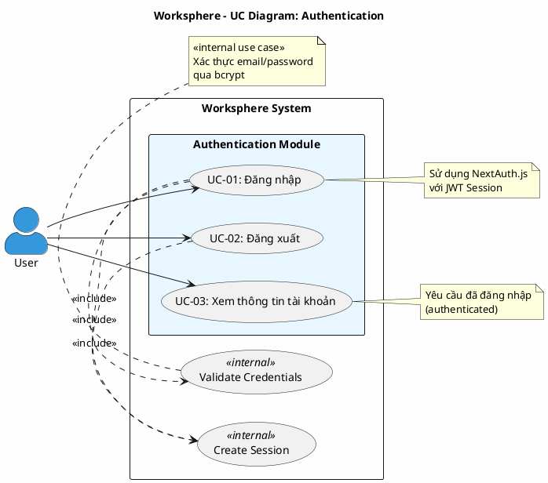

# Use Case Diagram 1: Xác thực (Authentication)

> **Hệ thống**: Worksphere - Hệ thống Quản lý Công việc & Dự án  
> **Module**: Authentication  
> **Phiên bản**: 1.0  
> **Ngày cập nhật**: 2026-01-15

---

## 1. Thông tin chung

| Thuộc tính | Giá trị |
|------------|---------|
| **Tên sơ đồ** | UC Diagram - Authentication |
| **Mô tả** | Các chức năng xác thực người dùng: đăng nhập, đăng xuất, xem thông tin tài khoản |
| **Số Use Cases** | 3 |
| **Actors** | User |

---

## 2. Actors (Tác nhân)

| Actor | Loại | Mô tả |
|-------|------|-------|
| **User** | Primary | Người dùng chưa/đã đăng nhập muốn truy cập hệ thống |

---

## 3. Use Case Diagram (PlantUML)

---

## 4. Bảng mô tả Use Cases

| UC ID | Tên Use Case | Actor | Mô tả | Precondition | Postcondition |
|-------|--------------|-------|-------|--------------|---------------|
| UC-01 | Đăng nhập | User | Người dùng nhập email và mật khẩu để đăng nhập vào hệ thống | User chưa đăng nhập, có tài khoản hợp lệ | User được xác thực, session được tạo |
| UC-02 | Đăng xuất | User | Người dùng kết thúc phiên làm việc và thoát khỏi hệ thống | User đã đăng nhập | Session bị hủy, redirect về trang login |
| UC-03 | Xem thông tin tài khoản | User | Người dùng xem thông tin cá nhân (tên, email, avatar) và danh sách dự án đang tham gia | User đã đăng nhập | Hiển thị thông tin profile |

---

## 5. Ma trận quan hệ

| Use Case | Include | Extend | Extended By |
|----------|---------|--------|-------------|
| UC-01: Đăng nhập | Validate Credentials, Create Session | - | - |
| UC-02: Đăng xuất | Create Session (destroy) | - | - |
| UC-03: Xem thông tin tài khoản | - | - | - |

---

## 6. Luồng sự kiện chi tiết

### 6.1 UC-01: Đăng nhập

**Tiền điều kiện:**
- User chưa đăng nhập
- User có tài khoản trong hệ thống

**Luồng chính (Main Flow):**
1. User truy cập trang đăng nhập (`/login`)
2. Hệ thống hiển thị form đăng nhập với các trường: Email, Password
3. User nhập email và mật khẩu
4. User nhấn nút "Đăng nhập"
5. Hệ thống gọi NextAuth signIn với credentials
6. <<include>> Validate Credentials:
   - Hệ thống tìm user theo email trong database
   - Hệ thống so sánh password với hash (bcrypt)
7. <<include>> Create Session:
   - Hệ thống tạo JWT session chứa userId, email, name, isAdministrator
8. Hệ thống redirect User đến Dashboard (`/`)
9. Kết thúc Use Case

**Luồng ngoại lệ (Exception Flow):**

| ID | Điều kiện | Xử lý |
|----|-----------|-------|
| E1 | Email không tồn tại | Hiển thị lỗi "Email hoặc mật khẩu không đúng", quay lại bước 2 |
| E2 | Mật khẩu không đúng | Hiển thị lỗi "Email hoặc mật khẩu không đúng", quay lại bước 2 |
| E3 | Tài khoản bị khóa (`isActive = false`) | Hiển thị lỗi "Tài khoản đã bị khóa", quay lại bước 2 |
| E4 | Lỗi kết nối database | Hiển thị lỗi "Không thể kết nối máy chủ", quay lại bước 2 |

**Hậu điều kiện:**
- User đã đăng nhập thành công
- JWT session được tạo và lưu trong cookie
- User được redirect đến Dashboard

---

### 6.2 UC-02: Đăng xuất

**Tiền điều kiện:**
- User đã đăng nhập

**Luồng chính (Main Flow):**
1. User click vào avatar/menu người dùng
2. Hệ thống hiển thị dropdown menu
3. User chọn "Đăng xuất"
4. Hệ thống gọi NextAuth signOut
5. <<include>> Create Session (destroy):
   - Hệ thống xóa JWT session khỏi cookie
6. Hệ thống redirect User về trang Login (`/login`)
7. Kết thúc Use Case

**Luồng ngoại lệ:**

| ID | Điều kiện | Xử lý |
|----|-----------|-------|
| E1 | Session đã hết hạn | Redirect về trang Login |

**Hậu điều kiện:**
- JWT session bị hủy
- User được redirect về trang Login

---

### 6.3 UC-03: Xem thông tin tài khoản

**Tiền điều kiện:**
- User đã đăng nhập

**Luồng chính (Main Flow):**
1. User click vào avatar/menu người dùng
2. User chọn "Thông tin tài khoản" hoặc truy cập `/profile`
3. Hệ thống lấy thông tin user từ session
4. Hệ thống query database để lấy thông tin chi tiết:
   - Thông tin cá nhân: name, email, avatar
   - Danh sách dự án đang tham gia
   - Role trong từng dự án
5. Hệ thống hiển thị trang Profile với thông tin
6. Kết thúc Use Case

**Luồng ngoại lệ:**

| ID | Điều kiện | Xử lý |
|----|-----------|-------|
| E1 | Session hết hạn | Redirect về trang Login |

**Hậu điều kiện:**
- Thông tin profile được hiển thị

---

## 7. Business Rules

| ID | Rule | Mô tả |
|----|------|-------|
| BR-01 | Password Hashing | Mật khẩu phải được hash bằng bcrypt trước khi lưu |
| BR-02 | Session Timeout | JWT session có thời hạn 30 ngày (maxAge) |
| BR-03 | Unique Email | Email phải là duy nhất trong hệ thống |
| BR-04 | Active Account | Chỉ tài khoản có `isActive = true` mới được đăng nhập |

---

## 8. Validation Checklist

- [x] Mọi UC đều nằm trong System Boundary
- [x] Mọi Actor đều nằm ngoài System Boundary
- [x] Tên UC là động từ + bổ ngữ
- [x] Include: Mũi tên từ UC gốc → UC con
- [x] Không có UC "lơ lửng"
- [x] Đã mô tả luồng chính và ngoại lệ

---

*Tài liệu được tạo dựa trên phân tích mã nguồn Worksphere*  
*Ngày tạo: 2026-01-15*
