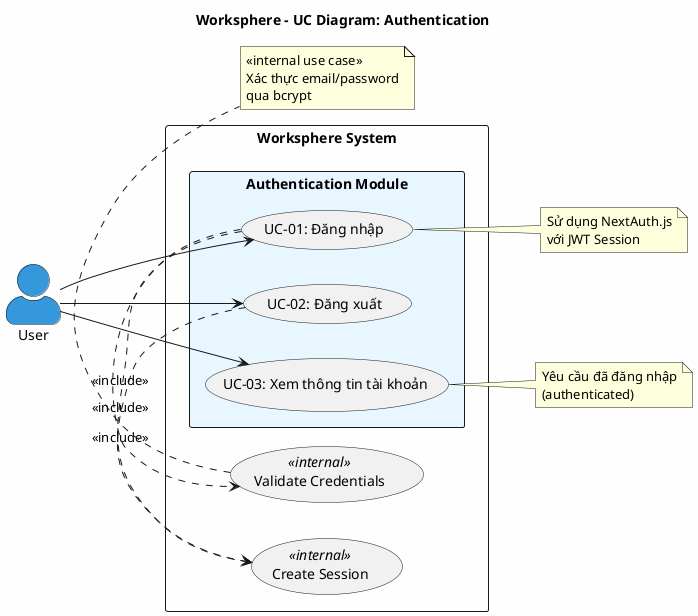

# Use Case Diagram 1: Xác thực (Authentication)

> **Hệ thống**: Worksphere - Hệ thống Quản lý Công việc & Dự án  
> **Module**: Authentication  
> **Phiên bản**: 1.0  
> **Ngày cập nhật**: 2026-01-15

---

## 1. Thông tin chung

| Thuộc tính | Giá trị |
|------------|---------|
| **Tên sơ đồ** | UC Diagram - Authentication |
| **Mô tả** | Các chức năng xác thực người dùng: đăng nhập, đăng xuất, xem thông tin tài khoản |
| **Số Use Cases** | 3 |
| **Actors** | User |

---

## 2. Actors (Tác nhân)

| Actor | Loại | Mô tả |
|-------|------|-------|
| **User** | Primary | Người dùng chưa/đã đăng nhập muốn truy cập hệ thống |

---

## 3. Use Case Diagram (PlantUML)

---

## 4. Bảng mô tả Use Cases

| UC ID | Tên Use Case | Actor | Mô tả | Precondition | Postcondition |
|-------|--------------|-------|-------|--------------|---------------|
| UC-01 | Đăng nhập | User | Người dùng nhập email và mật khẩu để đăng nhập vào hệ thống | User chưa đăng nhập, có tài khoản hợp lệ | User được xác thực, session được tạo |
| UC-02 | Đăng xuất | User | Người dùng kết thúc phiên làm việc và thoát khỏi hệ thống | User đã đăng nhập | Session bị hủy, redirect về trang login |
| UC-03 | Xem thông tin tài khoản | User | Người dùng xem thông tin cá nhân (tên, email, avatar) và danh sách dự án đang tham gia | User đã đăng nhập | Hiển thị thông tin profile |

---

## 5. Ma trận quan hệ

| Use Case | Include | Extend | Extended By |
|----------|---------|--------|-------------|
| UC-01: Đăng nhập | Validate Credentials, Create Session | - | - |
| UC-02: Đăng xuất | Create Session (destroy) | - | - |
| UC-03: Xem thông tin tài khoản | - | - | - |

---

## 6. Đặc tả Use Case chi tiết

---

### USE CASE: UC-01 - Đăng nhập

---

#### 1. Mô tả
Use Case này cho phép người dùng xác thực danh tính bằng email và mật khẩu để truy cập vào hệ thống Worksphere. Sau khi đăng nhập thành công, người dùng có thể sử dụng các chức năng theo quyền được cấp.

#### 2. Tác nhân chính
- **User**: Người dùng chưa đăng nhập muốn truy cập hệ thống.

#### 3. Tác nhân phụ
- *Không có*

#### 4. Tiền điều kiện
- Người dùng chưa có phiên đăng nhập hợp lệ.
- Người dùng đã có tài khoản được tạo trong hệ thống.
- Hệ thống đang hoạt động bình thường.

#### 5. Đảm bảo tối thiểu (Minimal Guarantee)
- Hệ thống không tiết lộ thông tin về việc email có tồn tại hay không.
- Không có phiên đăng nhập nào được tạo nếu xác thực thất bại.
- Số lần đăng nhập thất bại có thể được ghi nhận để bảo mật.

#### 6. Đảm bảo thành công (Success Guarantee)
- Người dùng được xác thực và có phiên đăng nhập hợp lệ.
- Phiên làm việc được tạo với các thông tin: ID người dùng, tên, email, quyền quản trị.
- Người dùng được chuyển đến trang chính của hệ thống.

#### 7. Chuỗi sự kiện chính (Main Flow)
1. Người dùng truy cập trang đăng nhập.
2. Hệ thống hiển thị biểu mẫu đăng nhập với hai trường: Email và Mật khẩu.
3. Người dùng nhập địa chỉ email.
4. Người dùng nhập mật khẩu.
5. Người dùng nhấn nút "Đăng nhập".
6. Hệ thống kiểm tra email tồn tại và tài khoản đang hoạt động (`isActive`).
7. Hệ thống xác minh mật khẩu nhập vào khớp với mật khẩu đã lưu (bcrypt).
8. Hệ thống tạo phiên đăng nhập JWT cho người dùng.
9. Hệ thống chuyển người dùng đến trang Dashboard.
10. Kết thúc Use Case.

#### 8. Luồng thay thế (Alternative Flow)
- *Không có*

#### 9. Luồng ngoại lệ (Exception Flow)

**E1: Email không tồn tại hoặc tài khoản bị khóa**
- Rẽ nhánh từ bước 6.
- Hệ thống kiểm tra: `!user || !user.isActive` → trả về lỗi.
- Hệ thống hiển thị thông báo lỗi chung: "Email hoặc mật khẩu không đúng".
- Ghi chú: Không tiết lộ email có tồn tại hay tài khoản bị khóa (security).
- Quay lại bước 2.

**E2: Mật khẩu không chính xác**
- Rẽ nhánh từ bước 7.
- Hệ thống hiển thị thông báo lỗi chung: "Email hoặc mật khẩu không đúng".
- Quay lại bước 2.

**E4: Lỗi kết nối hệ thống**
- Rẽ nhánh từ bất kỳ bước nào.
- Hệ thống hiển thị thông báo: "Không thể kết nối đến máy chủ, vui lòng thử lại sau".
- Kết thúc Use Case.

#### 10. Ghi chú
- Mật khẩu được mã hóa một chiều bằng bcrypt trước khi lưu trữ.
- Session sử dụng JWT strategy (NextAuth default).
- Thông báo lỗi được thiết kế chung chung để ngăn chặn tấn công dò tìm email.
- Thứ tự kiểm tra: user exists → isActive → password (theo `auth.ts` Line 19-34).

---

### USE CASE: UC-02 - Đăng xuất

---

#### 1. Mô tả
Use Case này cho phép người dùng kết thúc phiên làm việc hiện tại và thoát khỏi hệ thống một cách an toàn.

#### 2. Tác nhân chính
- **User**: Người dùng đã đăng nhập muốn kết thúc phiên làm việc.

#### 3. Tác nhân phụ
- *Không có*

#### 4. Tiền điều kiện
- Người dùng đang có phiên đăng nhập hợp lệ.

#### 5. Đảm bảo tối thiểu (Minimal Guarantee)
- Phiên đăng nhập luôn được hủy dù có lỗi xảy ra.

#### 6. Đảm bảo thành công (Success Guarantee)
- Phiên đăng nhập của người dùng bị hủy.
- Người dùng không thể truy cập các chức năng yêu cầu xác thực.
- Người dùng được chuyển về trang đăng nhập.

#### 7. Chuỗi sự kiện chính (Main Flow)
1. Người dùng nhấn vào biểu tượng avatar/menu người dùng.
2. Hệ thống hiển thị menu tùy chọn.
3. Người dùng chọn "Đăng xuất".
4. Hệ thống hủy phiên đăng nhập hiện tại.
5. Hệ thống xóa thông tin xác thực khỏi trình duyệt.
6. Hệ thống chuyển người dùng về trang đăng nhập.
7. Kết thúc Use Case.

#### 8. Luồng thay thế (Alternative Flow)
- *Không có*

#### 9. Luồng ngoại lệ (Exception Flow)

**E1: Phiên đăng nhập đã hết hạn**
- Rẽ nhánh từ bước 4.
- Hệ thống nhận thấy phiên đã hết hạn.
- Hệ thống chuyển người dùng về trang đăng nhập.
- Kết thúc Use Case.

#### 10. Ghi chú
- *Không có*

---

### USE CASE: UC-03 - Xem thông tin tài khoản

---

#### 1. Mô tả
Use Case này cho phép người dùng xem thông tin cá nhân của mình bao gồm: tên, email, ảnh đại diện và danh sách các dự án đang tham gia cùng vai trò trong từng dự án.

#### 2. Tác nhân chính
- **User**: Người dùng đã đăng nhập muốn xem thông tin tài khoản.

#### 3. Tác nhân phụ
- *Không có*

#### 4. Tiền điều kiện
- Người dùng đang có phiên đăng nhập hợp lệ.

#### 5. Đảm bảo tối thiểu (Minimal Guarantee)
- Nếu có lỗi, người dùng được thông báo và không có dữ liệu bị thay đổi.

#### 6. Đảm bảo thành công (Success Guarantee)
- Thông tin tài khoản được hiển thị đầy đủ và chính xác.

#### 7. Chuỗi sự kiện chính (Main Flow)
1. Người dùng nhấn vào biểu tượng avatar/menu người dùng.
2. Người dùng chọn "Thông tin tài khoản" hoặc truy cập trang hồ sơ.
3. Hệ thống lấy thông tin người dùng từ phiên đăng nhập.
4. Hệ thống truy vấn thông tin chi tiết từ cơ sở dữ liệu:
   - Thông tin cá nhân: tên, email, ảnh đại diện
   - Danh sách dự án đang tham gia
   - Vai trò trong từng dự án
   - Số công việc được gán và đã tạo
5. Hệ thống hiển thị trang thông tin tài khoản.
6. Kết thúc Use Case.

#### 8. Luồng thay thế (Alternative Flow)
- *Không có*

#### 9. Luồng ngoại lệ (Exception Flow)

**E1: Phiên đăng nhập hết hạn**
- Rẽ nhánh từ bước 3.
- Hệ thống chuyển người dùng về trang đăng nhập.
- Kết thúc Use Case.

#### 10. Ghi chú
- Người dùng có thể chỉnh sửa một số thông tin cá nhân từ trang này (tùy thuộc quyền).

---

## 7. Business Rules

| ID | Rule | Mô tả |
|----|------|-------|
| BR-01 | Password Hashing | Mật khẩu phải được mã hóa một chiều trước khi lưu |
| BR-02 | Session Timeout | Phiên đăng nhập có thời hạn tối đa 30 ngày |
| BR-03 | Unique Email | Email phải là duy nhất trong hệ thống |
| BR-04 | Active Account | Chỉ tài khoản đang hoạt động mới được đăng nhập |
| BR-05 | Generic Error Message | Thông báo lỗi đăng nhập không phân biệt loại lỗi cụ thể |

---

## 8. Validation Checklist

- [x] Mọi UC đều nằm trong System Boundary
- [x] Mọi Actor đều nằm ngoài System Boundary
- [x] Tên UC là động từ + bổ ngữ
- [x] Include: Mũi tên từ UC gốc → UC con
- [x] Không có UC "lơ lửng"
- [x] Đã mô tả đầy đủ luồng chính, thay thế và ngoại lệ
- [x] Đặc tả theo format chuẩn 10 mục

---

*Tài liệu được tạo dựa trên phân tích mã nguồn Worksphere*  
*Ngày cập nhật: 2026-01-16*

