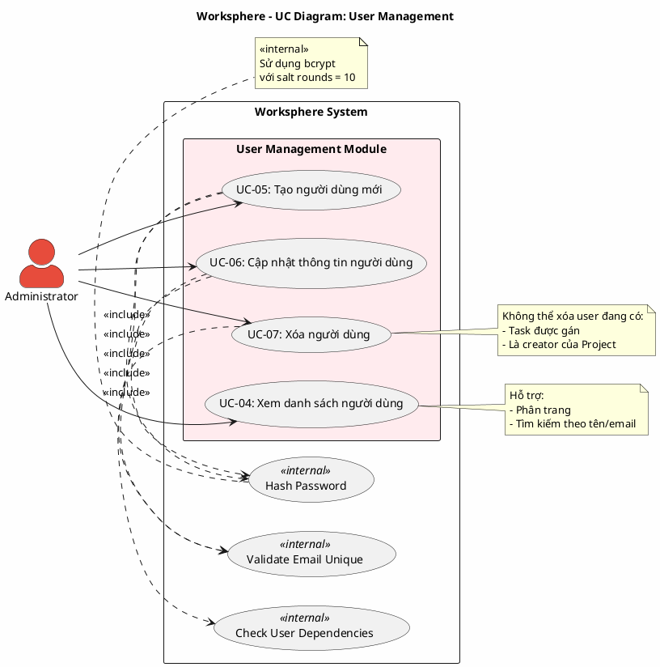

# Use Case Diagram 2: Quản lý Người dùng (User Management)

> **Hệ thống**: Worksphere - Hệ thống Quản lý Công việc & Dự án  
> **Module**: User Management  
> **Phiên bản**: 1.0  
> **Ngày cập nhật**: 2026-01-15

---

## 1. Thông tin chung

| Thuộc tính | Giá trị |
|------------|---------|
| **Tên sơ đồ** | UC Diagram - User Management |
| **Mô tả** | Các chức năng quản lý người dùng hệ thống (chỉ dành cho Administrator) |
| **Số Use Cases** | 4 |
| **Actors** | Administrator |
| **Quyền yêu cầu** | `isAdministrator = true` |

---

## 2. Actors (Tác nhân)

| Actor | Loại | Mô tả |
|-------|------|-------|
| **Administrator** | Primary | Quản trị viên hệ thống có quyền quản lý toàn bộ người dùng |

---

## 3. Use Case Diagram (PlantUML)

---

## 4. Bảng mô tả Use Cases

| UC ID | Tên Use Case | Actor | Mô tả | Precondition | Postcondition |
|-------|--------------|-------|-------|--------------|---------------|
| UC-04 | Xem danh sách người dùng | Admin | Xem danh sách tất cả người dùng trong hệ thống với phân trang và tìm kiếm | Admin đã đăng nhập | Hiển thị danh sách users |
| UC-05 | Tạo người dùng mới | Admin | Tạo tài khoản mới với email, tên, mật khẩu | Admin đã đăng nhập, email chưa tồn tại | User mới được tạo trong DB |
| UC-06 | Cập nhật thông tin người dùng | Admin | Chỉnh sửa thông tin người dùng: tên, email, mật khẩu, trạng thái, quyền admin | Admin đã đăng nhập, user tồn tại | User được cập nhật |
| UC-07 | Xóa người dùng | Admin | Xóa người dùng khỏi hệ thống | Admin đã đăng nhập, user không có dependencies | User bị xóa khỏi DB |

---

## 5. Ma trận quan hệ

| Use Case | Include | Extend | Extended By |
|----------|---------|--------|-------------|
| UC-04: Xem danh sách | - | - | - |
| UC-05: Tạo người dùng | Hash Password, Validate Email | - | - |
| UC-06: Cập nhật | Hash Password, Validate Email | - | - |
| UC-07: Xóa người dùng | Check Dependencies | - | - |

---

## 6. Đặc tả Use Case chi tiết

---

### USE CASE: UC-04 - Xem danh sách người dùng

---

#### 1. Mô tả
Use Case này cho phép Quản trị viên xem danh sách tất cả người dùng trong hệ thống với các thông tin cơ bản, hỗ trợ phân trang và tìm kiếm để quản lý hiệu quả.

#### 2. Tác nhân chính
- **Administrator**: Quản trị viên hệ thống.

#### 3. Tác nhân phụ
- *Không có*

#### 4. Tiền điều kiện
- Quản trị viên đã đăng nhập vào hệ thống.
- Tài khoản có quyền quản trị (isAdministrator = true).

#### 5. Đảm bảo tối thiểu (Minimal Guarantee)
- Người dùng không có quyền quản trị sẽ không thể truy cập chức năng này.

#### 6. Đảm bảo thành công (Success Guarantee)
- Danh sách người dùng được hiển thị đầy đủ với thông tin và phân trang.

#### 7. Chuỗi sự kiện chính (Main Flow)
1. Quản trị viên truy cập trang quản lý người dùng.
2. Hệ thống kiểm tra quyền quản trị của người dùng.
3. Hệ thống truy vấn danh sách người dùng từ cơ sở dữ liệu với phân trang mặc định.
4. Hệ thống trả về danh sách người dùng bao gồm:
   - Thông tin cơ bản: ID, tên, email, ảnh đại diện
   - Trạng thái: quyền quản trị, trạng thái hoạt động
   - Thống kê: số dự án tham gia, số công việc được gán
5. Hệ thống hiển thị bảng danh sách với các cột thông tin.
6. Kết thúc Use Case.

#### 8. Luồng thay thế (Alternative Flow)

**A1: Quản trị viên tìm kiếm người dùng**
- Rẽ nhánh từ bước 5.
- Quản trị viên nhập từ khóa vào ô tìm kiếm.
- Hệ thống lọc danh sách theo tên hoặc email chứa từ khóa.
- Hệ thống hiển thị kết quả lọc.
- Tiếp tục từ bước 5.

**A2: Quản trị viên chuyển trang**
- Rẽ nhánh từ bước 5.
- Quản trị viên nhấn nút chuyển trang.
- Hệ thống truy vấn trang dữ liệu mới.
- Tiếp tục từ bước 4.

#### 9. Luồng ngoại lệ (Exception Flow)

**E1: Không có quyền quản trị**
- Rẽ nhánh từ bước 2.
- Hệ thống từ chối truy cập với thông báo lỗi 403.
- Kết thúc Use Case.

#### 10. Ghi chú
- Danh sách được sắp xếp mặc định theo ngày tạo giảm dần.
- Mỗi trang hiển thị tối đa 20 người dùng.

---

### USE CASE: UC-05 - Tạo người dùng mới

---

#### 1. Mô tả
Use Case này cho phép Quản trị viên tạo tài khoản người dùng mới trong hệ thống với các thông tin cơ bản và phân quyền.

#### 2. Tác nhân chính
- **Administrator**: Quản trị viên hệ thống.

#### 3. Tác nhân phụ
- *Không có*

#### 4. Tiền điều kiện
- Quản trị viên đã đăng nhập vào hệ thống.
- Tài khoản có quyền quản trị.

#### 5. Đảm bảo tối thiểu (Minimal Guarantee)
- Nếu tạo thất bại, không có người dùng nào được tạo trong hệ thống.
- Mật khẩu luôn được mã hóa trước khi lưu.

#### 6. Đảm bảo thành công (Success Guarantee)
- Người dùng mới được tạo trong hệ thống với mật khẩu đã mã hóa.
- Người dùng mới có thể đăng nhập ngay lập tức (nếu trạng thái hoạt động).

#### 7. Chuỗi sự kiện chính (Main Flow)
1. Quản trị viên nhấn nút "Thêm người dùng".
2. Hệ thống hiển thị biểu mẫu tạo người dùng với các trường:
   - Tên (bắt buộc)
   - Email (bắt buộc)
   - Mật khẩu (bắt buộc)
   - Quyền quản trị (tùy chọn)
   - Trạng thái hoạt động (mặc định: hoạt động)
3. Quản trị viên nhập thông tin người dùng.
4. Quản trị viên nhấn nút "Lưu".
5. Hệ thống kiểm tra email chưa tồn tại trong hệ thống.
6. Hệ thống kiểm tra định dạng email hợp lệ.
7. Hệ thống mã hóa mật khẩu.
8. Hệ thống tạo người dùng mới trong cơ sở dữ liệu.
9. Hệ thống hiển thị thông báo thành công.
10. Hệ thống cập nhật danh sách người dùng.
11. Kết thúc Use Case.

#### 8. Luồng thay thế (Alternative Flow)
- *Không có*

#### 9. Luồng ngoại lệ (Exception Flow)

**E1: Email đã tồn tại**
- Rẽ nhánh từ bước 5.
- Hệ thống hiển thị thông báo lỗi: "Email đã được sử dụng".
- Quay lại bước 2.

**E2: Thiếu thông tin bắt buộc**
- Rẽ nhánh từ bước 4.
- Hệ thống hiển thị thông báo lỗi cho các trường thiếu.
- Quay lại bước 2.

**E3: Email không hợp lệ**
- Rẽ nhánh từ bước 6.
- Hệ thống hiển thị thông báo lỗi: "Email không hợp lệ".
- Quay lại bước 2.

**E4: Mật khẩu không đủ độ dài**
- Rẽ nhánh từ bước 4.
- Hệ thống hiển thị thông báo lỗi: "Mật khẩu phải có ít nhất 6 ký tự".
- Quay lại bước 2.

#### 10. Ghi chú
- Mật khẩu được mã hóa bằng thuật toán mã hóa một chiều với độ phức tạp cao.

---

### USE CASE: UC-06 - Cập nhật thông tin người dùng

---

#### 1. Mô tả
Use Case này cho phép Quản trị viên chỉnh sửa thông tin của người dùng trong hệ thống, bao gồm thay đổi tên, email, mật khẩu, quyền và trạng thái.

#### 2. Tác nhân chính
- **Administrator**: Quản trị viên hệ thống.

#### 3. Tác nhân phụ
- *Không có*

#### 4. Tiền điều kiện
- Quản trị viên đã đăng nhập vào hệ thống.
- Người dùng cần cập nhật tồn tại trong hệ thống.

#### 5. Đảm bảo tối thiểu (Minimal Guarantee)
- Nếu cập nhật thất bại, thông tin người dùng không bị thay đổi.

#### 6. Đảm bảo thành công (Success Guarantee)
- Thông tin người dùng được cập nhật trong hệ thống.
- Nếu đổi mật khẩu, mật khẩu mới được mã hóa trước khi lưu.

#### 7. Chuỗi sự kiện chính (Main Flow)
1. Quản trị viên chọn người dùng cần chỉnh sửa từ danh sách.
2. Hệ thống hiển thị biểu mẫu với thông tin hiện tại:
   - Tên, Email
   - Mật khẩu (để trống nếu không thay đổi)
   - Quyền quản trị, Trạng thái hoạt động
3. Quản trị viên chỉnh sửa thông tin cần thay đổi.
4. Quản trị viên nhấn nút "Lưu".
5. Nếu email được thay đổi, hệ thống kiểm tra email mới không trùng với người dùng khác.
6. Nếu mật khẩu được nhập, hệ thống mã hóa mật khẩu mới.
7. Hệ thống cập nhật thông tin người dùng trong cơ sở dữ liệu.
8. Hệ thống hiển thị thông báo thành công.
9. Kết thúc Use Case.

#### 8. Luồng thay thế (Alternative Flow)
- *Không có*

#### 9. Luồng ngoại lệ (Exception Flow)

**E1: Email trùng với người dùng khác**
- Rẽ nhánh từ bước 5.
- Hệ thống hiển thị thông báo lỗi: "Email đã được sử dụng".
- Quay lại bước 2.

**E2: Người dùng không tồn tại**
- Rẽ nhánh từ bước 1.
- Hệ thống hiển thị thông báo lỗi 404.
- Kết thúc Use Case.

#### 10. Ghi chú
- Người dùng thường có thể tự cập nhật một số thông tin cá nhân của mình (tên, ảnh đại diện).
- Chỉ quản trị viên mới có thể thay đổi quyền quản trị và trạng thái hoạt động.

---

### USE CASE: UC-07 - Xóa người dùng

---

#### 1. Mô tả
Use Case này cho phép Quản trị viên xóa người dùng khỏi hệ thống sau khi kiểm tra các ràng buộc dữ liệu liên quan.

#### 2. Tác nhân chính
- **Administrator**: Quản trị viên hệ thống.

#### 3. Tác nhân phụ
- *Không có*

#### 4. Tiền điều kiện
- Quản trị viên đã đăng nhập vào hệ thống.
- Người dùng cần xóa tồn tại trong hệ thống.

#### 5. Đảm bảo tối thiểu (Minimal Guarantee)
- Nếu có ràng buộc dữ liệu, người dùng không bị xóa và được thông báo lý do.
- Quản trị viên không thể tự xóa tài khoản của mình.

#### 6. Đảm bảo thành công (Success Guarantee)
- Người dùng bị xóa khỏi hệ thống.
- Các dữ liệu liên quan được xử lý theo quy tắc cascade.

#### 7. Chuỗi sự kiện chính (Main Flow)
1. Quản trị viên chọn người dùng cần xóa từ danh sách.
2. Quản trị viên nhấn nút "Xóa".
3. Hệ thống hiển thị hộp thoại xác nhận.
4. Quản trị viên xác nhận xóa.
5. Hệ thống kiểm tra người dùng không phải là người đang đăng nhập.
6. Hệ thống kiểm tra người dùng không có công việc đang được gán.
7. Hệ thống xóa các dữ liệu liên quan:
   - Xóa tư cách thành viên trong các dự án
   - Xóa danh sách theo dõi công việc
   - Xóa thông báo
8. Hệ thống xóa người dùng khỏi cơ sở dữ liệu.
9. Hệ thống hiển thị thông báo thành công.
10. Hệ thống cập nhật danh sách người dùng.
11. Kết thúc Use Case.

#### 8. Luồng thay thế (Alternative Flow)

**A1: Quản trị viên hủy xác nhận**
- Rẽ nhánh từ bước 4.
- Quản trị viên nhấn "Hủy".
- Hệ thống đóng hộp thoại xác nhận.
- Kết thúc Use Case mà không xóa.

#### 9. Luồng ngoại lệ (Exception Flow)

**E1: Đang cố xóa chính mình**
- Rẽ nhánh từ bước 5.
- Hệ thống hiển thị thông báo lỗi: "Không thể tự xóa tài khoản của mình".
- Kết thúc Use Case.

**E2: Người dùng đang có công việc được gán**
- Rẽ nhánh từ bước 6.
- Hệ thống hiển thị thông báo lỗi: "Không thể xóa người dùng đang được gán X công việc. Vui lòng chuyển giao công việc trước."
- Kết thúc Use Case.

#### 10. Ghi chú
- Nên chuyển giao công việc trước khi xóa người dùng.
- Có thể cân nhắc vô hiệu hóa tài khoản thay vì xóa để bảo toàn lịch sử.

---

## 7. Business Rules

| ID | Rule | Mô tả |
|----|------|-------|
| BR-01 | Admin Only | Chỉ người có quyền quản trị mới truy cập được module này |
| BR-02 | Unique Email | Email phải là duy nhất trong hệ thống |
| BR-03 | Password Policy | Mật khẩu phải được mã hóa trước khi lưu |
| BR-04 | No Self Delete | Quản trị viên không thể tự xóa tài khoản của mình |
| BR-05 | Dependency Check | Không thể xóa người dùng có công việc được gán |
| BR-06 | Min Password Length | Mật khẩu phải có ít nhất 6 ký tự |

---

## 8. Validation Checklist

- [x] Mọi UC đều nằm trong System Boundary
- [x] Mọi Actor đều nằm ngoài System Boundary
- [x] Tên UC là động từ + bổ ngữ
- [x] Include: Mũi tên từ UC gốc → UC con
- [x] Không có UC "lơ lửng"
- [x] Đã mô tả đầy đủ luồng chính, thay thế và ngoại lệ
- [x] Đặc tả theo format chuẩn 10 mục

---

*Tài liệu được tạo dựa trên phân tích mã nguồn Worksphere*  
*Ngày cập nhật: 2026-01-16*

