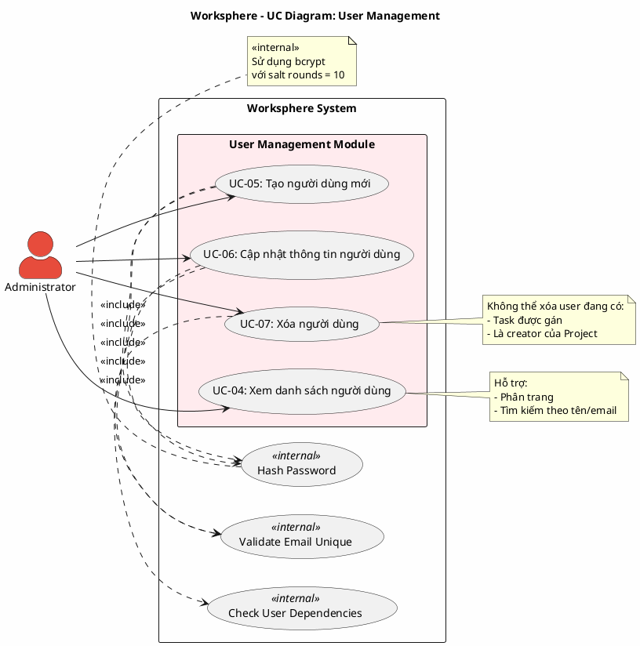

# Use Case Diagram 2: Quản lý Người dùng (User Management)

> **Hệ thống**: Worksphere - Hệ thống Quản lý Công việc & Dự án  
> **Module**: User Management  
> **Phiên bản**: 1.0  
> **Ngày cập nhật**: 2026-01-15

---

## 1. Thông tin chung

| Thuộc tính | Giá trị |
|------------|---------|
| **Tên sơ đồ** | UC Diagram - User Management |
| **Mô tả** | Các chức năng quản lý người dùng hệ thống (chỉ dành cho Administrator) |
| **Số Use Cases** | 4 |
| **Actors** | Administrator |
| **Quyền yêu cầu** | `isAdministrator = true` |

---

## 2. Actors (Tác nhân)

| Actor | Loại | Mô tả |
|-------|------|-------|
| **Administrator** | Primary | Quản trị viên hệ thống có quyền quản lý toàn bộ người dùng |

---

## 3. Use Case Diagram (PlantUML)

---

## 4. Bảng mô tả Use Cases

| UC ID | Tên Use Case | Actor | Mô tả | Precondition | Postcondition |
|-------|--------------|-------|-------|--------------|---------------|
| UC-04 | Xem danh sách người dùng | Admin | Xem danh sách tất cả người dùng trong hệ thống với phân trang và tìm kiếm | Admin đã đăng nhập | Hiển thị danh sách users |
| UC-05 | Tạo người dùng mới | Admin | Tạo tài khoản mới với email, tên, mật khẩu | Admin đã đăng nhập, email chưa tồn tại | User mới được tạo trong DB |
| UC-06 | Cập nhật thông tin người dùng | Admin | Chỉnh sửa thông tin người dùng: tên, email, mật khẩu, trạng thái, quyền admin | Admin đã đăng nhập, user tồn tại | User được cập nhật |
| UC-07 | Xóa người dùng | Admin | Xóa người dùng khỏi hệ thống | Admin đã đăng nhập, user không có dependencies | User bị xóa khỏi DB |

---

## 5. Ma trận quan hệ

| Use Case | Include | Extend | Extended By |
|----------|---------|--------|-------------|
| UC-04: Xem danh sách | - | - | - |
| UC-05: Tạo người dùng | Hash Password, Validate Email | - | - |
| UC-06: Cập nhật | Hash Password, Validate Email | - | - |
| UC-07: Xóa người dùng | Check Dependencies | - | - |

---

## 6. Luồng sự kiện chi tiết

### 6.1 UC-04: Xem danh sách người dùng

**Tiền điều kiện:**
- Administrator đã đăng nhập (`isAdministrator = true`)

**Luồng chính (Main Flow):**
1. Admin truy cập trang Quản lý Người dùng (`/settings/users`)
2. Hệ thống kiểm tra quyền Admin
3. Hệ thống query danh sách users từ database với:
   - Phân trang: page, limit
   - Tìm kiếm: theo name hoặc email
   - Sắp xếp: theo createdAt DESC
4. Hệ thống trả về danh sách users với thông tin:
   - ID, Name, Email, Avatar
   - isAdministrator, isActive
   - createdAt, updatedAt
5. Hệ thống hiển thị bảng danh sách với pagination
6. Kết thúc Use Case

**Luồng phụ (Alternative Flow):**

| ID | Điều kiện | Xử lý |
|----|-----------|-------|
| A1 | Admin nhập từ khóa tìm kiếm | Filter users theo keyword, quay lại bước 4 |

**Luồng ngoại lệ:**

| ID | Điều kiện | Xử lý |
|----|-----------|-------|
| E1 | Không phải Admin | Redirect về 403 Forbidden |

**Hậu điều kiện:**
- Danh sách users được hiển thị

---

### 6.2 UC-05: Tạo người dùng mới

**Tiền điều kiện:**
- Administrator đã đăng nhập

**Luồng chính (Main Flow):**
1. Admin click nút "Thêm người dùng"
2. Hệ thống hiển thị form với các trường:
   - Name (bắt buộc)
   - Email (bắt buộc)
   - Password (bắt buộc)
   - isAdministrator (checkbox)
   - isActive (checkbox, mặc định: true)
3. Admin nhập thông tin
4. Admin nhấn "Lưu"
5. <<include>> Validate Email Unique:
   - Hệ thống kiểm tra email chưa tồn tại trong DB
6. <<include>> Hash Password:
   - Hệ thống hash password bằng bcrypt (salt rounds = 10)
7. Hệ thống tạo user mới trong database
8. Hệ thống hiển thị thông báo thành công
9. Hệ thống refresh danh sách users
10. Kết thúc Use Case

**Luồng ngoại lệ:**

| ID | Điều kiện | Xử lý |
|----|-----------|-------|
| E1 | Email đã tồn tại | Hiển thị lỗi "Email đã được sử dụng", quay lại bước 2 |
| E2 | Thiếu trường bắt buộc | Hiển thị validation error, quay lại bước 2 |
| E3 | Email không hợp lệ | Hiển thị lỗi "Email không hợp lệ", quay lại bước 2 |

**Hậu điều kiện:**
- User mới được tạo trong database
- Password được lưu dạng hash

---

### 6.3 UC-06: Cập nhật thông tin người dùng

**Tiền điều kiện:**
- Administrator đã đăng nhập
- User cần cập nhật tồn tại

**Luồng chính (Main Flow):**
1. Admin click vào nút "Sửa" của user trong danh sách
2. Hệ thống hiển thị form với thông tin hiện tại:
   - Name, Email
   - Password (để trống nếu không đổi)
   - isAdministrator, isActive
3. Admin chỉnh sửa thông tin
4. Admin nhấn "Lưu"
5. <<include>> Validate Email Unique:
   - Kiểm tra email mới không trùng với user khác
6. Nếu password được nhập:
   - <<include>> Hash Password
7. Hệ thống cập nhật user trong database
8. Hệ thống hiển thị thông báo thành công
9. Kết thúc Use Case

**Luồng ngoại lệ:**

| ID | Điều kiện | Xử lý |
|----|-----------|-------|
| E1 | Email trùng với user khác | Hiển thị lỗi, quay lại bước 2 |
| E2 | User không tồn tại | Hiển thị 404 Not Found |

**Hậu điều kiện:**
- Thông tin user được cập nhật

---

### 6.4 UC-07: Xóa người dùng

**Tiền điều kiện:**
- Administrator đã đăng nhập
- User cần xóa tồn tại

**Luồng chính (Main Flow):**
1. Admin click nút "Xóa" của user
2. Hệ thống hiển thị dialog xác nhận
3. Admin xác nhận xóa
4. <<include>> Check Dependencies:
   - Kiểm tra user không có task được gán
   - Kiểm tra user không phải creator của project đang active
5. Hệ thống xóa user khỏi database (cascade):
   - Xóa ProjectMember records
   - Xóa Notifications
   - Xóa Comments
6. Hệ thống hiển thị thông báo thành công
7. Hệ thống refresh danh sách
8. Kết thúc Use Case

**Luồng ngoại lệ:**

| ID | Điều kiện | Xử lý |
|----|-----------|-------|
| E1 | User đang có task được gán | Hiển thị lỗi "Không thể xóa user đang có công việc" |
| E2 | User là creator của project | Hiển thị lỗi "Không thể xóa, user là người tạo dự án" |
| E3 | Admin hủy xác nhận | Đóng dialog, không xóa |

**Hậu điều kiện:**
- User bị xóa khỏi hệ thống
- Các dữ liệu liên quan được xóa cascade

---

## 7. Business Rules

| ID | Rule | Mô tả |
|----|------|-------|
| BR-01 | Admin Only | Chỉ user có `isAdministrator = true` mới truy cập được module này |
| BR-02 | Unique Email | Email phải là duy nhất trong hệ thống |
| BR-03 | Password Policy | Password phải được hash trước khi lưu |
| BR-04 | No Self Delete | Admin không thể tự xóa chính mình |
| BR-05 | Dependency Check | Không thể xóa user có task hoặc project liên quan |

---

## 8. Validation Checklist

- [x] Mọi UC đều nằm trong System Boundary
- [x] Mọi Actor đều nằm ngoài System Boundary
- [x] Tên UC là động từ + bổ ngữ
- [x] Include: Mũi tên từ UC gốc → UC con
- [x] Không có UC "lơ lửng"
- [x] Đã mô tả luồng chính và ngoại lệ

---

*Tài liệu được tạo dựa trên phân tích mã nguồn Worksphere*  
*Ngày tạo: 2026-01-15*
