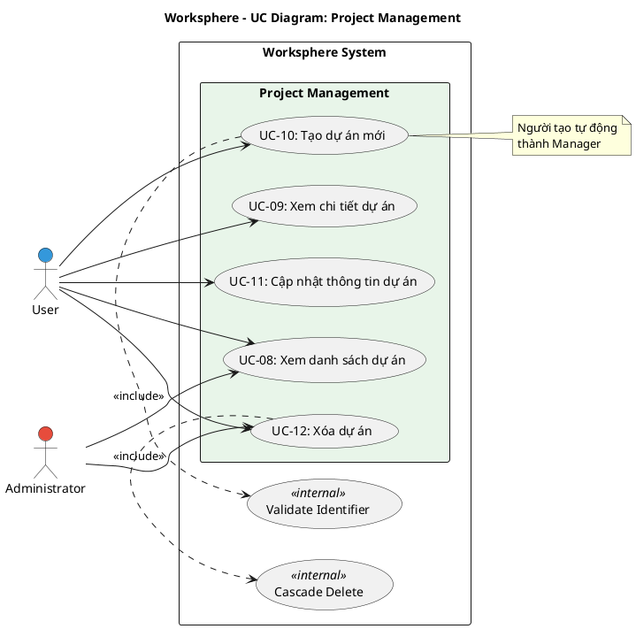

# Use Case Diagram 3: Quản lý Dự án (Project Management)

> **Module**: Project Management | **Số UC**: 5 | **Ngày**: 2026-01-15

---

## 1. Actors

| Actor | Loại | Mô tả |
|-------|------|-------|
| **User** | Primary | Người dùng có quyền `projects.create` hoặc là thành viên dự án |
| **Administrator** | Primary | Quản trị viên có toàn quyền |

---

## 2. Use Case Diagram (PlantUML)

---

## 3. Bảng mô tả Use Cases

| UC ID | Tên Use Case | Actor | Mô tả |
|-------|--------------|-------|-------|
| UC-08 | Xem danh sách dự án | User, Admin | Xem danh sách dự án mình là member (Admin xem tất cả) |
| UC-09 | Xem chi tiết dự án | User, Admin | Xem thông tin: mô tả, ngày, thành viên, thống kê |
| UC-10 | Tạo dự án mới | User, Admin | Tạo dự án với tên, identifier, mô tả. Creator thành Manager |
| UC-11 | Cập nhật thông tin dự án | User, Admin | Chỉnh sửa thông tin dự án (chỉ creator/Admin) |
| UC-12 | Xóa dự án | User, Admin | Xóa dự án và cascade all data (chỉ creator/Admin) |

---

## 4. Luồng sự kiện - UC-10: Tạo dự án mới

**Tiền điều kiện:** User có quyền `projects.create`

**Luồng chính:**
1. User click "Tạo dự án mới"
2. Hệ thống hiển thị form: Name, Identifier, Description, Dates
3. User nhập thông tin và submit
4. Hệ thống validate identifier unique
5. Hệ thống tạo project
6. Hệ thống tạo ProjectMember với role Manager cho creator
7. Redirect đến project mới

**Ngoại lệ:**
- E1: Identifier đã tồn tại → Hiển thị lỗi

**Hậu điều kiện:** Project được tạo, creator là member với role Manager

---

## 5. Business Rules

| ID | Rule |
|----|------|
| BR-01 | Identifier phải unique, lowercase, alphanumeric + dashes |
| BR-02 | Creator tự động thành member với role Manager |
| BR-03 | Xóa project sẽ cascade delete tất cả data liên quan |

---

*Ngày tạo: 2026-01-15*
