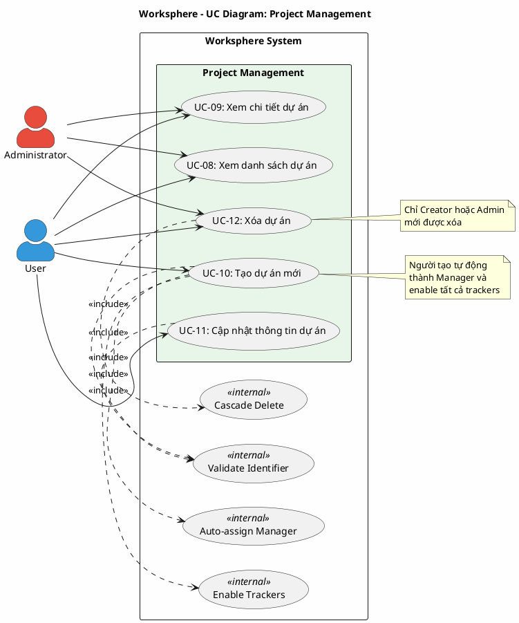

# Use Case Diagram 3: Quản lý Dự án (Project Management)

> **Hệ thống**: Worksphere - Hệ thống Quản lý Công việc & Dự án  
> **Module**: Project Management  
> **Phiên bản**: 1.0  
> **Ngày cập nhật**: 2026-01-16

---

## 1. Thông tin chung

| Thuộc tính | Giá trị |
|------------|---------|
| **Tên sơ đồ** | UC Diagram - Project Management |
| **Mô tả** | Các chức năng quản lý dự án: xem, tạo, cập nhật, xóa dự án |
| **Số Use Cases** | 5 |
| **Actors** | User, Administrator |
| **Source Files** | `src/app/api/projects/route.ts`, `src/app/api/projects/[id]/route.ts` |

---

## 2. Actors (Tác nhân)

| Actor | Loại | Mô tả |
|-------|------|-------|
| **User** | Primary | Người dùng có quyền `projects.create` hoặc là thành viên dự án |
| **Administrator** | Primary | Quản trị viên có toàn quyền trên tất cả dự án |

---

## 3. Use Case Diagram (PlantUML)

---

## 4. Bảng mô tả Use Cases

| UC ID | Tên Use Case | Actor | Mô tả | Precondition | Postcondition |
|-------|--------------|-------|-------|--------------|---------------|
| UC-08 | Xem danh sách dự án | User, Admin | Xem danh sách dự án mình là member (Admin xem tất cả) | Đã đăng nhập | Danh sách được hiển thị |
| UC-09 | Xem chi tiết dự án | User, Admin | Xem thông tin chi tiết: mô tả, ngày, thành viên, thống kê công việc | Đã đăng nhập, là member hoặc admin | Thông tin chi tiết được hiển thị |
| UC-10 | Tạo dự án mới | User, Admin | Tạo dự án với tên, identifier, mô tả. Creator tự động thành Manager | Đã đăng nhập, có quyền `projects.create` | Project được tạo, creator là Manager |
| UC-11 | Cập nhật thông tin dự án | User, Admin | Chỉnh sửa thông tin dự án | Đã đăng nhập, là creator hoặc admin | Thông tin được cập nhật |
| UC-12 | Xóa dự án | User, Admin | Xóa dự án và tất cả dữ liệu liên quan | Đã đăng nhập, là creator hoặc admin | Dự án và dữ liệu liên quan bị xóa |

---

## 5. Ma trận quan hệ

| Use Case | Include | Extend | Extended By |
|----------|---------|--------|-------------|
| UC-08: Xem danh sách | - | - | - |
| UC-09: Xem chi tiết | - | - | - |
| UC-10: Tạo dự án | Validate Identifier, Auto-assign Manager, Enable Trackers | - | - |
| UC-11: Cập nhật | Validate Identifier | - | - |
| UC-12: Xóa dự án | Cascade Delete | - | - |

---

## 6. Đặc tả Use Case chi tiết

---

### USE CASE: UC-08 - Xem danh sách dự án

---

#### 1. Mô tả
Use Case này cho phép người dùng xem danh sách các dự án mà họ có quyền truy cập. Người dùng thường chỉ thấy dự án mình là thành viên, trong khi Quản trị viên có thể xem tất cả dự án trong hệ thống.

#### 2. Tác nhân chính
- **User**: Thành viên của một hoặc nhiều dự án.
- **Administrator**: Quản trị viên hệ thống.

#### 3. Tác nhân phụ
- *Không có*

#### 4. Tiền điều kiện
- Người dùng đã đăng nhập vào hệ thống.

#### 5. Đảm bảo tối thiểu (Minimal Guarantee)
- Người dùng không được phép xem dự án mà họ không phải thành viên (trừ admin).

#### 6. Đảm bảo thành công (Success Guarantee)
- Danh sách dự án phù hợp với quyền của người dùng được hiển thị.
- Thông tin cơ bản của từng dự án được hiển thị đầy đủ.

#### 7. Chuỗi sự kiện chính (Main Flow)
1. Người dùng truy cập trang danh sách dự án.
2. Hệ thống xác định quyền của người dùng.
3. Nếu là Quản trị viên: Hệ thống truy vấn tất cả dự án.
4. Nếu là người dùng thường: Hệ thống truy vấn dự án mà người dùng là thành viên.
5. Hệ thống áp dụng các bộ lọc (nếu có):
   - Tìm kiếm theo tên, mã định danh, mô tả
   - Lọc theo trạng thái: đang hoạt động, đã lưu trữ
6. Hệ thống trả về danh sách dự án với thông tin:
   - Tên, mã định danh, mô tả
   - Người tạo
   - Danh sách thành viên với vai trò
   - Số lượng công việc và thành viên
7. Hệ thống hiển thị danh sách dự án dạng thẻ hoặc bảng.
8. Kết thúc Use Case.

#### 8. Luồng thay thế (Alternative Flow)

**A1: Người dùng tìm kiếm dự án**
- Rẽ nhánh từ bước 7.
- Người dùng nhập từ khóa vào ô tìm kiếm.
- Hệ thống lọc danh sách theo từ khóa (tên, mã định danh, mô tả).
- Tiếp tục từ bước 7.

**A2: Người dùng lọc theo trạng thái**
- Rẽ nhánh từ bước 7.
- Người dùng chọn bộ lọc: "Đang hoạt động" hoặc "Đã lưu trữ".
- Hệ thống lọc danh sách theo trạng thái.
- Tiếp tục từ bước 7.

**A3: Người dùng chỉ xem dự án của mình**
- Rẽ nhánh từ bước 4.
- Người dùng (kể cả admin) chọn tùy chọn "Dự án của tôi".
- Hệ thống chỉ hiển thị dự án mà người dùng là thành viên.
- Tiếp tục từ bước 5.

#### 9. Luồng ngoại lệ (Exception Flow)

**E1: Người dùng không thuộc dự án nào**
- Rẽ nhánh từ bước 4.
- Hệ thống trả về danh sách rỗng.
- Hệ thống hiển thị thông báo: "Bạn chưa tham gia dự án nào".
- Kết thúc Use Case.

#### 10. Ghi chú
- Danh sách được sắp xếp theo thời gian cập nhật giảm dần.
- Dự án đã lưu trữ mặc định không hiển thị.

---

### USE CASE: UC-09 - Xem chi tiết dự án

---

#### 1. Mô tả
Use Case này cho phép người dùng xem thông tin chi tiết của một dự án bao gồm: thông tin cơ bản, danh sách thành viên, thống kê công việc theo trạng thái.

#### 2. Tác nhân chính
- **User**: Thành viên của dự án.
- **Administrator**: Quản trị viên hệ thống.

#### 3. Tác nhân phụ
- *Không có*

#### 4. Tiền điều kiện
- Người dùng đã đăng nhập vào hệ thống.
- Người dùng là thành viên của dự án hoặc là Quản trị viên.

#### 5. Đảm bảo tối thiểu (Minimal Guarantee)
- Người dùng không có quyền truy cập dự án sẽ bị từ chối.

#### 6. Đảm bảo thành công (Success Guarantee)
- Thông tin chi tiết dự án được hiển thị đầy đủ.
- Thống kê công việc được tính toán chính xác.

#### 7. Chuỗi sự kiện chính (Main Flow)
1. Người dùng chọn một dự án từ danh sách hoặc truy cập trực tiếp qua URL.
2. Hệ thống kiểm tra quyền truy cập:
   - Là Quản trị viên: cho phép truy cập.
   - Là thành viên của dự án: cho phép truy cập.
3. Hệ thống truy vấn thông tin chi tiết dự án:
   - Tên, mã định danh, mô tả
   - Người tạo với thông tin cơ bản
   - Ngày bắt đầu, ngày kết thúc
   - Trạng thái lưu trữ
4. Hệ thống truy vấn danh sách thành viên dự án với vai trò.
5. Hệ thống thống kê công việc theo trạng thái.
6. Hệ thống hiển thị trang chi tiết dự án.
7. Kết thúc Use Case.

#### 8. Luồng thay thế (Alternative Flow)
- *Không có*

#### 9. Luồng ngoại lệ (Exception Flow)

**E1: Không có quyền truy cập**
- Rẽ nhánh từ bước 2.
- Hệ thống từ chối truy cập với mã lỗi 403.
- Hệ thống hiển thị thông báo: "Không có quyền truy cập dự án này".
- Kết thúc Use Case.

**E2: Dự án không tồn tại**
- Rẽ nhánh từ bước 2.
- Hệ thống trả về mã lỗi 404.
- Hệ thống hiển thị thông báo: "Dự án không tồn tại".
- Kết thúc Use Case.

#### 10. Ghi chú
- Thống kê công việc bao gồm số lượng công việc theo từng trạng thái.

---

### USE CASE: UC-10 - Tạo dự án mới

---

#### 1. Mô tả
Use Case này cho phép người dùng có quyền tạo một dự án mới trong hệ thống. Sau khi tạo, người tạo tự động trở thành thành viên với vai trò Quản lý (Manager) và tất cả các loại công việc (Tracker) được kích hoạt cho dự án.

#### 2. Tác nhân chính
- **User**: Người dùng có quyền `projects.create` trong bất kỳ dự án nào.
- **Administrator**: Quản trị viên hệ thống (luôn có quyền).

#### 3. Tác nhân phụ
- *Không có*

#### 4. Tiền điều kiện
- Người dùng đã đăng nhập vào hệ thống.
- Người dùng là Quản trị viên HOẶC có quyền `projects.create` trong ít nhất một dự án (kiểm tra quyền toàn cục).

#### 5. Đảm bảo tối thiểu (Minimal Guarantee)
- Nếu tạo thất bại, không có dự án nào được tạo trong hệ thống.
- Mã định danh dự án luôn được kiểm tra trùng lặp.

#### 6. Đảm bảo thành công (Success Guarantee)
- Dự án mới được tạo trong hệ thống.
- Người tạo tự động là thành viên với vai trò Manager.
- Tất cả các Tracker hiện có được kích hoạt cho dự án.
- Nhật ký hoạt động được ghi lại.

#### 7. Chuỗi sự kiện chính (Main Flow)
1. Người dùng nhấn nút "Tạo dự án mới".
2. Hệ thống kiểm tra quyền tạo dự án:
   - Nếu là Quản trị viên: cho phép.
   - Nếu không: kiểm tra quyền `projects.create` trong các dự án đang tham gia.
3. Hệ thống hiển thị biểu mẫu tạo dự án với các trường:
   - Tên dự án (bắt buộc, tối đa 100 ký tự)
   - Mã định danh (bắt buộc, chữ thường, số, dấu gạch ngang)
   - Mô tả (tùy chọn)
   - Ngày bắt đầu (tùy chọn)
   - Ngày kết thúc (tùy chọn)
4. Người dùng nhập thông tin dự án.
5. Người dùng nhấn nút "Tạo".
6. Hệ thống kiểm tra mã định danh chưa tồn tại trong hệ thống.
7. Hệ thống tạo dự án mới trong cơ sở dữ liệu.
8. Hệ thống tìm vai trò "Manager" trong hệ thống.
9. Hệ thống thêm người tạo làm thành viên với vai trò Manager.
10. Hệ thống lấy danh sách tất cả Tracker hiện có.
11. Hệ thống kích hoạt tất cả Tracker cho dự án mới.
12. Hệ thống ghi nhật ký hoạt động (action: created).
13. Hệ thống trả về thông tin dự án vừa tạo.
14. Hệ thống chuyển người dùng đến trang chi tiết dự án.
15. Kết thúc Use Case.

#### 8. Luồng thay thế (Alternative Flow)
- *Không có*

#### 9. Luồng ngoại lệ (Exception Flow)

**E1: Không có quyền tạo dự án**
- Rẽ nhánh từ bước 2.
- Hệ thống từ chối với mã lỗi 403.
- Hệ thống hiển thị thông báo: "Không có quyền tạo dự án".
- Kết thúc Use Case.

**E2: Mã định danh đã tồn tại**
- Rẽ nhánh từ bước 6.
- Hệ thống hiển thị thông báo lỗi: "Định danh dự án đã tồn tại".
- Quay lại bước 3.

**E3: Dữ liệu không hợp lệ**
- Rẽ nhánh từ bước 5.
- Hệ thống hiển thị các lỗi validation:
  - Tên dự án trống
  - Mã định danh không đúng định dạng
- Quay lại bước 3.

#### 10. Ghi chú
- Mã định danh chỉ chứa chữ thường (a-z), số (0-9) và dấu gạch ngang (-).
- Quyền `projects.create` được kiểm tra toàn cục (không theo dự án cụ thể).
- Nếu không tìm thấy vai trò Manager, người tạo sẽ không được thêm làm thành viên tự động.

---

### USE CASE: UC-11 - Cập nhật thông tin dự án

---

#### 1. Mô tả
Use Case này cho phép người có quyền chỉnh sửa thông tin của dự án bao gồm tên, mô tả, ngày tháng và trạng thái lưu trữ.

#### 2. Tác nhân chính
- **User**: Người tạo dự án (Creator).
- **Administrator**: Quản trị viên hệ thống.

#### 3. Tác nhân phụ
- *Không có*

#### 4. Tiền điều kiện
- Người dùng đã đăng nhập vào hệ thống.
- Người dùng là người tạo dự án hoặc là Quản trị viên.
- Dự án tồn tại trong hệ thống.

#### 5. Đảm bảo tối thiểu (Minimal Guarantee)
- Nếu cập nhật thất bại, thông tin dự án không bị thay đổi.

#### 6. Đảm bảo thành công (Success Guarantee)
- Thông tin dự án được cập nhật trong hệ thống.
- Nhật ký hoạt động được ghi lại với chi tiết thay đổi.

#### 7. Chuỗi sự kiện chính (Main Flow)
1. Người dùng truy cập trang cài đặt dự án.
2. Hệ thống kiểm tra quyền quản lý dự án:
   - Nếu là Quản trị viên: cho phép.
   - Nếu là người tạo dự án: cho phép.
3. Hệ thống lấy thông tin hiện tại của dự án.
4. Hệ thống hiển thị biểu mẫu chỉnh sửa với thông tin hiện tại.
5. Người dùng chỉnh sửa thông tin cần thay đổi.
6. Người dùng nhấn nút "Lưu".
7. Nếu mã định danh được thay đổi:
   - Hệ thống kiểm tra mã định danh mới không trùng với dự án khác.
8. Hệ thống cập nhật thông tin dự án.
9. Hệ thống ghi nhật ký hoạt động với chi tiết thay đổi (giá trị cũ và mới).
10. Hệ thống hiển thị thông báo thành công.
11. Kết thúc Use Case.

#### 8. Luồng thay thế (Alternative Flow)

**A1: Lưu trữ hoặc kích hoạt lại dự án**
- Rẽ nhánh từ bước 5.
- Người dùng thay đổi trạng thái lưu trữ của dự án.
- Tiếp tục từ bước 6.

#### 9. Luồng ngoại lệ (Exception Flow)

**E1: Không có quyền sửa dự án**
- Rẽ nhánh từ bước 2.
- Hệ thống từ chối với mã lỗi 403.
- Hệ thống hiển thị thông báo: "Không có quyền sửa dự án này".
- Kết thúc Use Case.

**E2: Mã định danh mới đã tồn tại**
- Rẽ nhánh từ bước 7.
- Hệ thống hiển thị thông báo lỗi: "Định danh dự án đã tồn tại".
- Quay lại bước 4.

#### 10. Ghi chú
- Chỉ người tạo hoặc Quản trị viên mới có thể sửa dự án.
- Không có quyền cấp thấp hơn cho việc chỉnh sửa dự án trong code hiện tại.

---

### USE CASE: UC-12 - Xóa dự án

---

#### 1. Mô tả
Use Case này cho phép người có quyền xóa hoàn toàn một dự án và tất cả dữ liệu liên quan khỏi hệ thống.

#### 2. Tác nhân chính
- **User**: Người tạo dự án (Creator).
- **Administrator**: Quản trị viên hệ thống.

#### 3. Tác nhân phụ
- *Không có*

#### 4. Tiền điều kiện
- Người dùng đã đăng nhập vào hệ thống.
- Người dùng là người tạo dự án hoặc là Quản trị viên.
- Dự án tồn tại trong hệ thống.

#### 5. Đảm bảo tối thiểu (Minimal Guarantee)
- Người dùng luôn được yêu cầu xác nhận trước khi xóa.
- Nếu xóa thất bại, dữ liệu không bị mất.

#### 6. Đảm bảo thành công (Success Guarantee)
- Dự án bị xóa hoàn toàn khỏi hệ thống.
- Tất cả dữ liệu liên quan bị xóa theo cascade.
- Nhật ký hoạt động được ghi lại.

#### 7. Chuỗi sự kiện chính (Main Flow)
1. Người dùng mở trang cài đặt dự án hoặc nhấn nút xóa dự án.
2. Hệ thống kiểm tra quyền quản lý dự án:
   - Nếu là Quản trị viên: cho phép.
   - Nếu là người tạo dự án: cho phép.
3. Hệ thống hiển thị hộp thoại xác nhận xóa.
4. Người dùng xác nhận xóa dự án.
5. Hệ thống lấy thông tin dự án trước khi xóa (để ghi log).
6. Hệ thống thực hiện xóa dữ liệu theo thứ tự cascade:
   - Xóa tất cả bình luận của công việc trong dự án
   - Xóa tất cả tệp đính kèm của công việc trong dự án
   - Xóa tất cả người theo dõi của công việc trong dự án
   - Xóa tất cả công việc trong dự án
   - Xóa tất cả thành viên dự án
   - Xóa dự án
7. Hệ thống ghi nhật ký hoạt động (action: deleted).
8. Hệ thống hiển thị thông báo thành công.
9. Hệ thống chuyển người dùng về trang danh sách dự án.
10. Kết thúc Use Case.

#### 8. Luồng thay thế (Alternative Flow)

**A1: Người dùng hủy xác nhận**
- Rẽ nhánh từ bước 4.
- Người dùng nhấn "Hủy".
- Hệ thống đóng hộp thoại xác nhận.
- Kết thúc Use Case mà không xóa.

#### 9. Luồng ngoại lệ (Exception Flow)

**E1: Không có quyền xóa dự án**
- Rẽ nhánh từ bước 2.
- Hệ thống từ chối với mã lỗi 403.
- Hệ thống hiển thị thông báo: "Không có quyền xóa dự án này".
- Kết thúc Use Case.

#### 10. Ghi chú
- **CẢNH BÁO**: Đây là thao tác không thể hoàn tác.
- Tệp đính kèm vật lý trên hệ thống file KHÔNG được xóa tự động.
- Phiên bản (Version) có thể không được xóa cascade trong code hiện tại - cần kiểm tra.
- Thông báo (Notification) liên quan đến dự án không được xóa.
- Nên cân nhắc lưu trữ (archive) thay vì xóa để bảo toàn lịch sử.

---

## 7. Business Rules

| ID | Rule | Mô tả |
|----|------|-------|
| BR-01 | Unique Identifier | Mã định danh dự án phải là duy nhất trong hệ thống |
| BR-02 | Identifier Format | Mã định danh chỉ chứa chữ thường, số và dấu gạch ngang |
| BR-03 | Auto Manager | Người tạo tự động thành thành viên với vai trò Manager |
| BR-04 | Auto Enable Trackers | Tất cả Tracker hiện có được kích hoạt cho dự án mới |
| BR-05 | Creator or Admin | Chỉ người tạo hoặc Quản trị viên mới có quyền sửa/xóa dự án |
| BR-06 | Cascade Delete | Xóa dự án sẽ xóa tất cả dữ liệu liên quan |
| BR-07 | Audit Logging | Mọi thao tác tạo, sửa, xóa đều được ghi nhật ký |

---

## 8. Validation Checklist

- [x] Mọi UC đều nằm trong System Boundary
- [x] Mọi Actor đều nằm ngoài System Boundary
- [x] Tên UC là động từ + bổ ngữ
- [x] Include: Mũi tên từ UC gốc → UC con
- [x] Không có UC "lơ lửng"
- [x] Đã mô tả đầy đủ luồng chính, thay thế và ngoại lệ
- [x] Đặc tả theo format chuẩn 10 mục
- [x] Đã đối chiếu với source code thực tế

---

*Tài liệu được tạo dựa trên phân tích mã nguồn Worksphere*  
*Ngày cập nhật: 2026-01-16*
