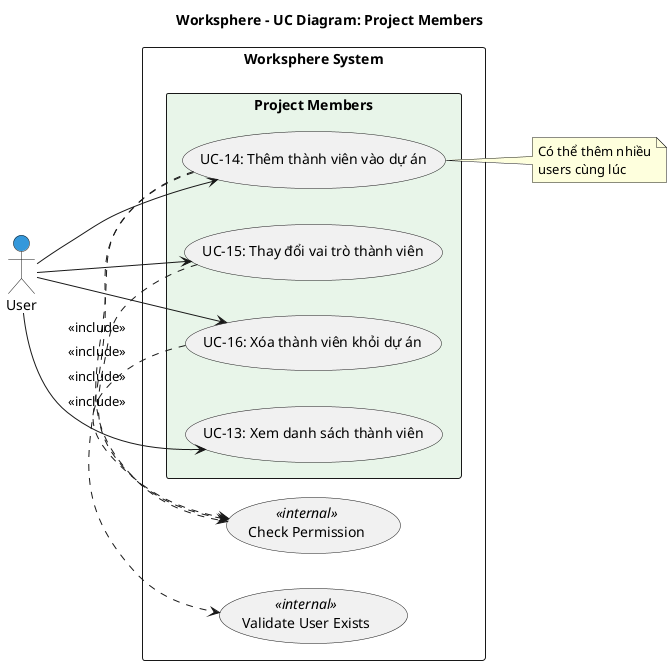

# Use Case Diagram 4: Quản lý Thành viên Dự án (Project Members)

> **Module**: Project Members | **Số UC**: 4 | **Ngày**: 2026-01-15

---

## 1. Actors

| Actor | Loại | Mô tả |
|-------|------|-------|
| **User** | Primary | Người dùng có quyền `projects.manage_members` |

---

## 2. Use Case Diagram (PlantUML)

---

## 3. Bảng mô tả Use Cases

| UC ID | Tên Use Case | Actor | Mô tả |
|-------|--------------|-------|-------|
| UC-13 | Xem danh sách thành viên | User | Xem tất cả thành viên dự án cùng vai trò |
| UC-14 | Thêm thành viên vào dự án | User | Thêm 1 hoặc nhiều users vào dự án với role được chọn |
| UC-15 | Thay đổi vai trò thành viên | User | Thay đổi role của member trong dự án |
| UC-16 | Xóa thành viên khỏi dự án | User | Xóa member khỏi dự án |

---

## 4. Luồng sự kiện - UC-14: Thêm thành viên

**Tiền điều kiện:** User có quyền `projects.manage_members`

**Luồng chính:**
1. User vào Settings → Members
2. Hệ thống hiển thị danh sách members hiện tại
3. User click "Thêm thành viên"
4. Hệ thống hiển thị form: User dropdown, Role dropdown
5. User chọn users và role
6. User submit
7. Hệ thống tạo ProjectMember records
8. Refresh danh sách

**Ngoại lệ:**
- E1: User đã là member → Hiển thị lỗi

**Hậu điều kiện:** Users mới được thêm vào project với role

---

## 5. Business Rules

| ID | Rule |
|----|------|
| BR-01 | Cần quyền `projects.manage_members` để thêm/sửa/xóa |
| BR-02 | Không thể xóa creator của project |
| BR-03 | User chỉ có 1 role trong 1 project |

---

*Ngày tạo: 2026-01-15*
