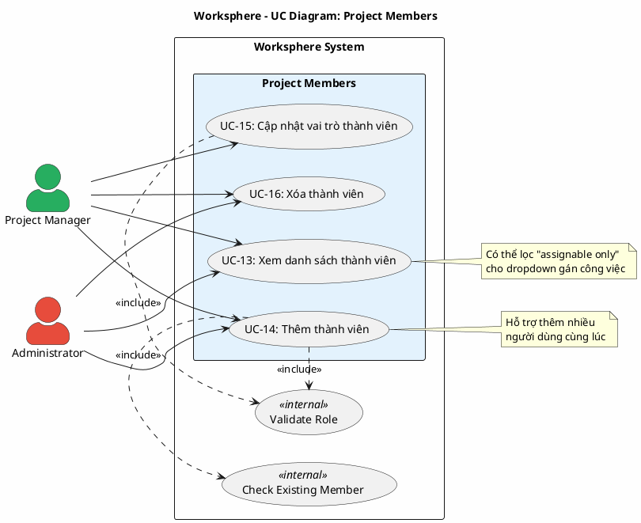

# Use Case Diagram 4: Quản lý Thành viên Dự án (Project Members)

> **Hệ thống**: Worksphere - Hệ thống Quản lý Công việc & Dự án  
> **Module**: Project Members  
> **Phiên bản**: 1.0  
> **Ngày cập nhật**: 2026-01-16

---

## 1. Thông tin chung

| Thuộc tính | Giá trị |
|------------|---------|
| **Tên sơ đồ** | UC Diagram - Project Members |
| **Mô tả** | Các chức năng quản lý thành viên dự án: xem, thêm, cập nhật vai trò, xóa thành viên |
| **Số Use Cases** | 4 |
| **Actors** | Project Manager, Administrator |
| **Source Files** | `src/app/api/projects/[id]/members/route.ts` |

---

## 2. Actors (Tác nhân)

| Actor | Loại | Mô tả |
|-------|------|-------|
| **Project Manager** | Primary | Người sáng lập dự án hoặc có quyền `projects.manage_members` |
| **Administrator** | Primary | Quản trị viên có toàn quyền quản lý thành viên |

---

## 3. Use Case Diagram (PlantUML)

---

## 4. Bảng mô tả Use Cases

| UC ID | Tên Use Case | Actor | Mô tả |
|-------|--------------|-------|-------|
| UC-13 | Xem danh sách thành viên | PM, Admin | Xem danh sách thành viên dự án với vai trò và thông tin |
| UC-14 | Thêm thành viên | PM, Admin | Thêm một hoặc nhiều người dùng vào dự án với vai trò |
| UC-15 | Cập nhật vai trò thành viên | PM, Admin | Thay đổi vai trò của thành viên trong dự án |
| UC-16 | Xóa thành viên | PM, Admin | Xóa thành viên khỏi dự án |

---

## 5. Ma trận quan hệ

| Use Case | Include | Extend | Extended By |
|----------|---------|--------|-------------|
| UC-13: Xem danh sách | - | - | - |
| UC-14: Thêm thành viên | Check Existing, Validate Role | - | - |
| UC-15: Cập nhật vai trò | Validate Role | - | - |
| UC-16: Xóa thành viên | - | - | - |

---

## 6. Đặc tả Use Case chi tiết

---

### USE CASE: UC-13 - Xem danh sách thành viên

---

#### 1. Mô tả
Use Case này cho phép người dùng xem danh sách tất cả thành viên của dự án, bao gồm thông tin cá nhân và vai trò của họ trong dự án.

#### 2. Tác nhân chính
- **User**: Bất kỳ thành viên nào của dự án.

#### 3. Tác nhân phụ
- *Không có*

#### 4. Tiền điều kiện
- Người dùng đã đăng nhập vào hệ thống.
- Người dùng là thành viên của dự án hoặc là Quản trị viên.

#### 5. Đảm bảo tối thiểu (Minimal Guarantee)
- Người dùng không thuộc dự án sẽ không xem được danh sách thành viên.

#### 6. Đảm bảo thành công (Success Guarantee)
- Danh sách thành viên được hiển thị đầy đủ với thông tin và vai trò.

#### 7. Chuỗi sự kiện chính (Main Flow)
1. Người dùng truy cập trang thành viên dự án.
2. Hệ thống truy vấn danh sách thành viên dự án.
3. Hệ thống trả về danh sách bao gồm:
   - Thông tin người dùng: ID, tên, email, ảnh đại diện, trạng thái hoạt động
   - Vai trò trong dự án: ID, tên vai trò
4. Hệ thống sắp xếp danh sách theo thời gian tham gia tăng dần.
5. Hệ thống hiển thị danh sách thành viên.
6. Kết thúc Use Case.

#### 8. Luồng thay thế (Alternative Flow)

**A1: Lọc danh sách có thể gán công việc**
- Rẽ nhánh từ bước 1.
- Người dùng (hoặc hệ thống) yêu cầu chỉ lấy thành viên có thể gán công việc.
- Hệ thống kiểm tra quyền `canAssignToOther` của người yêu cầu:
  - Nếu KHÔNG có quyền: chỉ trả về chính người dùng đó.
  - Nếu CÓ quyền: trả về tất cả thành viên dự án.
- Tiếp tục từ bước 4.

#### 9. Luồng ngoại lệ (Exception Flow)

**E1: Không có quyền truy cập**
- Rẽ nhánh từ bước 2.
- Hệ thống từ chối với mã lỗi 403.
- Kết thúc Use Case.

#### 10. Ghi chú
- Tùy chọn `assignable=true` được sử dụng khi lấy danh sách dropdown gán công việc.
- Quyền `canAssignToOther` quyết định người dùng có thể gán công việc cho người khác hay chỉ cho mình.

---

### USE CASE: UC-14 - Thêm thành viên

---

#### 1. Mô tả
Use Case này cho phép người có quyền thêm một hoặc nhiều người dùng vào dự án với vai trò được chỉ định.

#### 2. Tác nhân chính
- **Project Manager**: Người sáng lập dự án hoặc có quyền `projects.manage_members`.
- **Administrator**: Quản trị viên hệ thống.

#### 3. Tác nhân phụ
- *Không có*

#### 4. Tiền điều kiện
- Người dùng đã đăng nhập vào hệ thống.
- Người dùng là Quản trị viên, người sáng lập dự án, hoặc có quyền `projects.manage_members`.
- Dự án tồn tại trong hệ thống.

#### 5. Đảm bảo tối thiểu (Minimal Guarantee)
- Không có người dùng nào được thêm nếu vai trò không hợp lệ.
- Người dùng đã là thành viên sẽ không được thêm lại.

#### 6. Đảm bảo thành công (Success Guarantee)
- Một hoặc nhiều người dùng được thêm vào dự án với vai trò chỉ định.

#### 7. Chuỗi sự kiện chính (Main Flow)
1. Người quản lý dự án mở trang quản lý thành viên.
2. Người quản lý nhấn nút "Thêm thành viên".
3. Hệ thống hiển thị biểu mẫu thêm thành viên với:
   - Danh sách người dùng có thể thêm (dropdown hoặc tìm kiếm)
   - Danh sách vai trò (dropdown)
4. Người quản lý chọn một hoặc nhiều người dùng.
5. Người quản lý chọn vai trò cho thành viên.
6. Người quản lý nhấn nút "Thêm".
7. Hệ thống kiểm tra quyền `projects.manage_members`:
   - Là Quản trị viên: cho phép.
   - Là người sáng lập dự án: cho phép.
   - Có quyền `projects.manage_members` trong dự án: cho phép.
8. Hệ thống kiểm tra vai trò tồn tại trong hệ thống.
9. Hệ thống kiểm tra danh sách người dùng đã là thành viên:
   - Lọc ra những người chưa là thành viên.
10. Hệ thống thêm các thành viên mới vào dự án.
11. Hệ thống trả về số lượng thành viên đã thêm thành công.
12. Hệ thống hiển thị thông báo: "Đã thêm X thành viên".
13. Hệ thống cập nhật danh sách thành viên.
14. Kết thúc Use Case.

#### 8. Luồng thay thế (Alternative Flow)
- *Không có*

#### 9. Luồng ngoại lệ (Exception Flow)

**E1: Không có quyền quản lý thành viên**
- Rẽ nhánh từ bước 7.
- Hệ thống từ chối với mã lỗi 403.
- Hệ thống hiển thị thông báo: "Không có quyền quản lý thành viên".
- Kết thúc Use Case.

**E2: Vai trò không tồn tại**
- Rẽ nhánh từ bước 8.
- Hệ thống hiển thị thông báo lỗi: "Vai trò không tồn tại".
- Quay lại bước 3.

**E3: Thiếu thông tin bắt buộc**
- Rẽ nhánh từ bước 6.
- Hệ thống hiển thị thông báo lỗi: "Cần chọn người dùng và vai trò".
- Quay lại bước 3.

**E4: Tất cả người dùng đã là thành viên**
- Rẽ nhánh từ bước 9.
- Hệ thống hiển thị thông báo lỗi: "Tất cả người dùng được chọn đã là thành viên".
- Quay lại bước 3.

#### 10. Ghi chú
- Hỗ trợ thêm nhiều người dùng cùng lúc với cùng vai trò.
- Sử dụng `createMany` để tối ưu hiệu suất khi thêm nhiều thành viên.

---

### USE CASE: UC-15 - Cập nhật vai trò thành viên

---

#### 1. Mô tả
Use Case này cho phép người có quyền thay đổi vai trò của thành viên trong dự án.

#### 2. Tác nhân chính
- **Project Manager**: Người sáng lập dự án hoặc có quyền `projects.manage_members`.
- **Administrator**: Quản trị viên hệ thống.

#### 3. Tác nhân phụ
- *Không có*

#### 4. Tiền điều kiện
- Người dùng đã đăng nhập vào hệ thống.
- Người dùng có quyền quản lý thành viên.
- Thành viên cần cập nhật tồn tại trong dự án.

#### 5. Đảm bảo tối thiểu (Minimal Guarantee)
- Nếu cập nhật thất bại, vai trò của thành viên không bị thay đổi.

#### 6. Đảm bảo thành công (Success Guarantee)
- Vai trò của thành viên được cập nhật thành công.

#### 7. Chuỗi sự kiện chính (Main Flow)
1. Người quản lý chọn thành viên cần thay đổi vai trò.
2. Hệ thống hiển thị danh sách vai trò có thể chọn.
3. Người quản lý chọn vai trò mới.
4. Người quản lý xác nhận thay đổi.
5. Hệ thống kiểm tra quyền quản lý thành viên.
6. Hệ thống kiểm tra vai trò mới tồn tại.
7. Hệ thống cập nhật vai trò của thành viên.
8. Hệ thống hiển thị thông báo thành công.
9. Kết thúc Use Case.

#### 8. Luồng thay thế (Alternative Flow)
- *Không có*

#### 9. Luồng ngoại lệ (Exception Flow)

**E1: Không có quyền**
- Rẽ nhánh từ bước 5.
- Hệ thống từ chối với mã lỗi 403.
- Kết thúc Use Case.

**E2: Vai trò không tồn tại**
- Rẽ nhánh từ bước 6.
- Hệ thống hiển thị thông báo lỗi.
- Quay lại bước 2.

#### 10. Ghi chú
- Thay đổi vai trò sẽ ảnh hưởng ngay lập tức đến quyền của thành viên trong dự án.

---

### USE CASE: UC-16 - Xóa thành viên

---

#### 1. Mô tả
Use Case này cho phép người có quyền xóa thành viên khỏi dự án.

#### 2. Tác nhân chính
- **Project Manager**: Người sáng lập dự án hoặc có quyền `projects.manage_members`.
- **Administrator**: Quản trị viên hệ thống.

#### 3. Tác nhân phụ
- *Không có*

#### 4. Tiền điều kiện
- Người dùng đã đăng nhập vào hệ thống.
- Người dùng có quyền quản lý thành viên.
- Thành viên cần xóa tồn tại trong dự án.

#### 5. Đảm bảo tối thiểu (Minimal Guarantee)
- Yêu cầu xác nhận trước khi xóa.

#### 6. Đảm bảo thành công (Success Guarantee)
- Thành viên bị xóa khỏi dự án.
- Thành viên không còn quyền truy cập dự án.

#### 7. Chuỗi sự kiện chính (Main Flow)
1. Người quản lý chọn thành viên cần xóa.
2. Người quản lý nhấn nút "Xóa".
3. Hệ thống hiển thị hộp thoại xác nhận.
4. Người quản lý xác nhận xóa.
5. Hệ thống kiểm tra quyền quản lý thành viên.
6. Hệ thống xóa thành viên khỏi dự án.
7. Hệ thống hiển thị thông báo thành công.
8. Hệ thống cập nhật danh sách thành viên.
9. Kết thúc Use Case.

#### 8. Luồng thay thế (Alternative Flow)

**A1: Hủy xác nhận**
- Rẽ nhánh từ bước 4.
- Người quản lý nhấn "Hủy".
- Kết thúc Use Case mà không xóa.

#### 9. Luồng ngoại lệ (Exception Flow)

**E1: Không có quyền**
- Rẽ nhánh từ bước 5.
- Hệ thống từ chối với mã lỗi 403.
- Kết thúc Use Case.

#### 10. Ghi chú
- Xóa thành viên không ảnh hưởng đến công việc đã gán cho họ.
- Nên cân nhắc chuyển giao công việc trước khi xóa thành viên.

---

## 7. Business Rules

| ID | Rule | Mô tả |
|----|------|-------|
| BR-01 | Manage Permission | Quyền quản lý thành viên: Admin, Creator, hoặc có `projects.manage_members` |
| BR-02 | Unique Membership | Một người dùng chỉ có thể là thành viên một lần trong mỗi dự án |
| BR-03 | Valid Role | Vai trò phải tồn tại trong hệ thống |
| BR-04 | Bulk Add | Hỗ trợ thêm nhiều thành viên cùng lúc |
| BR-05 | Assignable Filter | Quyền `canAssignToOther` quyết định danh sách người có thể gán công việc |

---

## 8. Validation Checklist

- [x] Mọi UC đều nằm trong System Boundary
- [x] Mọi Actor đều nằm ngoài System Boundary
- [x] Tên UC là động từ + bổ ngữ
- [x] Include: Mũi tên từ UC gốc → UC con
- [x] Không có UC "lơ lửng"
- [x] Đã mô tả đầy đủ luồng chính, thay thế và ngoại lệ
- [x] Đặc tả theo format chuẩn 10 mục
- [x] Đã đối chiếu với source code thực tế

---

*Tài liệu được tạo dựa trên phân tích mã nguồn Worksphere*  
*Ngày cập nhật: 2026-01-16*
