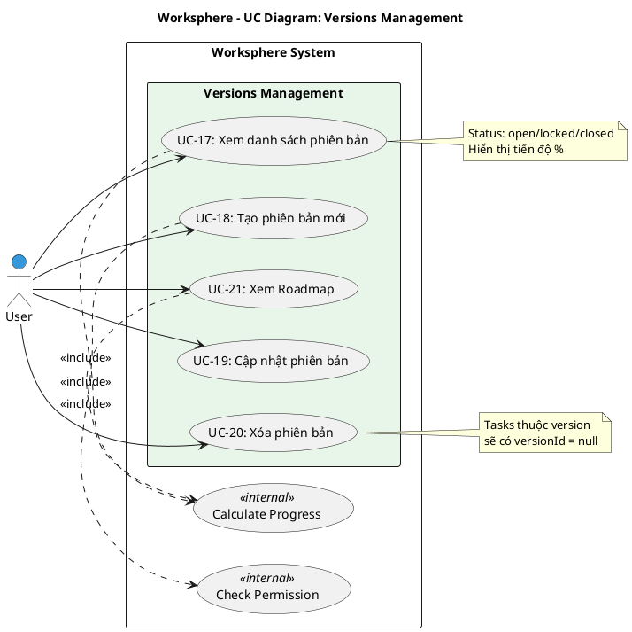

# Use Case Diagram 5: Quản lý Phiên bản (Versions/Milestones)

> **Module**: Versions | **Số UC**: 5 | **Ngày**: 2026-01-15

---

## 1. Actors

| Actor | Loại | Mô tả |
|-------|------|-------|
| **User** | Primary | Người dùng có quyền `projects.manage_versions` |

---

## 2. Use Case Diagram (PlantUML)

---

## 3. Bảng mô tả Use Cases

| UC ID | Tên Use Case | Actor | Mô tả |
|-------|--------------|-------|-------|
| UC-17 | Xem danh sách phiên bản | User | Xem versions với status, ngày, tiến độ |
| UC-18 | Tạo phiên bản mới | User | Tạo version với tên, mô tả, due date |
| UC-19 | Cập nhật phiên bản | User | Chỉnh sửa version: tên, mô tả, status |
| UC-20 | Xóa phiên bản | User | Xóa version (tasks liên quan set null) |
| UC-21 | Xem Roadmap | User | Xem lộ trình: versions, tasks, backlog |

---

## 4. Luồng sự kiện - UC-21: Xem Roadmap

**Tiền điều kiện:** User là member của project

**Luồng chính:**
1. User truy cập Roadmap (`/projects/[id]/roadmap`)
2. Hệ thống query tất cả versions của project
3. Với mỗi version, lấy tasks thuộc version đó
4. Tính tiến độ mỗi version (% tasks closed)
5. Lấy backlog (tasks không có version)
6. Hiển thị timeline với versions và tasks

**Hậu điều kiện:** Roadmap được hiển thị

---

## 5. Business Rules

| ID | Rule |
|----|------|
| BR-01 | Version status: open → locked → closed |
| BR-02 | Xóa version không xóa tasks, chỉ set versionId = null |
| BR-03 | Tiến độ = (closed tasks / total tasks) * 100 |

---

*Ngày tạo: 2026-01-15*
