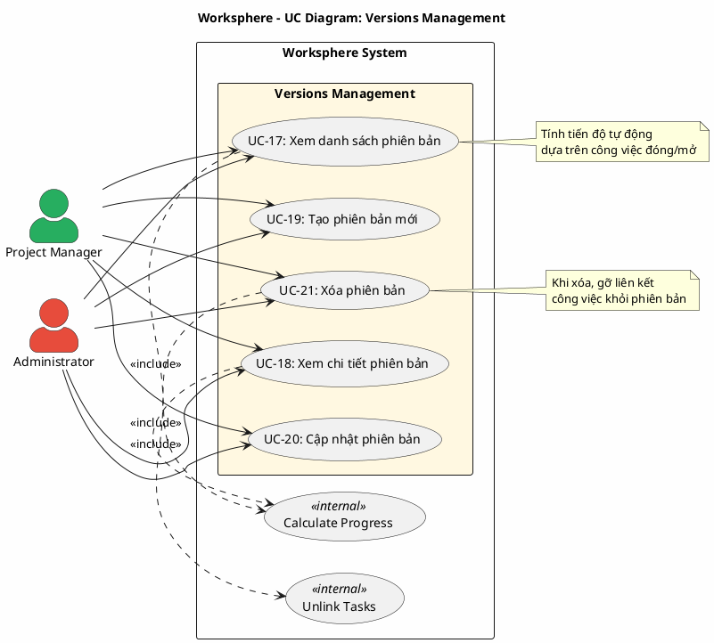

# Use Case Diagram 5: Quản lý Phiên bản (Versions Management)

> **Hệ thống**: Worksphere - Hệ thống Quản lý Công việc & Dự án  
> **Module**: Versions Management  
> **Phiên bản**: 1.0  
> **Ngày cập nhật**: 2026-01-16

---

## 1. Thông tin chung

| Thuộc tính | Giá trị |
|------------|---------|
| **Tên sơ đồ** | UC Diagram - Versions Management |
| **Mô tả** | Các chức năng quản lý phiên bản/mốc thời gian (milestone) của dự án |
| **Số Use Cases** | 5 |
| **Actors** | Project Manager, Administrator |
| **Source Files** | `src/app/api/projects/[id]/versions/route.ts`, `src/app/api/versions/[id]/route.ts` |

---

## 2. Actors (Tác nhân)

| Actor | Loại | Mô tả |
|-------|------|-------|
| **Project Manager** | Primary | Thành viên dự án có quyền `projects.manage_versions` |
| **Administrator** | Primary | Quản trị viên có toàn quyền quản lý phiên bản |

---

## 3. Use Case Diagram (PlantUML)

---

## 4. Bảng mô tả Use Cases

| UC ID | Tên Use Case | Actor | Mô tả |
|-------|--------------|-------|-------|
| UC-17 | Xem danh sách phiên bản | PM, Admin | Xem danh sách phiên bản của dự án với tiến độ |
| UC-18 | Xem chi tiết phiên bản | PM, Admin | Xem chi tiết phiên bản và danh sách công việc liên quan |
| UC-19 | Tạo phiên bản mới | PM, Admin | Tạo phiên bản/mốc thời gian mới cho dự án |
| UC-20 | Cập nhật phiên bản | PM, Admin | Chỉnh sửa thông tin phiên bản |
| UC-21 | Xóa phiên bản | PM, Admin | Xóa phiên bản và gỡ liên kết công việc |

---

## 5. Ma trận quan hệ

| Use Case | Include | Extend | Extended By |
|----------|---------|--------|-------------|
| UC-17: Xem danh sách | Calculate Progress | - | - |
| UC-18: Xem chi tiết | Calculate Progress | - | - |
| UC-19: Tạo phiên bản | - | - | - |
| UC-20: Cập nhật | - | - | - |
| UC-21: Xóa phiên bản | Unlink Tasks | - | - |

---

## 6. Đặc tả Use Case chi tiết

---

### USE CASE: UC-17 - Xem danh sách phiên bản

---

#### 1. Mô tả
Use Case này cho phép người dùng xem danh sách tất cả phiên bản (version/milestone) của dự án, bao gồm thông tin tiến độ hoàn thành được tính toán tự động.

#### 2. Tác nhân chính
- **User**: Thành viên của dự án.

#### 3. Tác nhân phụ
- *Không có*

#### 4. Tiền điều kiện
- Người dùng đã đăng nhập vào hệ thống.
- Người dùng là thành viên của dự án hoặc là Quản trị viên.

#### 5. Đảm bảo tối thiểu (Minimal Guarantee)
- Người dùng không thuộc dự án không thể xem danh sách phiên bản.

#### 6. Đảm bảo thành công (Success Guarantee)
- Danh sách phiên bản được hiển thị với tiến độ được tính toán chính xác.

#### 7. Chuỗi sự kiện chính (Main Flow)
1. Người dùng truy cập trang phiên bản của dự án.
2. Hệ thống kiểm tra quyền truy cập:
   - Là Quản trị viên: cho phép.
   - Là thành viên dự án: cho phép.
3. Hệ thống truy vấn danh sách phiên bản của dự án.
4. Với mỗi phiên bản, hệ thống tính toán:
   - Tổng số công việc liên kết
   - Số công việc đã đóng (trạng thái isClosed = true)
   - Phần trăm hoàn thành = (closedTasks / totalTasks) * 100
5. Hệ thống sắp xếp danh sách theo:
   - Trạng thái (open trước, locked, closed sau)
   - Ngày đến hạn (tăng dần)
   - Tên (thứ tự bảng chữ cái)
6. Hệ thống hiển thị danh sách phiên bản với thanh tiến độ.
7. Kết thúc Use Case.

#### 8. Luồng thay thế (Alternative Flow)
- *Không có*

#### 9. Luồng ngoại lệ (Exception Flow)

**E1: Không có quyền truy cập**
- Rẽ nhánh từ bước 2.
- Hệ thống từ chối với mã lỗi 403.
- Kết thúc Use Case.

#### 10. Ghi chú
- Tiến độ được tính dựa trên số lượng công việc có trạng thái "đóng".
- Phiên bản không có công việc nào sẽ có tiến độ 0%.

---

### USE CASE: UC-18 - Xem chi tiết phiên bản

---

#### 1. Mô tả
Use Case này cho phép người dùng xem thông tin chi tiết của một phiên bản bao gồm danh sách tất cả công việc được liên kết với phiên bản đó.

#### 2. Tác nhân chính
- **User**: Thành viên của dự án.

#### 3. Tác nhân phụ
- *Không có*

#### 4. Tiền điều kiện
- Người dùng đã đăng nhập vào hệ thống.
- Người dùng là thành viên dự án hoặc Quản trị viên.
- Phiên bản tồn tại trong hệ thống.

#### 5. Đảm bảo tối thiểu (Minimal Guarantee)
- Người dùng không có quyền sẽ không xem được chi tiết.

#### 6. Đảm bảo thành công (Success Guarantee)
- Thông tin chi tiết phiên bản và danh sách công việc được hiển thị.

#### 7. Chuỗi sự kiện chính (Main Flow)
1. Người dùng chọn phiên bản từ danh sách hoặc truy cập trực tiếp.
2. Hệ thống truy vấn thông tin phiên bản:
   - Tên, mô tả, trạng thái, ngày đến hạn
   - Thông tin dự án liên quan
3. Hệ thống truy vấn danh sách công việc liên kết với phiên bản:
   - Thông tin công việc: trạng thái, độ ưu tiên, người được gán, loại công việc
   - Sắp xếp theo: vị trí trạng thái tăng dần, độ ưu tiên giảm dần
4. Hệ thống kiểm tra quyền truy cập dự án của phiên bản.
5. Hệ thống tính toán:
   - Số công việc đã đóng
   - Tổng số công việc
   - Phần trăm tiến độ
6. Hệ thống hiển thị trang chi tiết phiên bản.
7. Kết thúc Use Case.

#### 8. Luồng thay thế (Alternative Flow)
- *Không có*

#### 9. Luồng ngoại lệ (Exception Flow)

**E1: Phiên bản không tồn tại**
- Rẽ nhánh từ bước 2.
- Hệ thống trả về mã lỗi 404.
- Hệ thống hiển thị: "Version không tồn tại".
- Kết thúc Use Case.

**E2: Không có quyền truy cập**
- Rẽ nhánh từ bước 4.
- Hệ thống từ chối với mã lỗi 403.
- Kết thúc Use Case.

#### 10. Ghi chú
- Danh sách công việc hiển thị đầy đủ thông tin để dễ dàng theo dõi.

---

### USE CASE: UC-19 - Tạo phiên bản mới

---

#### 1. Mô tả
Use Case này cho phép người có quyền tạo phiên bản/mốc thời gian mới cho dự án để phân chia công việc theo giai đoạn.

#### 2. Tác nhân chính
- **Project Manager**: Thành viên có quyền `projects.manage_versions`.
- **Administrator**: Quản trị viên hệ thống.

#### 3. Tác nhân phụ
- *Không có*

#### 4. Tiền điều kiện
- Người dùng đã đăng nhập vào hệ thống.
- Người dùng là Quản trị viên hoặc có quyền `projects.manage_versions` trong dự án.

#### 5. Đảm bảo tối thiểu (Minimal Guarantee)
- Nếu tạo thất bại, không có phiên bản nào được tạo.

#### 6. Đảm bảo thành công (Success Guarantee)
- Phiên bản mới được tạo trong dự án.
- Phiên bản có thể được gán cho công việc.

#### 7. Chuỗi sự kiện chính (Main Flow)
1. Người quản lý nhấn nút "Tạo phiên bản mới".
2. Hệ thống kiểm tra quyền `projects.manage_versions`:
   - Là Quản trị viên: cho phép.
   - Là thành viên có quyền: cho phép.
3. Hệ thống hiển thị biểu mẫu tạo phiên bản với các trường:
   - Tên phiên bản (bắt buộc, tối đa 100 ký tự)
   - Mô tả (tùy chọn)
   - Trạng thái (mặc định: open)
   - Ngày đến hạn (tùy chọn)
4. Người quản lý nhập thông tin.
5. Người quản lý nhấn nút "Tạo".
6. Hệ thống kiểm tra dữ liệu đầu vào.
7. Hệ thống tạo phiên bản mới trong cơ sở dữ liệu.
8. Hệ thống trả về thông tin phiên bản vừa tạo.
9. Hệ thống hiển thị thông báo thành công.
10. Kết thúc Use Case.

#### 8. Luồng thay thế (Alternative Flow)
- *Không có*

#### 9. Luồng ngoại lệ (Exception Flow)

**E1: Không có quyền tạo phiên bản**
- Rẽ nhánh từ bước 2.
- Hệ thống từ chối với mã lỗi 403.
- Hệ thống hiển thị: "Không có quyền tạo version".
- Kết thúc Use Case.

**E2: Thiếu tên phiên bản**
- Rẽ nhánh từ bước 6.
- Hệ thống hiển thị lỗi validation.
- Quay lại bước 3.

#### 10. Ghi chú
- Trạng thái phiên bản: `open` (đang mở), `locked` (khóa), `closed` (đóng).
- Phiên bản mới được tạo với trạng thái mặc định là "open".

---

### USE CASE: UC-20 - Cập nhật phiên bản

---

#### 1. Mô tả
Use Case này cho phép người có quyền chỉnh sửa thông tin của phiên bản bao gồm tên, mô tả, trạng thái và ngày đến hạn.

#### 2. Tác nhân chính
- **Project Manager**: Thành viên có quyền `projects.manage_versions`.
- **Administrator**: Quản trị viên hệ thống.

#### 3. Tác nhân phụ
- *Không có*

#### 4. Tiền điều kiện
- Người dùng đã đăng nhập vào hệ thống.
- Người dùng có quyền `projects.manage_versions` hoặc là Quản trị viên.
- Phiên bản tồn tại trong hệ thống.

#### 5. Đảm bảo tối thiểu (Minimal Guarantee)
- Nếu cập nhật thất bại, thông tin phiên bản không bị thay đổi.

#### 6. Đảm bảo thành công (Success Guarantee)
- Thông tin phiên bản được cập nhật thành công.

#### 7. Chuỗi sự kiện chính (Main Flow)
1. Người quản lý chọn phiên bản cần sửa.
2. Hệ thống kiểm tra phiên bản tồn tại.
3. Hệ thống kiểm tra quyền `projects.manage_versions` trong dự án chứa phiên bản.
4. Hệ thống hiển thị biểu mẫu chỉnh sửa với thông tin hiện tại.
5. Người quản lý chỉnh sửa thông tin.
6. Người quản lý nhấn nút "Lưu".
7. Hệ thống cập nhật thông tin phiên bản.
8. Hệ thống hiển thị thông báo thành công.
9. Kết thúc Use Case.

#### 8. Luồng thay thế (Alternative Flow)

**A1: Thay đổi trạng thái phiên bản**
- Rẽ nhánh từ bước 5.
- Người quản lý thay đổi trạng thái: open → locked → closed.
- Tiếp tục từ bước 6.

#### 9. Luồng ngoại lệ (Exception Flow)

**E1: Phiên bản không tồn tại**
- Rẽ nhánh từ bước 2.
- Hệ thống trả về mã lỗi 404.
- Kết thúc Use Case.

**E2: Không có quyền sửa**
- Rẽ nhánh từ bước 3.
- Hệ thống từ chối với mã lỗi 403.
- Kết thúc Use Case.

#### 10. Ghi chú
- Thay đổi trạng thái phiên bản không ảnh hưởng đến công việc liên kết.

---

### USE CASE: UC-21 - Xóa phiên bản

---

#### 1. Mô tả
Use Case này cho phép người có quyền xóa phiên bản khỏi hệ thống. Khi xóa, tất cả công việc liên kết với phiên bản sẽ được gỡ liên kết (không xóa công việc).

#### 2. Tác nhân chính
- **Project Manager**: Thành viên có quyền `projects.manage_versions`.
- **Administrator**: Quản trị viên hệ thống.

#### 3. Tác nhân phụ
- *Không có*

#### 4. Tiền điều kiện
- Người dùng đã đăng nhập vào hệ thống.
- Người dùng có quyền `projects.manage_versions` hoặc là Quản trị viên.
- Phiên bản tồn tại trong hệ thống.

#### 5. Đảm bảo tối thiểu (Minimal Guarantee)
- Yêu cầu xác nhận trước khi xóa.
- Công việc liên kết không bị xóa, chỉ gỡ liên kết.

#### 6. Đảm bảo thành công (Success Guarantee)
- Phiên bản bị xóa khỏi hệ thống.
- Công việc liên kết có versionId = null.

#### 7. Chuỗi sự kiện chính (Main Flow)
1. Người quản lý chọn phiên bản cần xóa.
2. Người quản lý nhấn nút "Xóa".
3. Hệ thống hiển thị hộp thoại xác nhận, cảnh báo về số công việc liên kết.
4. Người quản lý xác nhận xóa.
5. Hệ thống kiểm tra phiên bản tồn tại.
6. Hệ thống kiểm tra quyền `projects.manage_versions`.
7. Nếu có công việc liên kết:
   - Hệ thống cập nhật versionId = null cho tất cả công việc liên kết.
8. Hệ thống xóa phiên bản khỏi cơ sở dữ liệu.
9. Hệ thống hiển thị thông báo: "Đã xóa version".
10. Hệ thống cập nhật danh sách phiên bản.
11. Kết thúc Use Case.

#### 8. Luồng thay thế (Alternative Flow)

**A1: Hủy xác nhận**
- Rẽ nhánh từ bước 4.
- Người quản lý nhấn "Hủy".
- Kết thúc Use Case mà không xóa.

#### 9. Luồng ngoại lệ (Exception Flow)

**E1: Phiên bản không tồn tại**
- Rẽ nhánh từ bước 5.
- Hệ thống trả về mã lỗi 404.
- Kết thúc Use Case.

**E2: Không có quyền xóa**
- Rẽ nhánh từ bước 6.
- Hệ thống từ chối với mã lỗi 403.
- Kết thúc Use Case.

#### 10. Ghi chú
- Xóa phiên bản KHÔNG xóa công việc liên kết.
- Công việc sẽ có versionId = null sau khi xóa phiên bản.

---

## 7. Business Rules

| ID | Rule | Mô tả |
|----|------|-------|
| BR-01 | Permission Check | Quyền quản lý phiên bản: Admin hoặc có `projects.manage_versions` |
| BR-02 | Version Status | Trạng thái phiên bản: open, locked, closed |
| BR-03 | Auto Progress | Tiến độ tự động tính = (công việc đóng / tổng công việc) × 100% |
| BR-04 | Unlink on Delete | Khi xóa phiên bản, công việc được gỡ liên kết (không xóa) |
| BR-05 | Default Status | Phiên bản mới có trạng thái mặc định là "open" |

---

## 8. Validation Checklist

- [x] Mọi UC đều nằm trong System Boundary
- [x] Mọi Actor đều nằm ngoài System Boundary
- [x] Tên UC là động từ + bổ ngữ
- [x] Include: Mũi tên từ UC gốc → UC con
- [x] Không có UC "lơ lửng"
- [x] Đã mô tả đầy đủ luồng chính, thay thế và ngoại lệ
- [x] Đặc tả theo format chuẩn 10 mục
- [x] Đã đối chiếu với source code thực tế

---

*Tài liệu được tạo dựa trên phân tích mã nguồn Worksphere*  
*Ngày cập nhật: 2026-01-16*
