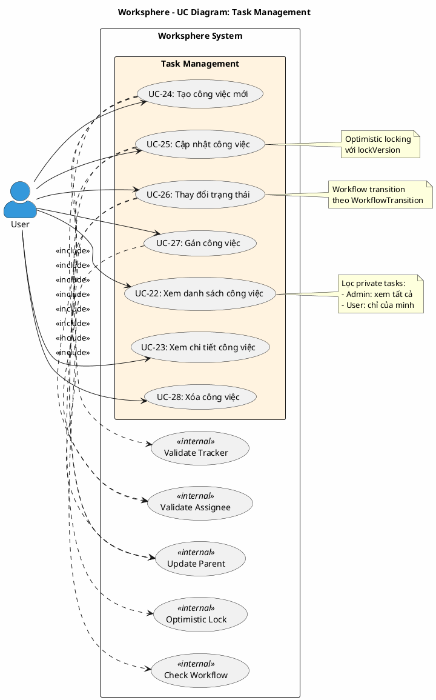

# Use Case Diagram 6: Quản lý Công việc (Task Management)

> **Hệ thống**: Worksphere - Hệ thống Quản lý Công việc & Dự án  
> **Module**: Task Management  
> **Phiên bản**: 1.0  
> **Ngày cập nhật**: 2026-01-16

---

## 1. Thông tin chung

| Thuộc tính | Giá trị |
|------------|---------|
| **Tên sơ đồ** | UC Diagram - Task Management |
| **Mô tả** | Các chức năng quản lý công việc: xem danh sách, chi tiết, tạo, cập nhật, thay đổi trạng thái, gán, xóa |
| **Số Use Cases** | 7 |
| **Actors** | User |
| **Source Files** | `src/app/api/tasks/route.ts`, `src/app/api/tasks/[id]/route.ts` |

---

## 2. Actors (Tác nhân)

| Actor | Loại | Mô tả |
|-------|------|-------|
| **User** | Primary | Thành viên dự án có quyền tương ứng với từng thao tác |

---

## 3. Use Case Diagram (PlantUML)

---

## 4. Bảng mô tả Use Cases

| UC ID | Tên Use Case | Actor | Mô tả |
|-------|--------------|-------|-------|
| UC-22 | Xem danh sách công việc | User | Xem danh sách công việc với filter, search, pagination và aggregations |
| UC-23 | Xem chi tiết công việc | User | Xem đầy đủ thông tin: thuộc tính, subtasks, comments, attachments, history |
| UC-24 | Tạo công việc mới | User | Tạo task/subtask với validation tracker, assignee, hierarchy |
| UC-25 | Cập nhật công việc | User | Cập nhật thông tin với optimistic locking và auto doneRatio |
| UC-26 | Thay đổi trạng thái | User | Chuyển status theo workflow với auto doneRatio |
| UC-27 | Gán công việc | User | Gán task cho thành viên với kiểm tra canAssignToOther |
| UC-28 | Xóa công việc | User | Xóa task, cập nhật subtasks thành root level |

---

## 5. Ma trận quan hệ

| Use Case | Include | Extend | Extended By |
|----------|---------|--------|-------------|
| UC-22: Xem danh sách | - | - | - |
| UC-23: Xem chi tiết | - | - | - |
| UC-24: Tạo công việc | Validate Tracker, Validate Assignee, Update Parent | - | - |
| UC-25: Cập nhật | Optimistic Lock, Update Parent | - | - |
| UC-26: Thay đổi trạng thái | Check Workflow, Update Parent | - | - |
| UC-27: Gán công việc | Validate Assignee | - | - |
| UC-28: Xóa công việc | - | - | - |

---

## 6. Đặc tả Use Case chi tiết

---

### USE CASE: UC-22 - Xem danh sách công việc

---

#### 1. Mô tả
Use Case này cho phép người dùng xem danh sách công việc trong các dự án mà họ có quyền truy cập, với các tính năng lọc, tìm kiếm, phân trang và tổng hợp dữ liệu.

#### 2. Tác nhân chính
- **User**: Thành viên dự án có quyền `tasks.view_project`.

#### 3. Tác nhân phụ
- *Không có*

#### 4. Tiền điều kiện
- Người dùng đã đăng nhập vào hệ thống.

#### 5. Đảm bảo tối thiểu (Minimal Guarantee)
- Người dùng chỉ xem được công việc trong dự án họ có quyền `tasks.view_project`.
- Công việc riêng tư (private) chỉ hiện với người tạo và người được gán.

#### 6. Đảm bảo thành công (Success Guarantee)
- Danh sách công việc phù hợp với quyền và bộ lọc được hiển thị.
- Thông tin tổng hợp (aggregations) được tính toán chính xác.

#### 7. Chuỗi sự kiện chính (Main Flow)
1. Người dùng truy cập trang danh sách công việc.
2. Hệ thống xác định danh sách dự án người dùng có quyền `tasks.view_project`:
   - Nếu là Quản trị viên: tất cả dự án.
   - Nếu không: chỉ dự án có quyền tương ứng.
3. Nếu người dùng chỉ định dự án cụ thể, hệ thống kiểm tra quyền truy cập.
4. Hệ thống xây dựng bộ lọc công việc riêng tư:
   - Nếu là Quản trị viên: xem tất cả công việc.
   - Nếu không: chỉ xem công việc không riêng tư HOẶC công việc riêng tư do mình tạo/được gán.
5. Hệ thống áp dụng các bộ lọc từ tham số:
   - Trạng thái, độ ưu tiên, loại công việc
   - Người được gán, người tạo
   - Phiên bản, công việc cha
   - Trạng thái đóng/mở
   - Tìm kiếm văn bản (tiêu đề, mô tả)
   - Khoảng ngày bắt đầu, ngày đến hạn
   - Bộ lọc nhanh: "Của tôi", "Được gán cho tôi", "Tôi tạo"
6. Hệ thống thực hiện truy vấn song song:
   - Lấy danh sách công việc với phân trang và includes đầy đủ
   - Đếm tổng số công việc
   - Tính tổng số giờ ước tính
7. Hệ thống trả về danh sách công việc với:
   - Thông tin đầy đủ: tracker, status, priority, project, assignee, creator, version
   - Danh sách subtasks, attachments
   - Số lượng subtasks và comments
   - Thông tin phân trang và aggregations
8. Hệ thống hiển thị danh sách công việc.
9. Kết thúc Use Case.

#### 8. Luồng thay thế (Alternative Flow)

**A1: Người dùng áp dụng bộ lọc**
- Rẽ nhánh từ bước 8.
- Người dùng thay đổi bộ lọc (trạng thái, độ ưu tiên, v.v.).
- Hệ thống truy vấn lại với bộ lọc mới.
- Tiếp tục từ bước 6.

**A2: Người dùng sắp xếp danh sách**
- Rẽ nhánh từ bước 8.
- Người dùng chọn tiêu chí sắp xếp và hướng (tăng/giảm).
- Hệ thống truy vấn lại với sắp xếp mới.
- Tiếp tục từ bước 6.

**A3: Người dùng chuyển trang**
- Rẽ nhánh từ bước 8.
- Người dùng chọn trang khác.
- Hệ thống truy vấn trang mới.
- Tiếp tục từ bước 6.

#### 9. Luồng ngoại lệ (Exception Flow)

**E1: Không có quyền truy cập dự án được chỉ định**
- Rẽ nhánh từ bước 3.
- Hệ thống từ chối với mã lỗi 403.
- Hệ thống hiển thị: "Bạn không có quyền xem công việc trong dự án này".
- Kết thúc Use Case.

**E2: Không có dự án nào có quyền truy cập**
- Rẽ nhánh từ bước 2.
- Hệ thống trả về danh sách rỗng.
- Hệ thống hiển thị thông báo: "Bạn chưa tham gia dự án nào".
- Kết thúc Use Case.

#### 10. Ghi chú
- Quyền `tasks.view_project` (View Issues) quyết định dự án nào người dùng được xem.
- Sắp xếp mặc định theo thời gian cập nhật giảm dần.
- Kích thước trang tối đa 100 công việc.
- Aggregations bao gồm tổng số giờ ước tính của các công việc trong bộ lọc.

---

### USE CASE: UC-23 - Xem chi tiết công việc

---

#### 1. Mô tả
Use Case này cho phép người dùng xem thông tin chi tiết đầy đủ của một công việc bao gồm tất cả thuộc tính, subtasks, comments, attachments, watchers và các liên kết.

#### 2. Tác nhân chính
- **User**: Thành viên của dự án chứa công việc.

#### 3. Tác nhân phụ
- *Không có*

#### 4. Tiền điều kiện
- Người dùng đã đăng nhập vào hệ thống.
- Người dùng là thành viên dự án hoặc Quản trị viên.

#### 5. Đảm bảo tối thiểu (Minimal Guarantee)
- Người dùng không có quyền truy cập sẽ bị từ chối.

#### 6. Đảm bảo thành công (Success Guarantee)
- Thông tin chi tiết công việc được hiển thị đầy đủ.

#### 7. Chuỗi sự kiện chính (Main Flow)
1. Người dùng chọn công việc từ danh sách hoặc truy cập trực tiếp qua URL.
2. Hệ thống phân giải ID công việc:
   - Nếu là số: tìm theo số thứ tự (number)
   - Nếu là CUID: tìm theo ID
3. Hệ thống kiểm tra quyền truy cập:
   - Là Quản trị viên: cho phép.
   - Là thành viên dự án chứa công việc: cho phép.
4. Hệ thống truy vấn thông tin chi tiết công việc bao gồm:
   - Thông tin cơ bản: tiêu đề, mô tả, doneRatio, estimatedHours, lockVersion, isPrivate
   - Liên kết: tracker, status, priority, project, assignee, creator, version
   - Công việc cha (parent)
   - Danh sách subtasks với thông tin trạng thái, độ ưu tiên, người được gán
   - Danh sách comments sắp xếp theo thời gian tạo tăng dần
   - Danh sách attachments sắp xếp theo thời gian tạo giảm dần
   - Danh sách watchers
   - Các liên kết công việc (relations)
5. Hệ thống hiển thị trang chi tiết công việc.
6. Kết thúc Use Case.

#### 8. Luồng thay thế (Alternative Flow)

**A1: Truy cập bằng số thứ tự**
- Rẽ nhánh từ bước 1.
- Người dùng truy cập qua URL dạng `/tasks/42` (số thứ tự).
- Hệ thống tìm công việc bằng trường number thay vì id.
- Tiếp tục từ bước 3.

#### 9. Luồng ngoại lệ (Exception Flow)

**E1: Công việc không tồn tại**
- Rẽ nhánh từ bước 2.
- Hệ thống trả về mã lỗi 404.
- Hệ thống hiển thị: "Công việc không tồn tại".
- Kết thúc Use Case.

**E2: Không có quyền truy cập**
- Rẽ nhánh từ bước 3.
- Hệ thống từ chối với mã lỗi 403.
- Hệ thống hiển thị: "Không có quyền truy cập".
- Kết thúc Use Case.

#### 10. Ghi chú
- Hỗ trợ truy cập cả bằng CUID và số thứ tự (number) để thuận tiện.
- Quyền truy cập chỉ yêu cầu là thành viên dự án, không cần quyền cụ thể.

---

### USE CASE: UC-24 - Tạo công việc mới

---

#### 1. Mô tả
Use Case này cho phép người dùng có quyền tạo công việc mới trong dự án, bao gồm cả công việc con (subtask). Hệ thống tự động xác thực tracker, assignee, và tính toán hierarchy.

#### 2. Tác nhân chính
- **User**: Thành viên dự án có quyền `tasks.create` (Add Issues).

#### 3. Tác nhân phụ
- *Không có*

#### 4. Tiền điều kiện
- Người dùng đã đăng nhập vào hệ thống.
- Người dùng có quyền `tasks.create` trong dự án đích.

#### 5. Đảm bảo tối thiểu (Minimal Guarantee)
- Nếu tạo thất bại, không có công việc nào được tạo.
- Dữ liệu luôn được validate trước khi lưu.

#### 6. Đảm bảo thành công (Success Guarantee)
- Công việc mới được tạo trong dự án.
- Số thứ tự (number) được tự động gán.
- Hierarchy (level, path) được tính toán nếu có công việc cha.
- Thông báo được gửi cho người được gán (nếu có).
- Nhật ký hoạt động được ghi lại.
- Thuộc tính công việc cha được cập nhật (nếu có).

#### 7. Chuỗi sự kiện chính (Main Flow)
1. Người dùng nhấn nút "Tạo công việc mới".
2. Hệ thống kiểm tra quyền `tasks.create` trong dự án.
3. Hệ thống hiển thị biểu mẫu tạo công việc với các trường:
   - Tiêu đề (bắt buộc, tối đa 200 ký tự)
   - Mô tả (tùy chọn)
   - Loại công việc - Tracker (bắt buộc)
   - Trạng thái (bắt buộc)
   - Độ ưu tiên (bắt buộc)
   - Người được gán (tùy chọn)
   - Phiên bản (tùy chọn)
   - Công việc cha (tùy chọn)
   - Ngày bắt đầu, ngày đến hạn (tùy chọn)
   - Số giờ ước tính, phần trăm hoàn thành (tùy chọn)
   - Riêng tư (tùy chọn, mặc định false)
4. Người dùng nhập thông tin và nhấn "Tạo".
5. Hệ thống validate Tracker:
   - Kiểm tra tracker được kích hoạt cho dự án (ProjectTracker).
   - Kiểm tra tracker được phép cho vai trò của người dùng (RoleTracker) - trừ admin.
6. Nếu có người được gán, hệ thống validate Assignee:
   - Kiểm tra người được gán là thành viên dự án.
   - Nếu gán cho người khác (không phải mình): kiểm tra quyền `canAssignToOther`.
7. Nếu có công việc cha, hệ thống validate và tính toán hierarchy:
   - Kiểm tra công việc cha tồn tại.
   - Kiểm tra công việc cha thuộc cùng dự án.
   - Kiểm tra độ sâu không vượt quá 5 cấp (level < 4).
   - Tính toán level = parent.level + 1.
   - Tính toán path = parent.path + "." + parent.id.
8. Hệ thống tạo công việc trong cơ sở dữ liệu với:
   - creatorId = người dùng hiện tại
   - Các giá trị mặc định: doneRatio = 0, isPrivate = false
9. Nếu người được gán khác người tạo, hệ thống gửi thông báo.
10. Hệ thống ghi nhật ký hoạt động (action: created).
11. Nếu có công việc cha, hệ thống cập nhật thuộc tính công việc cha (roll-up).
12. Hệ thống trả về công việc vừa tạo.
13. Kết thúc Use Case.

#### 8. Luồng thay thế (Alternative Flow)

**A1: Tạo công việc con (Subtask)**
- Rẽ nhánh từ bước 4.
- Người dùng chọn công việc cha từ dropdown.
- Tiếp tục từ bước 5.

#### 9. Luồng ngoại lệ (Exception Flow)

**E1: Không có quyền tạo công việc**
- Rẽ nhánh từ bước 2.
- Hệ thống từ chối với mã lỗi 403.
- Hệ thống hiển thị: "Bạn không có quyền thêm công việc vào dự án này".
- Kết thúc Use Case.

**E2: Tracker không được kích hoạt cho dự án**
- Rẽ nhánh từ bước 5.
- Hệ thống hiển thị lỗi: "Tracker này không được kích hoạt cho dự án hiện tại".
- Quay lại bước 3.

**E3: Tracker không được phép cho vai trò**
- Rẽ nhánh từ bước 5.
- Hệ thống hiển thị lỗi: "Tracker không được hỗ trợ trong dự án này".
- Quay lại bước 3.

**E4: Người được gán không phải thành viên**
- Rẽ nhánh từ bước 6.
- Hệ thống hiển thị lỗi: "Người thực hiện không phải là thành viên của dự án này".
- Quay lại bước 3.

**E5: Không có quyền gán cho người khác**
- Rẽ nhánh từ bước 6.
- Hệ thống từ chối với mã lỗi 403.
- Hệ thống hiển thị: "Bạn không có quyền giao việc cho người khác".
- Quay lại bước 3.

**E6: Công việc cha không tồn tại**
- Rẽ nhánh từ bước 7.
- Hệ thống hiển thị lỗi: "Không tìm thấy công việc cha".
- Quay lại bước 3.

**E7: Công việc cha khác dự án**
- Rẽ nhánh từ bước 7.
- Hệ thống hiển thị lỗi: "Công việc cha phải thuộc cùng một dự án".
- Quay lại bước 3.

**E8: Vượt quá độ sâu tối đa**
- Rẽ nhánh từ bước 7.
- Hệ thống hiển thị lỗi: "Vượt quá độ sâu tối đa của công việc con (tối đa 5 cấp)".
- Quay lại bước 3.

#### 10. Ghi chú
- Quyền `tasks.create` = "Add Issues" trong hệ thống quyền.
- Quyền `canAssignToOther` là thuộc tính boolean của Role, yêu cầu giá trị true tường minh.
- Hierarchy: level tối đa = 4 (tính từ 0), nghĩa là tối đa 5 cấp.
- Path format: "grandparent.parent" (không bao gồm bản thân).

---

### USE CASE: UC-25 - Cập nhật công việc

---

#### 1. Mô tả
Use Case này cho phép người dùng có quyền chỉnh sửa thông tin của công việc. Hệ thống sử dụng cơ chế Optimistic Locking để tránh xung đột khi nhiều người cùng sửa.

#### 2. Tác nhân chính
- **User**: Người dùng có quyền chỉnh sửa công việc.

#### 3. Tác nhân phụ
- *Không có*

#### 4. Tiền điều kiện
- Người dùng đã đăng nhập vào hệ thống.
- Công việc tồn tại trong hệ thống.
- Người dùng có một trong các quyền:
  - `tasks.edit_any`: Chỉnh sửa bất kỳ công việc nào
  - `tasks.edit_own`: Chỉnh sửa công việc do mình tạo
  - `tasks.edit_assigned`: Chỉnh sửa công việc được gán cho mình
  - Là Quản trị viên

#### 5. Đảm bảo tối thiểu (Minimal Guarantee)
- Nếu cập nhật thất bại, dữ liệu công việc không bị thay đổi.
- Xung đột version được phát hiện và thông báo.

#### 6. Đảm bảo thành công (Success Guarantee)
- Công việc được cập nhật thành công.
- lockVersion được tăng lên 1.
- Thông báo được gửi cho các bên liên quan.
- Nhật ký hoạt động được ghi lại với chi tiết thay đổi.
- Thuộc tính công việc cha được cập nhật nếu cần.

#### 7. Chuỗi sự kiện chính (Main Flow)
1. Người dùng mở trang chỉnh sửa công việc.
2. Hệ thống kiểm tra quyền chỉnh sửa theo thứ tự ưu tiên:
   - Là Quản trị viên: cho phép.
   - Có quyền `tasks.edit_any`: cho phép.
   - Là người tạo VÀ có quyền `tasks.edit_own`: cho phép.
   - Là người được gán VÀ có quyền `tasks.edit_assigned`: cho phép.
3. Hệ thống hiển thị biểu mẫu với thông tin hiện tại và lockVersion.
4. Người dùng chỉnh sửa thông tin.
5. Người dùng nhấn nút "Lưu".
6. Hệ thống kiểm tra Optimistic Lock:
   - So sánh lockVersion gửi lên với lockVersion trong database.
   - Nếu khác nhau: báo lỗi xung đột.
7. Nếu thay đổi trạng thái, hệ thống kiểm tra workflow (xem UC-26).
8. Nếu thay đổi tracker, hệ thống validate:
   - Tracker được kích hoạt cho dự án
   - Tracker được phép cho vai trò người dùng
9. Nếu thay đổi người được gán, hệ thống validate (xem UC-27).
10. Nếu thay đổi công việc cha, hệ thống:
    - Validate như khi tạo mới
    - Kiểm tra không tạo vòng lặp (không thể là cha của chính mình)
    - Tính toán lại level và path
11. Xử lý tự động doneRatio theo trạng thái:
    - Nếu trạng thái đóng (isClosed = true): FORCE doneRatio = 100
    - Nếu chuyển từ đóng sang mở: reset doneRatio về mặc định hoặc 0
12. Hệ thống cập nhật công việc với lockVersion tăng 1.
13. Hệ thống cập nhật thuộc tính:
    - Công việc cha hiện tại (nếu có)
    - Công việc cha cũ (nếu đã thay đổi)
    - Path/level của tất cả subtasks (nếu parent thay đổi)
14. Hệ thống gửi thông báo:
    - Nếu người được gán thay đổi: thông báo cho người mới
    - Nếu trạng thái thay đổi: thông báo cho watchers
15. Hệ thống ghi nhật ký với chi tiết thay đổi (giá trị cũ và mới).
16. Hệ thống trả về công việc đã cập nhật.
17. Kết thúc Use Case.

#### 8. Luồng thay thế (Alternative Flow)

**A1: Chỉ cập nhật doneRatio**
- Rẽ nhánh từ bước 4.
- Người dùng chỉ thay đổi phần trăm hoàn thành.
- Tiếp tục từ bước 5.

#### 9. Luồng ngoại lệ (Exception Flow)

**E1: Không có quyền chỉnh sửa**
- Rẽ nhánh từ bước 2.
- Hệ thống từ chối với mã lỗi 403.
- Hệ thống hiển thị: "Không có quyền sửa task này".
- Kết thúc Use Case.

**E2: Xung đột Optimistic Lock**
- Rẽ nhánh từ bước 6.
- Hệ thống trả về mã lỗi 409 (Conflict).
- Hệ thống hiển thị: "Dữ liệu đã bị thay đổi bởi người khác. Vui lòng tải lại trang."
- Kết thúc Use Case.

**E3: Workflow không cho phép chuyển trạng thái**
- Rẽ nhánh từ bước 7.
- Hệ thống từ chối với mã lỗi 403.
- Hệ thống hiển thị: "Không được phép chuyển sang trạng thái này theo quy trình làm việc (Workflow)".
- Quay lại bước 3.

**E4: Công việc không thể là cha của chính mình**
- Rẽ nhánh từ bước 10.
- Hệ thống hiển thị lỗi: "Công việc không thể là công việc cha của chính nó".
- Quay lại bước 3.

#### 10. Ghi chú
- Optimistic Locking sử dụng trường `lockVersion` để phát hiện xung đột.
- Quy tắc doneRatio: Trạng thái đóng luôn có doneRatio = 100% (Redmine standard).
- 3 loại quyền chỉnh sửa: `edit_any`, `edit_own`, `edit_assigned` - theo thứ tự ưu tiên.

---

### USE CASE: UC-26 - Thay đổi trạng thái

---

#### 1. Mô tả
Use Case này cho phép người dùng thay đổi trạng thái công việc theo các chuyển đổi được phép trong Workflow. Hệ thống tự động điều chỉnh phần trăm hoàn thành khi trạng thái thay đổi.

#### 2. Tác nhân chính
- **User**: Người dùng có quyền chỉnh sửa công việc.

#### 3. Tác nhân phụ
- *Không có*

#### 4. Tiền điều kiện
- Người dùng đã đăng nhập vào hệ thống.
- Người dùng có quyền chỉnh sửa công việc.
- Công việc tồn tại trong hệ thống.

#### 5. Đảm bảo tối thiểu (Minimal Guarantee)
- Chỉ các chuyển đổi được phép trong workflow mới được thực hiện.

#### 6. Đảm bảo thành công (Success Guarantee)
- Trạng thái công việc được cập nhật.
- doneRatio được tự động điều chỉnh theo quy tắc business.
- Thông báo được gửi cho watchers.
- Thuộc tính công việc cha được cập nhật.

#### 7. Chuỗi sự kiện chính (Main Flow)
1. Người dùng mở chi tiết hoặc chỉnh sửa công việc.
2. Người dùng chọn trạng thái mới từ dropdown.
3. Hệ thống kiểm tra quyền chỉnh sửa công việc.
4. Hệ thống kiểm tra workflow transition:
   - Là Quản trị viên: bỏ qua kiểm tra workflow.
   - Truy vấn WorkflowTransition với:
     - trackerId = tracker của công việc
     - fromStatusId = trạng thái hiện tại
     - toStatusId = trạng thái mới
     - roleId = NULL (áp dụng cho tất cả vai trò) HOẶC roleId của người dùng trong dự án
5. Hệ thống cập nhật trạng thái công việc.
6. Hệ thống điều chỉnh doneRatio tự động:
   - Nếu trạng thái mới là đóng (isClosed = true): doneRatio = 100
   - Nếu chuyển từ đóng sang mở: doneRatio = defaultDoneRatio của trạng thái mới hoặc 0
   - Nếu không: giữ nguyên hoặc dùng defaultDoneRatio nếu không được set
7. Hệ thống gửi thông báo thay đổi trạng thái cho watchers.
8. Hệ thống cập nhật thuộc tính công việc cha.
9. Hệ thống ghi nhật ký hoạt động.
10. Kết thúc Use Case.

#### 8. Luồng thay thế (Alternative Flow)
- *Không có*

#### 9. Luồng ngoại lệ (Exception Flow)

**E1: Workflow không cho phép chuyển đổi**
- Rẽ nhánh từ bước 4.
- Hệ thống từ chối với mã lỗi 403.
- Hệ thống hiển thị: "Không được phép chuyển sang trạng thái này theo quy trình làm việc (Workflow)".
- Kết thúc Use Case.

#### 10. Ghi chú
- WorkflowTransition với roleId = NULL áp dụng cho TẤT CẢ vai trò.
- Quy tắc Redmine: Trạng thái đóng LUÔN có doneRatio = 100%.
- Khi mở lại công việc đã đóng, doneRatio được reset.

---

### USE CASE: UC-27 - Gán công việc

---

#### 1. Mô tả
Use Case này cho phép người dùng gán công việc cho một thành viên trong dự án. Việc gán cho người khác yêu cầu quyền đặc biệt.

#### 2. Tác nhân chính
- **User**: Người dùng có quyền chỉnh sửa công việc.

#### 3. Tác nhân phụ
- *Không có*

#### 4. Tiền điều kiện
- Người dùng đã đăng nhập vào hệ thống.
- Người dùng có quyền chỉnh sửa công việc.

#### 5. Đảm bảo tối thiểu (Minimal Guarantee)
- Người được gán phải là thành viên dự án.
- Quyền gán cho người khác được kiểm tra.

#### 6. Đảm bảo thành công (Success Guarantee)
- Công việc được gán cho thành viên được chọn.
- Thông báo được gửi cho người được gán mới.

#### 7. Chuỗi sự kiện chính (Main Flow)
1. Người dùng mở chi tiết hoặc chỉnh sửa công việc.
2. Người dùng chọn người thực hiện từ dropdown.
3. Hệ thống kiểm tra người được chọn là thành viên dự án.
4. Nếu gán cho người khác (không phải chính mình):
   - Hệ thống kiểm tra quyền `canAssignToOther` của vai trò người dùng.
   - Yêu cầu giá trị boolean `true` tường minh.
5. Người dùng lưu thay đổi.
6. Hệ thống cập nhật assigneeId của công việc.
7. Nếu người được gán khác người thực hiện thao tác:
   - Hệ thống gửi thông báo cho người được gán mới.
8. Kết thúc Use Case.

#### 8. Luồng thay thế (Alternative Flow)

**A1: Gán cho chính mình**
- Rẽ nhánh từ bước 4.
- Người dùng chọn chính mình.
- Bỏ qua kiểm tra quyền `canAssignToOther`.
- Tiếp tục từ bước 5.

**A2: Bỏ gán (Unassign)**
- Rẽ nhánh từ bước 2.
- Người dùng chọn "Không chọn" (null).
- Tiếp tục từ bước 5.

#### 9. Luồng ngoại lệ (Exception Flow)

**E1: Người được gán không phải thành viên**
- Rẽ nhánh từ bước 3.
- Hệ thống hiển thị lỗi: "Người thực hiện không phải là thành viên của dự án này".
- Quay lại bước 1.

**E2: Không có quyền gán cho người khác**
- Rẽ nhánh từ bước 4.
- Hệ thống từ chối với mã lỗi 403.
- Hệ thống hiển thị: "Bạn không có quyền giao việc cho người khác".
- Quay lại bước 1.

#### 10. Ghi chú
- Quyền `canAssignToOther` là thuộc tính của Role, không phải Permission.
- Kiểm tra tường minh: phải là `true`, không phải truthy value.
- Gán cho chính mình luôn được phép nếu có quyền sửa công việc.

---

### USE CASE: UC-28 - Xóa công việc

---

#### 1. Mô tả
Use Case này cho phép người tạo công việc hoặc Quản trị viên xóa công việc khỏi hệ thống. Khi xóa, các công việc con sẽ được chuyển lên cấp gốc.

#### 2. Tác nhân chính
- **User**: Người tạo công việc.
- **Administrator**: Quản trị viên hệ thống.

#### 3. Tác nhân phụ
- *Không có*

#### 4. Tiền điều kiện
- Người dùng đã đăng nhập vào hệ thống.
- Người dùng là người tạo công việc hoặc Quản trị viên.
- Công việc tồn tại trong hệ thống.

#### 5. Đảm bảo tối thiểu (Minimal Guarantee)
- Yêu cầu xác nhận trước khi xóa.
- Công việc con không bị xóa theo.

#### 6. Đảm bảo thành công (Success Guarantee)
- Công việc bị xóa khỏi hệ thống.
- Dữ liệu liên quan (comments, attachments, watchers) bị xóa.
- Công việc con được chuyển lên cấp gốc (parentId = null, level = 0).
- Thuộc tính công việc cha cũ được cập nhật.
- Nhật ký hoạt động được ghi lại.

#### 7. Chuỗi sự kiện chính (Main Flow)
1. Người dùng mở chi tiết công việc.
2. Người dùng nhấn nút "Xóa".
3. Hệ thống hiển thị hộp thoại xác nhận.
4. Người dùng xác nhận xóa.
5. Hệ thống kiểm tra quyền xóa:
   - Là Quản trị viên: cho phép.
   - Là người tạo công việc: cho phép.
6. Hệ thống lấy danh sách công việc con trực tiếp.
7. Hệ thống thực hiện trong transaction:
   - Xóa tất cả comments của công việc
   - Xóa tất cả attachments của công việc
   - Xóa tất cả watchers của công việc
   - Cập nhật công việc con: parentId = null, level = 0, path = null
   - Xóa công việc
8. Với mỗi công việc con (đã chuyển lên root):
   - Cập nhật đệ quy path/level của subtasks của nó.
9. Nếu công việc có công việc cha:
   - Cập nhật thuộc tính công việc cha (roll-up).
10. Hệ thống ghi nhật ký hoạt động (action: deleted).
11. Hệ thống hiển thị thông báo: "Đã xóa công việc".
12. Hệ thống chuyển người dùng về danh sách công việc.
13. Kết thúc Use Case.

#### 8. Luồng thay thế (Alternative Flow)

**A1: Người dùng hủy xác nhận**
- Rẽ nhánh từ bước 4.
- Người dùng nhấn "Hủy".
- Kết thúc Use Case mà không xóa.

#### 9. Luồng ngoại lệ (Exception Flow)

**E1: Không có quyền xóa**
- Rẽ nhánh từ bước 5.
- Hệ thống từ chối với mã lỗi 403.
- Hệ thống hiển thị: "Không có quyền xóa task này".
- Kết thúc Use Case.

**E2: Công việc không tồn tại**
- Rẽ nhánh từ bước 2.
- Hệ thống trả về mã lỗi 404.
- Kết thúc Use Case.

#### 10. Ghi chú
- Chỉ người tạo hoặc admin mới có quyền xóa (không có permission key riêng).
- Công việc con KHÔNG bị xóa theo, chúng được chuyển lên cấp gốc.
- Tệp đính kèm vật lý trên server KHÔNG được xóa tự động.

---

## 7. Business Rules

| ID | Rule | Mô tả |
|----|------|-------|
| BR-01 | Permission View | Quyền `tasks.view_project` quyết định dự án nào người dùng xem được |
| BR-02 | Private Task | Công việc riêng tư chỉ hiện cho người tạo và người được gán (trừ admin) |
| BR-03 | Tracker Validation | Tracker phải được kích hoạt cho dự án VÀ được phép cho vai trò |
| BR-04 | Assignee Validation | Người được gán phải là thành viên dự án |
| BR-05 | canAssignToOther | Gán cho người khác yêu cầu Role có canAssignToOther = true |
| BR-06 | Hierarchy Max Depth | Tối đa 5 cấp công việc con (level 0-4) |
| BR-07 | Same Project | Công việc cha và con phải thuộc cùng dự án |
| BR-08 | Optimistic Lock | lockVersion được sử dụng để phát hiện xung đột khi cập nhật |
| BR-09 | Workflow | Chuyển trạng thái phải tuân theo WorkflowTransition |
| BR-10 | Auto DoneRatio | Trạng thái đóng LUÔN có doneRatio = 100% |
| BR-11 | Reopen Reset | Mở lại công việc đóng sẽ reset doneRatio về mặc định |
| BR-12 | Edit Permissions | 3 quyền sửa: edit_any, edit_own, edit_assigned - kiểm tra theo thứ tự |
| BR-13 | Delete Permission | Chỉ người tạo hoặc admin mới được xóa công việc |
| BR-14 | Subtask on Delete | Khi xóa, subtasks được chuyển lên root (không xóa theo) |

---

## 8. Validation Checklist

- [x] Mọi UC đều nằm trong System Boundary
- [x] Mọi Actor đều nằm ngoài System Boundary
- [x] Tên UC là động từ + bổ ngữ
- [x] Include: Mũi tên từ UC gốc → UC con
- [x] Không có UC "lơ lửng"
- [x] Đã mô tả đầy đủ luồng chính, thay thế và ngoại lệ
- [x] Đặc tả theo format chuẩn 10 mục
- [x] Đã đối chiếu với source code thực tế

---

*Tài liệu được tạo dựa trên phân tích mã nguồn Worksphere*  
*Ngày cập nhật: 2026-01-16*
