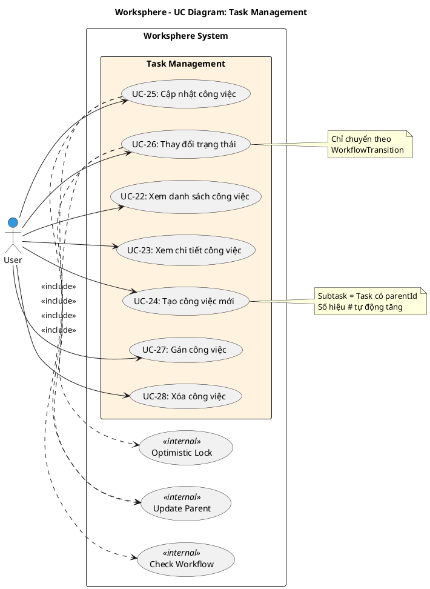

# Use Case Diagram 6: Quản lý Công việc (Task Management)

> **Module**: Task Management | **Số UC**: 7 | **Ngày**: 2026-01-15

---

## 1. Actors

| Actor | Loại | Mô tả |
|-------|------|-------|
| **User** | Primary | Người dùng có quyền tasks.* tương ứng |

---

## 2. Use Case Diagram (PlantUML)

---

## 3. Bảng mô tả Use Cases

| UC ID | Tên Use Case | Actor | Mô tả |
|-------|--------------|-------|-------|
| UC-22 | Xem danh sách công việc | User | Xem tasks với filter, search, pagination |
| UC-23 | Xem chi tiết công việc | User | Xem đầy đủ: thuộc tính, subtasks, comments, history |
| UC-24 | Tạo công việc mới | User | Tạo task/subtask với tất cả thuộc tính |
| UC-25 | Cập nhật công việc | User | Cập nhật thông tin với optimistic locking |
| UC-26 | Thay đổi trạng thái | User | Chuyển status theo workflow |
| UC-27 | Gán công việc | User | Gán task cho member |
| UC-28 | Xóa công việc | User | Xóa task và dữ liệu liên quan |

---

## 4. Luồng sự kiện - UC-26: Thay đổi trạng thái

**Tiền điều kiện:** User có quyền edit task

**Luồng chính:**
1. User mở chi tiết task
2. User click vào status dropdown
3. Hệ thống query WorkflowTransition để lấy các status hợp lệ
4. Hiển thị chỉ các status được phép chuyển
5. User chọn status mới
6. Hệ thống validate transition hợp lệ
7. Cập nhật status task
8. <<include>> Update Parent: Tính lại % cha nếu có
9. Tạo AuditLog record

**Ngoại lệ:**
- E1: Transition không hợp lệ → Hiển thị lỗi

**Hậu điều kiện:** Status được cập nhật, parent được recalculate

---

## 5. Business Rules

| ID | Rule |
|----|------|
| BR-01 | Subtask = Task có parentId |
| BR-02 | Status chỉ chuyển theo WorkflowTransition |
| BR-03 | Optimistic locking kiểm tra version khi update |
| BR-04 | Khi subtask thay đổi, tự động tính lại parent |
| BR-05 | Private task chỉ hiển thị cho creator/assignee |

---

*Ngày tạo: 2026-01-15*
