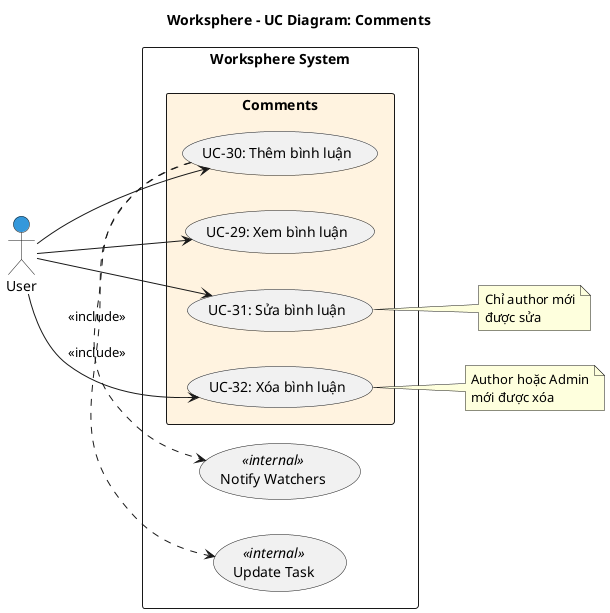

# Use Case Diagram 7: Bình luận (Comments)

> **Module**: Comments | **Số UC**: 4 | **Ngày**: 2026-01-15

---

## 1. Actors

| Actor | Loại | Mô tả |
|-------|------|-------|
| **User** | Primary | Thành viên dự án |

---

## 2. Use Case Diagram (PlantUML)

---

## 3. Bảng mô tả Use Cases

| UC ID | Tên Use Case | Actor | Mô tả |
|-------|--------------|-------|-------|
| UC-29 | Xem bình luận | User | Xem danh sách comments trên task, sắp xếp theo thời gian |
| UC-30 | Thêm bình luận | User | Thêm comment mới, tự động notify watchers |
| UC-31 | Sửa bình luận | User | Sửa nội dung comment (chỉ author) |
| UC-32 | Xóa bình luận | User | Xóa comment (author hoặc Admin) |

---

## 4. Luồng sự kiện - UC-30: Thêm bình luận

**Tiền điều kiện:** User là member của project

**Luồng chính:**
1. User mở chi tiết task
2. User nhập nội dung comment
3. User click "Gửi"
4. Hệ thống tạo Comment record
5. <<include>> Update Task: Cập nhật updatedAt của task
6. <<include>> Notify Watchers: Gửi notification cho watchers
7. Hiển thị comment mới

**Hậu điều kiện:** Comment được tạo, watchers được thông báo

---

## 5. Business Rules

| ID | Rule |
|----|------|
| BR-01 | Chỉ author mới được sửa comment của mình |
| BR-02 | Author hoặc Admin mới được xóa comment |
| BR-03 | Thêm comment sẽ update task.updatedAt |
| BR-04 | Watchers được notify khi có comment mới |

---

*Ngày tạo: 2026-01-15*
