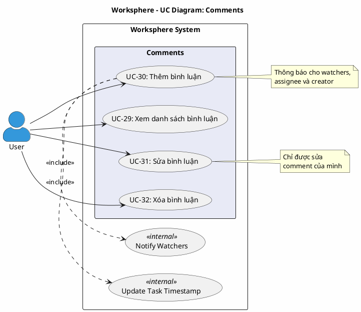

# Use Case Diagram 7: Bình luận (Comments)

> **Hệ thống**: Worksphere - Hệ thống Quản lý Công việc & Dự án  
> **Module**: Comments  
> **Phiên bản**: 1.0  
> **Ngày cập nhật**: 2026-01-16

---

## 1. Thông tin chung

| Thuộc tính | Giá trị |
|------------|---------|
| **Tên sơ đồ** | UC Diagram - Comments |
| **Mô tả** | Các chức năng quản lý bình luận trên công việc |
| **Số Use Cases** | 4 |
| **Actors** | User |
| **Source Files** | `src/app/api/tasks/[id]/comments/route.ts`, `src/app/api/tasks/[id]/comments/[commentId]/route.ts` |

---

## 2. Actors (Tác nhân)

| Actor | Loại | Mô tả |
|-------|------|-------|
| **User** | Primary | Thành viên dự án có quyền truy cập công việc |

---

## 3. Use Case Diagram (PlantUML)

---

## 4. Bảng mô tả Use Cases

| UC ID | Tên Use Case | Actor | Mô tả |
|-------|--------------|-------|-------|
| UC-29 | Xem danh sách bình luận | User | Xem tất cả bình luận của công việc |
| UC-30 | Thêm bình luận | User | Thêm bình luận mới vào công việc |
| UC-31 | Sửa bình luận | User | Chỉnh sửa bình luận của mình |
| UC-32 | Xóa bình luận | User | Xóa bình luận của mình |

---

## 5. Ma trận quan hệ

| Use Case | Include | Extend | Extended By |
|----------|---------|--------|-------------|
| UC-29: Xem danh sách | - | - | - |
| UC-30: Thêm bình luận | Notify Watchers, Update Task Timestamp | - | - |
| UC-31: Sửa bình luận | - | - | - |
| UC-32: Xóa bình luận | - | - | - |

---

## 6. Đặc tả Use Case chi tiết

---

### USE CASE: UC-29 - Xem danh sách bình luận

---

#### 1. Mô tả
Use Case này cho phép người dùng xem danh sách tất cả bình luận của một công việc, sắp xếp theo thời gian tạo.

#### 2. Tác nhân chính
- **User**: Người dùng đã đăng nhập.

#### 3. Tác nhân phụ
- *Không có*

#### 4. Tiền điều kiện
- Người dùng đã đăng nhập vào hệ thống.
- Công việc tồn tại trong hệ thống.

#### 5. Đảm bảo tối thiểu (Minimal Guarantee)
- Chỉ người dùng đã đăng nhập mới xem được bình luận.

#### 6. Đảm bảo thành công (Success Guarantee)
- Danh sách bình luận được hiển thị đầy đủ với thông tin người viết.

#### 7. Chuỗi sự kiện chính (Main Flow)
1. Người dùng xem chi tiết công việc.
2. Hệ thống truy vấn danh sách bình luận của công việc.
3. Hệ thống trả về danh sách bao gồm:
   - Nội dung bình luận
   - Thông tin người viết: ID, tên, ảnh đại diện
   - Thời gian tạo và cập nhật
4. Hệ thống sắp xếp theo thời gian tạo tăng dần (cũ nhất trước).
5. Hệ thống hiển thị danh sách bình luận.
6. Kết thúc Use Case.

#### 8. Luồng thay thế (Alternative Flow)
- *Không có*

#### 9. Luồng ngoại lệ (Exception Flow)

**E1: Chưa đăng nhập**
- Rẽ nhánh từ bước 1.
- Hệ thống từ chối với mã lỗi 401.
- Kết thúc Use Case.

#### 10. Ghi chú
- Bình luận được sắp xếp theo thứ tự thời gian để dễ theo dõi cuộc hội thoại.

---

### USE CASE: UC-30 - Thêm bình luận

---

#### 1. Mô tả
Use Case này cho phép thành viên dự án thêm bình luận vào công việc. Sau khi thêm, hệ thống tự động gửi thông báo cho những người liên quan và cập nhật thời gian sửa đổi của công việc.

#### 2. Tác nhân chính
- **User**: Thành viên của dự án chứa công việc.

#### 3. Tác nhân phụ
- *Không có*

#### 4. Tiền điều kiện
- Người dùng đã đăng nhập vào hệ thống.
- Người dùng là thành viên dự án hoặc Quản trị viên.
- Công việc tồn tại trong hệ thống.

#### 5. Đảm bảo tối thiểu (Minimal Guarantee)
- Nếu thêm thất bại, không có bình luận nào được tạo.

#### 6. Đảm bảo thành công (Success Guarantee)
- Bình luận được thêm vào công việc.
- Thời gian updatedAt của công việc được cập nhật.
- Thông báo được gửi cho: người theo dõi, người được gán, người tạo (trừ người viết bình luận).

#### 7. Chuỗi sự kiện chính (Main Flow)
1. Người dùng mở chi tiết công việc.
2. Người dùng nhập nội dung bình luận vào ô văn bản.
3. Người dùng nhấn nút "Gửi".
4. Hệ thống kiểm tra công việc tồn tại.
5. Hệ thống kiểm tra quyền truy cập:
   - Là Quản trị viên: cho phép.
   - Là thành viên dự án chứa công việc: cho phép.
6. Hệ thống tạo bình luận mới với:
   - Nội dung từ người dùng
   - taskId = ID công việc
   - userId = ID người dùng hiện tại
7. Hệ thống cập nhật updatedAt của công việc.
8. Hệ thống gửi thông báo (bất đồng bộ) đến:
   - Tất cả người theo dõi (watchers) của công việc
   - Người được gán công việc
   - Người tạo công việc
   - Loại trừ: người viết bình luận
9. Hệ thống trả về bình luận vừa tạo.
10. Hệ thống hiển thị bình luận mới trong danh sách.
11. Kết thúc Use Case.

#### 8. Luồng thay thế (Alternative Flow)
- *Không có*

#### 9. Luồng ngoại lệ (Exception Flow)

**E1: Công việc không tồn tại**
- Rẽ nhánh từ bước 4.
- Hệ thống trả về mã lỗi 404.
- Hệ thống hiển thị: "Task không tồn tại".
- Kết thúc Use Case.

**E2: Không có quyền bình luận**
- Rẽ nhánh từ bước 5.
- Hệ thống từ chối với mã lỗi 403.
- Hệ thống hiển thị: "Không có quyền bình luận".
- Kết thúc Use Case.

**E3: Nội dung bình luận trống**
- Rẽ nhánh từ bước 3.
- Hệ thống hiển thị lỗi validation.
- Quay lại bước 2.

#### 10. Ghi chú
- Quyền bình luận chỉ yêu cầu là thành viên dự án, không cần quyền cụ thể.
- Thông báo được gửi bất đồng bộ để không làm chậm phản hồi.
- Người viết bình luận không nhận thông báo về bình luận của chính mình.

---

### USE CASE: UC-31 - Sửa bình luận

---

#### 1. Mô tả
Use Case này cho phép người dùng chỉnh sửa bình luận mà chính họ đã viết. Người dùng chỉ được sửa bình luận của mình, không thể sửa của người khác.

#### 2. Tác nhân chính
- **User**: Người đã viết bình luận.

#### 3. Tác nhân phụ
- *Không có*

#### 4. Tiền điều kiện
- Người dùng đã đăng nhập vào hệ thống.
- Bình luận tồn tại và thuộc về người dùng.

#### 5. Đảm bảo tối thiểu (Minimal Guarantee)
- Người dùng chỉ có thể sửa bình luận của chính mình.

#### 6. Đảm bảo thành công (Success Guarantee)
- Bình luận được cập nhật với nội dung mới.
- Thời gian updatedAt của bình luận được cập nhật.

#### 7. Chuỗi sự kiện chính (Main Flow)
1. Người dùng mở menu tùy chọn của bình luận mình đã viết.
2. Người dùng chọn "Sửa".
3. Hệ thống kiểm tra bình luận tồn tại.
4. Hệ thống kiểm tra bình luận thuộc về công việc được chỉ định.
5. Hệ thống kiểm tra người dùng là tác giả bình luận.
6. Hệ thống hiển thị ô nhập liệu với nội dung hiện tại.
7. Người dùng chỉnh sửa nội dung.
8. Người dùng nhấn nút "Lưu".
9. Hệ thống cập nhật bình luận với:
   - Nội dung mới
   - updatedAt = thời gian hiện tại
10. Hệ thống trả về bình luận đã cập nhật.
11. Hệ thống hiển thị bình luận đã sửa.
12. Kết thúc Use Case.

#### 8. Luồng thay thế (Alternative Flow)

**A1: Hủy chỉnh sửa**
- Rẽ nhánh từ bước 7.
- Người dùng nhấn "Hủy".
- Kết thúc Use Case mà không thay đổi.

#### 9. Luồng ngoại lệ (Exception Flow)

**E1: Bình luận không tồn tại**
- Rẽ nhánh từ bước 3.
- Hệ thống trả về mã lỗi 404.
- Hệ thống hiển thị: "Comment không tồn tại".
- Kết thúc Use Case.

**E2: Bình luận không thuộc công việc này**
- Rẽ nhánh từ bước 4.
- Hệ thống trả về mã lỗi 400.
- Hệ thống hiển thị: "Comment không thuộc task này".
- Kết thúc Use Case.

**E3: Không phải tác giả**
- Rẽ nhánh từ bước 5.
- Hệ thống từ chối với mã lỗi 403.
- Hệ thống hiển thị: "Bạn chỉ có thể chỉnh sửa comment của mình".
- Kết thúc Use Case.

#### 10. Ghi chú
- Chỉ tác giả bình luận mới có thể sửa, không có ngoại lệ cho admin.
- Bình luận đã sửa có thể được đánh dấu "(đã chỉnh sửa)" trên giao diện.

---

### USE CASE: UC-32 - Xóa bình luận

---

#### 1. Mô tả
Use Case này cho phép người dùng xóa bình luận mà chính họ đã viết. Người dùng chỉ được xóa bình luận của mình.

#### 2. Tác nhân chính
- **User**: Người đã viết bình luận.

#### 3. Tác nhân phụ
- *Không có*

#### 4. Tiền điều kiện
- Người dùng đã đăng nhập vào hệ thống.
- Bình luận tồn tại và thuộc về người dùng.

#### 5. Đảm bảo tối thiểu (Minimal Guarantee)
- Yêu cầu xác nhận trước khi xóa.
- Người dùng chỉ có thể xóa bình luận của chính mình.

#### 6. Đảm bảo thành công (Success Guarantee)
- Bình luận bị xóa khỏi hệ thống.

#### 7. Chuỗi sự kiện chính (Main Flow)
1. Người dùng mở menu tùy chọn của bình luận mình đã viết.
2. Người dùng chọn "Xóa".
3. Hệ thống hiển thị hộp thoại xác nhận.
4. Người dùng xác nhận xóa.
5. Hệ thống kiểm tra bình luận tồn tại.
6. Hệ thống kiểm tra bình luận thuộc về công việc được chỉ định.
7. Hệ thống kiểm tra người dùng là tác giả bình luận.
8. Hệ thống xóa bình luận khỏi cơ sở dữ liệu.
9. Hệ thống hiển thị thông báo: "Đã xóa comment".
10. Hệ thống cập nhật danh sách bình luận.
11. Kết thúc Use Case.

#### 8. Luồng thay thế (Alternative Flow)

**A1: Hủy xác nhận**
- Rẽ nhánh từ bước 4.
- Người dùng nhấn "Hủy".
- Kết thúc Use Case mà không xóa.

#### 9. Luồng ngoại lệ (Exception Flow)

**E1: Bình luận không tồn tại**
- Rẽ nhánh từ bước 5.
- Hệ thống trả về mã lỗi 404.
- Kết thúc Use Case.

**E2: Bình luận không thuộc công việc này**
- Rẽ nhánh từ bước 6.
- Hệ thống trả về mã lỗi 400.
- Kết thúc Use Case.

**E3: Không phải tác giả**
- Rẽ nhánh từ bước 7.
- Hệ thống từ chối với mã lỗi 403.
- Hệ thống hiển thị: "Bạn chỉ có thể xóa comment của mình".
- Kết thúc Use Case.

#### 10. Ghi chú
- Chỉ tác giả bình luận mới có thể xóa, không có ngoại lệ cho admin trong code hiện tại.
- Xóa bình luận là vĩnh viễn, không thể khôi phục.

---

## 7. Business Rules

| ID | Rule | Mô tả |
|----|------|-------|
| BR-01 | Member Only | Chỉ thành viên dự án hoặc admin mới bình luận được |
| BR-02 | Owner Only Edit | Chỉ tác giả bình luận mới được sửa |
| BR-03 | Owner Only Delete | Chỉ tác giả bình luận mới được xóa |
| BR-04 | Update Timestamp | Thêm bình luận sẽ cập nhật updatedAt của công việc |
| BR-05 | Notify Watchers | Thông báo cho watchers, assignee, creator (trừ người viết) |
| BR-06 | Order Ascending | Bình luận sắp xếp theo thời gian tạo tăng dần |

---

## 8. Validation Checklist

- [x] Mọi UC đều nằm trong System Boundary
- [x] Mọi Actor đều nằm ngoài System Boundary
- [x] Tên UC là động từ + bổ ngữ
- [x] Include: Mũi tên từ UC gốc → UC con
- [x] Không có UC "lơ lửng"
- [x] Đã mô tả đầy đủ luồng chính, thay thế và ngoại lệ
- [x] Đặc tả theo format chuẩn 10 mục
- [x] Đã đối chiếu với source code thực tế

---

*Tài liệu được tạo dựa trên phân tích mã nguồn Worksphere*  
*Ngày cập nhật: 2026-01-16*
