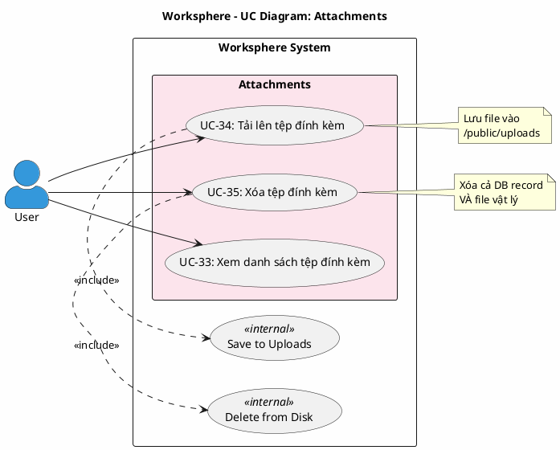

# Use Case Diagram 8: Tệp đính kèm (Attachments)

> **Hệ thống**: Worksphere - Hệ thống Quản lý Công việc & Dự án  
> **Module**: Attachments  
> **Phiên bản**: 1.1  
> **Ngày cập nhật**: 2026-01-16

---

## 1. Thông tin chung

| Thuộc tính | Giá trị |
|------------|---------|
| **Tên sơ đồ** | UC Diagram - Attachments |
| **Mô tả** | Các chức năng quản lý tệp đính kèm của công việc |
| **Số Use Cases** | 3 |
| **Actors** | User |
| **Source Files** | `src/app/api/tasks/[id]/attachments/route.ts`, `src/app/api/attachments/[id]/route.ts` |

---

## 2. Actors (Tác nhân)

| Actor | Loại | Mô tả |
|-------|------|-------|
| **User** | Primary | Thành viên dự án có quyền truy cập công việc |

---

## 3. Use Case Diagram (PlantUML)

---

## 4. Bảng mô tả Use Cases

| UC ID | Tên Use Case | Actor | Mô tả |
|-------|--------------|-------|-------|
| UC-33 | Xem danh sách tệp đính kèm | User | Xem danh sách tệp đính kèm của công việc |
| UC-34 | Tải lên tệp đính kèm | User | Tải file lên và đính kèm vào công việc |
| UC-35 | Xóa tệp đính kèm | User | Xóa tệp đính kèm khỏi công việc và disk |

---

## 5. Ma trận quan hệ

| Use Case | Include | Extend | Extended By |
|----------|---------|--------|-------------|
| UC-33: Xem danh sách | - | - | - |
| UC-34: Tải lên | Save to Uploads | - | - |
| UC-35: Xóa | Delete from Disk | - | - |

---

## 6. Đặc tả Use Case chi tiết

---

### USE CASE: UC-33 - Xem danh sách tệp đính kèm

---

#### 1. Mô tả
Use Case này cho phép người dùng xem danh sách tất cả tệp đính kèm của một công việc.

#### 2. Tác nhân chính
- **User**: Thành viên dự án.

#### 3. Tác nhân phụ
- *Không có*

#### 4. Tiền điều kiện
- Người dùng đã đăng nhập vào hệ thống.
- Người dùng có quyền xem công việc.

#### 5. Đảm bảo tối thiểu (Minimal Guarantee)
- Không có thay đổi dữ liệu.

#### 6. Đảm bảo thành công (Success Guarantee)
- Danh sách tệp đính kèm được hiển thị với đầy đủ thông tin.

#### 7. Chuỗi sự kiện chính (Main Flow)
1. Người dùng xem chi tiết công việc.
2. Hệ thống truy vấn danh sách tệp đính kèm bao gồm:
   - Tên file gốc (filename)
   - Đường dẫn lưu trữ (path)
   - Kích thước file (size)
   - Loại MIME (mimeType)
   - Người tải lên (user: id, name)
   - Thời gian tải lên (createdAt)
3. Hệ thống sắp xếp theo thời gian tạo giảm dần (mới nhất trước).
4. Hệ thống hiển thị danh sách tệp đính kèm.
5. Kết thúc Use Case.

#### 8. Luồng thay thế (Alternative Flow)
- *Không có*

#### 9. Luồng ngoại lệ (Exception Flow)
- *Không có*

#### 10. Ghi chú
- Tệp đính kèm được lấy cùng với chi tiết công việc trong API GET task.

---

### USE CASE: UC-34 - Tải lên tệp đính kèm

---

#### 1. Mô tả
Use Case này cho phép thành viên dự án tải file lên và đính kèm vào công việc.

#### 2. Tác nhân chính
- **User**: Thành viên của dự án chứa công việc.

#### 3. Tác nhân phụ
- *Không có*

#### 4. Tiền điều kiện
- Người dùng đã đăng nhập vào hệ thống.
- Người dùng là thành viên dự án hoặc Quản trị viên.
- Công việc tồn tại trong hệ thống.

#### 5. Đảm bảo tối thiểu (Minimal Guarantee)
- Nếu tải lên thất bại, không có file nào được lưu.

#### 6. Đảm bảo thành công (Success Guarantee)
- File được lưu trên server với tên UUID.
- Bản ghi attachment được tạo trong cơ sở dữ liệu.

#### 7. Chuỗi sự kiện chính (Main Flow)
1. Người dùng mở chi tiết công việc.
2. Người dùng nhấn nút "Đính kèm file" hoặc kéo thả file.
3. Người dùng chọn file từ máy tính.
4. Hệ thống kiểm tra công việc tồn tại.
5. Hệ thống kiểm tra quyền truy cập:
   - Là Quản trị viên: cho phép.
   - Là thành viên dự án chứa công việc: cho phép.
6. Hệ thống đọc nội dung file (arrayBuffer → Buffer).
7. Hệ thống tạo thư mục /public/uploads nếu chưa tồn tại (mkdir recursive).
8. Hệ thống tạo tên file duy nhất: UUID + extension.
9. Hệ thống lưu file vào /public/uploads/[unique-filename].
10. Hệ thống tạo bản ghi attachment với:
    - filename: tên file gốc
    - path: /uploads/[unique-filename]
    - size: file.size
    - mimeType: file.type
    - taskId: ID công việc
    - userId: ID người tải lên
11. Hệ thống trả về thông tin attachment với user info.
12. Hệ thống cập nhật danh sách tệp đính kèm.
13. Kết thúc Use Case.

#### 8. Luồng thay thế (Alternative Flow)
- *Không có*

#### 9. Luồng ngoại lệ (Exception Flow)

**E1: Công việc không tồn tại**
- Rẽ nhánh từ bước 4.
- Hệ thống trả về mã lỗi 404.
- Hệ thống hiển thị: "Task không tồn tại".
- Kết thúc Use Case.

**E2: Không có quyền upload**
- Rẽ nhánh từ bước 5.
- Hệ thống từ chối với mã lỗi 403.
- Hệ thống hiển thị: "Không có quyền upload file".
- Kết thúc Use Case.

**E3: Không có file**
- Rẽ nhánh từ bước 3.
- Hệ thống hiển thị lỗi: "Không tìm thấy file".
- Quay lại bước 2.

#### 10. Ghi chú
- File được lưu với tên UUID để tránh trùng lặp và bảo mật.
- Tên file gốc được lưu trong database (filename) để hiển thị.
- Không có giới hạn kích thước hoặc loại file trong code hiện tại.

---

### USE CASE: UC-35 - Xóa tệp đính kèm

---

#### 1. Mô tả
Use Case này cho phép người dùng xóa tệp đính kèm khỏi công việc. Hệ thống xóa cả bản ghi database VÀ file vật lý trên disk.

#### 2. Tác nhân chính
- **User**: Người tải lên file.
- **Administrator**: Quản trị viên hệ thống.

#### 3. Tác nhân phụ
- *Không có*

#### 4. Tiền điều kiện
- Người dùng đã đăng nhập vào hệ thống.
- Tệp đính kèm tồn tại trong hệ thống.

#### 5. Đảm bảo tối thiểu (Minimal Guarantee)
- Chỉ người tải lên hoặc admin mới xóa được.
- Nếu xóa file vật lý thất bại, bản ghi DB vẫn bị xóa.

#### 6. Đảm bảo thành công (Success Guarantee)
- Bản ghi attachment bị xóa khỏi database.
- File vật lý bị xóa khỏi disk.

#### 7. Chuỗi sự kiện chính (Main Flow)
1. Người dùng mở chi tiết công việc.
2. Người dùng nhấn nút "Xóa" trên tệp đính kèm.
3. Hệ thống hiển thị hộp thoại xác nhận.
4. Người dùng xác nhận xóa.
5. Hệ thống kiểm tra tệp đính kèm tồn tại.
6. Hệ thống kiểm tra quyền xóa:
   - Là tác giả (attachment.userId === session.user.id): cho phép.
   - Là Quản trị viên: cho phép.
7. Hệ thống xóa bản ghi attachment khỏi database.
8. Hệ thống xóa file vật lý từ disk:
   - Đường dẫn: process.cwd() + "/public" + attachment.path
   - Sử dụng fs.unlink
   - Nếu lỗi (file đã bị xóa): log error nhưng tiếp tục.
9. Hệ thống hiển thị thông báo: "Đã xóa file".
10. Hệ thống cập nhật danh sách tệp đính kèm.
11. Kết thúc Use Case.

#### 8. Luồng thay thế (Alternative Flow)

**A1: Hủy xác nhận**
- Rẽ nhánh từ bước 4.
- Người dùng nhấn "Hủy".
- Kết thúc Use Case mà không xóa.

#### 9. Luồng ngoại lệ (Exception Flow)

**E1: Tệp đính kèm không tồn tại**
- Rẽ nhánh từ bước 5.
- Hệ thống trả về mã lỗi 404.
- Hệ thống hiển thị: "File không tồn tại".
- Kết thúc Use Case.

**E2: Không có quyền xóa**
- Rẽ nhánh từ bước 6.
- Hệ thống từ chối với mã lỗi 403.
- Hệ thống hiển thị: "Không có quyền xóa file này".
- Kết thúc Use Case.

#### 10. Ghi chú
- Chỉ tác giả (người upload) hoặc admin mới được xóa.
- File vật lý được xóa bằng `fs.unlink`, nhưng nếu thất bại (file đã mất) thì chỉ log error và vẫn xóa DB record thành công.

---

## 7. Business Rules

| ID | Rule | Mô tả |
|----|------|-------|
| BR-01 | Member Only Upload | Chỉ thành viên dự án hoặc admin mới upload được |
| BR-02 | UUID Filename | File được lưu với tên UUID để tránh trùng lặp |
| BR-03 | Preserve Original Name | Tên file gốc được lưu trong database (filename field) |
| BR-04 | Author or Admin Delete | Chỉ tác giả hoặc admin mới xóa được |
| BR-05 | Delete Both | Xóa attachment sẽ xóa cả DB record VÀ file vật lý |
| BR-06 | Graceful File Delete | Lỗi xóa file vật lý được log nhưng không fail operation |
| BR-07 | Public Uploads | File được lưu trong /public/uploads, truy cập công khai |

---

## 8. Validation Checklist

- [x] Đã đối chiếu với `src/app/api/tasks/[id]/attachments/route.ts` POST
- [x] Đã đối chiếu với `src/app/api/attachments/[id]/route.ts` DELETE
- [x] Confirmed: DELETE xóa cả file vật lý (unlink)
- [x] Confirmed: Chỉ author hoặc admin được xóa
- [x] Confirmed: UUID tên file, original name lưu DB

---

*Tài liệu được tạo dựa trên phân tích mã nguồn Worksphere*  
*Ngày cập nhật: 2026-01-16*
