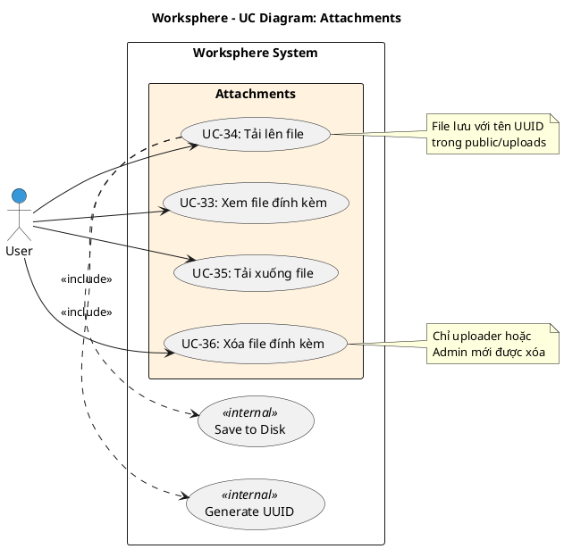

# Use Case Diagram 8: File đính kèm (Attachments)

> **Module**: Attachments | **Số UC**: 4 | **Ngày**: 2026-01-15

---

## 1. Actors

| Actor | Loại | Mô tả |
|-------|------|-------|
| **User** | Primary | Thành viên dự án |

---

## 2. Use Case Diagram (PlantUML)

---

## 3. Bảng mô tả Use Cases

| UC ID | Tên Use Case | Actor | Mô tả |
|-------|--------------|-------|-------|
| UC-33 | Xem file đính kèm | User | Xem danh sách files: tên, size, type, uploader, date |
| UC-34 | Tải lên file | User | Upload file, lưu với UUID trong public/uploads |
| UC-35 | Tải xuống file | User | Download file về máy |
| UC-36 | Xóa file đính kèm | User | Xóa file (uploader hoặc Admin) |

---

## 4. Luồng sự kiện - UC-34: Tải lên file

**Tiền điều kiện:** User là member của project

**Luồng chính:**
1. User mở chi tiết task
2. User click "Đính kèm file"
3. User chọn file từ máy
4. <<include>> Generate UUID: Tạo tên file duy nhất
5. <<include>> Save to Disk: Lưu file vào public/uploads
6. Hệ thống tạo Attachment record với metadata
7. Hiển thị file trong danh sách attachments

**Ngoại lệ:**
- E1: File quá lớn → Hiển thị lỗi
- E2: Loại file không hợp lệ → Hiển thị lỗi

**Hậu điều kiện:** File được upload và lưu

---

## 5. Business Rules

| ID | Rule |
|----|------|
| BR-01 | File lưu với tên UUID để tránh trùng |
| BR-02 | Chỉ uploader hoặc Admin mới được xóa |
| BR-03 | Lưu metadata: filename, contentType, size |

---

*Ngày tạo: 2026-01-15*
