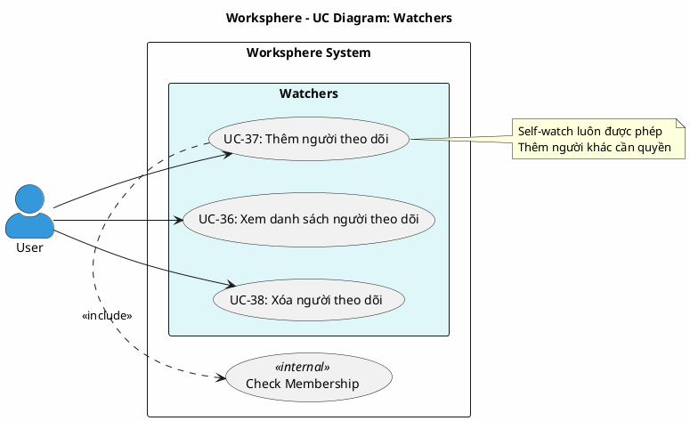

# Use Case Diagram 9: Người theo dõi (Watchers)

> **Hệ thống**: Worksphere - Hệ thống Quản lý Công việc & Dự án  
> **Module**: Watchers  
> **Phiên bản**: 1.0  
> **Ngày cập nhật**: 2026-01-16

---

## 1. Thông tin chung

| Thuộc tính | Giá trị |
|------------|---------|
| **Tên sơ đồ** | UC Diagram - Watchers |
| **Mô tả** | Các chức năng quản lý người theo dõi công việc |
| **Số Use Cases** | 3 |
| **Actors** | User |
| **Source Files** | `src/app/api/tasks/[id]/watchers/route.ts` |

---

## 2. Actors (Tác nhân)

| Actor | Loại | Mô tả |
|-------|------|-------|
| **User** | Primary | Thành viên dự án có quyền truy cập công việc |

---

## 3. Use Case Diagram (PlantUML)

---

## 4. Bảng mô tả Use Cases

| UC ID | Tên Use Case | Actor | Mô tả |
|-------|--------------|-------|-------|
| UC-36 | Xem danh sách người theo dõi | User | Xem danh sách người đang theo dõi công việc |
| UC-37 | Thêm người theo dõi | User | Thêm mình hoặc người khác vào danh sách theo dõi |
| UC-38 | Xóa người theo dõi | User | Xóa mình hoặc người khác khỏi danh sách theo dõi |

---

## 5. Đặc tả Use Case chi tiết

---

### USE CASE: UC-36 - Xem danh sách người theo dõi

---

#### 1. Mô tả
Use Case này cho phép người dùng xem danh sách tất cả người đang theo dõi công việc và biết mình có đang theo dõi hay không.

#### 2. Tác nhân chính
- **User**: Người dùng đã đăng nhập.

#### 3. Tác nhân phụ
- *Không có*

#### 4. Tiền điều kiện
- Người dùng đã đăng nhập vào hệ thống.

#### 5. Đảm bảo tối thiểu (Minimal Guarantee)
- Không có thay đổi dữ liệu.

#### 6. Đảm bảo thành công (Success Guarantee)
- Danh sách người theo dõi được hiển thị.
- Trạng thái theo dõi của người dùng hiện tại được xác định.

#### 7. Chuỗi sự kiện chính (Main Flow)
1. Người dùng xem chi tiết công việc.
2. Hệ thống truy vấn danh sách người theo dõi bao gồm:
   - Thông tin người dùng: ID, tên, ảnh đại diện, email
   - Thời gian bắt đầu theo dõi
3. Hệ thống kiểm tra người dùng hiện tại có trong danh sách không.
4. Hệ thống trả về:
   - Danh sách watchers
   - isWatching: true/false
   - count: số lượng người theo dõi
5. Hệ thống hiển thị danh sách người theo dõi.
6. Kết thúc Use Case.

#### 8. Luồng thay thế (Alternative Flow)
- *Không có*

#### 9. Luồng ngoại lệ (Exception Flow)
- *Không có*

#### 10. Ghi chú
- Danh sách được sắp xếp theo thời gian theo dõi giảm dần.

---

### USE CASE: UC-37 - Thêm người theo dõi

---

#### 1. Mô tả
Use Case này cho phép người dùng thêm mình hoặc người khác vào danh sách theo dõi công việc. Tự theo dõi mình luôn được phép, thêm người khác yêu cầu quyền.

#### 2. Tác nhân chính
- **User**: Thành viên của dự án chứa công việc.

#### 3. Tác nhân phụ
- *Không có*

#### 4. Tiền điều kiện
- Người dùng đã đăng nhập vào hệ thống.
- Công việc tồn tại trong hệ thống.

#### 5. Đảm bảo tối thiểu (Minimal Guarantee)
- Người được thêm phải là thành viên dự án.
- Không thể thêm trùng lặp.

#### 6. Đảm bảo thành công (Success Guarantee)
- Người dùng được thêm vào danh sách theo dõi.
- Người dùng sẽ nhận thông báo về các thay đổi của công việc.

#### 7. Chuỗi sự kiện chính (Main Flow)
1. Người dùng mở chi tiết công việc.
2. Người dùng nhấn nút "Theo dõi" hoặc "Thêm người theo dõi".
3. Hệ thống kiểm tra công việc tồn tại.
4. Hệ thống xác định người được thêm:
   - Nếu không có userId: tự thêm mình.
   - Nếu có userId: thêm người được chỉ định.
5. Nếu thêm cho chính mình (self-watch): cho phép ngay.
6. Nếu thêm người khác, hệ thống kiểm tra quyền:
   - Là Quản trị viên: cho phép.
   - Là người tạo công việc: cho phép.
   - Là người được gán công việc: cho phép.
   - Là thành viên dự án: cho phép.
7. Hệ thống kiểm tra người được thêm là thành viên dự án.
8. Hệ thống tạo bản ghi watcher.
9. Hệ thống trả về thông tin watcher vừa tạo.
10. Hệ thống cập nhật danh sách người theo dõi.
11. Kết thúc Use Case.

#### 8. Luồng thay thế (Alternative Flow)

**A1: Tự theo dõi (Watch)**
- Rẽ nhánh từ bước 2.
- Người dùng nhấn nút "Theo dõi".
- Bỏ qua bước 6 (không cần kiểm tra quyền).
- Tiếp tục từ bước 7.

#### 9. Luồng ngoại lệ (Exception Flow)

**E1: Công việc không tồn tại**
- Rẽ nhánh từ bước 3.
- Hệ thống trả về mã lỗi 404.
- Kết thúc Use Case.

**E2: Không có quyền thêm người theo dõi**
- Rẽ nhánh từ bước 6.
- Hệ thống từ chối với mã lỗi 403.
- Hệ thống hiển thị: "Không có quyền thêm người theo dõi".
- Kết thúc Use Case.

**E3: Người được thêm không phải thành viên dự án**
- Rẽ nhánh từ bước 7.
- Hệ thống hiển thị lỗi: "Người dùng này không phải thành viên dự án".
- Quay lại bước 2.

**E4: Đã theo dõi rồi**
- Rẽ nhánh từ bước 8.
- Hệ thống trả về mã lỗi 409 (Conflict).
- Hệ thống hiển thị: "Người dùng này đang theo dõi task rồi".
- Kết thúc Use Case.

#### 10. Ghi chú
- Self-watch (tự theo dõi) luôn được phép nếu đã đăng nhập.
- Thêm người khác yêu cầu là member của dự án hoặc có quan hệ với task (creator/assignee).
- Unique constraint: một người chỉ có thể theo dõi một task một lần.

---

### USE CASE: UC-38 - Xóa người theo dõi

---

#### 1. Mô tả
Use Case này cho phép người dùng xóa mình hoặc người khác khỏi danh sách theo dõi. Tự bỏ theo dõi luôn được phép.

#### 2. Tác nhân chính
- **User**: Người đang theo dõi hoặc có quyền quản lý.

#### 3. Tác nhân phụ
- *Không có*

#### 4. Tiền điều kiện
- Người dùng đã đăng nhập vào hệ thống.
- Người được xóa đang theo dõi công việc.

#### 5. Đảm bảo tối thiểu (Minimal Guarantee)
- Tự bỏ theo dõi luôn được phép.

#### 6. Đảm bảo thành công (Success Guarantee)
- Người dùng bị xóa khỏi danh sách theo dõi.
- Người dùng không còn nhận thông báo về công việc.

#### 7. Chuỗi sự kiện chính (Main Flow)
1. Người dùng mở chi tiết công việc.
2. Người dùng nhấn nút "Bỏ theo dõi" hoặc xóa người khác khỏi danh sách.
3. Hệ thống kiểm tra công việc tồn tại.
4. Hệ thống xác định người bị xóa:
   - Nếu không có userId: tự bỏ theo dõi.
   - Nếu có userId: xóa người được chỉ định.
5. Nếu tự bỏ theo dõi (self-unwatch): cho phép ngay.
6. Nếu xóa người khác, hệ thống kiểm tra quyền:
   - Là Quản trị viên: cho phép.
   - Là người tạo công việc: cho phép.
   - Là người được gán công việc: cho phép.
7. Hệ thống kiểm tra watcher tồn tại.
8. Hệ thống xóa bản ghi watcher.
9. Hệ thống hiển thị: "Đã xóa khỏi danh sách theo dõi".
10. Hệ thống cập nhật danh sách người theo dõi.
11. Kết thúc Use Case.

#### 8. Luồng thay thế (Alternative Flow)

**A1: Tự bỏ theo dõi (Unwatch)**
- Rẽ nhánh từ bước 2.
- Người dùng nhấn nút "Bỏ theo dõi".
- Bỏ qua bước 6 (không cần kiểm tra quyền).
- Tiếp tục từ bước 7.

#### 9. Luồng ngoại lệ (Exception Flow)

**E1: Công việc không tồn tại**
- Rẽ nhánh từ bước 3.
- Hệ thống trả về mã lỗi 404.
- Kết thúc Use Case.

**E2: Không có quyền xóa người theo dõi**
- Rẽ nhánh từ bước 6.
- Hệ thống từ chối với mã lỗi 403.
- Hệ thống hiển thị: "Không có quyền xóa người theo dõi".
- Kết thúc Use Case.

**E3: Không tìm thấy watcher**
- Rẽ nhánh từ bước 7.
- Hệ thống trả về mã lỗi 404.
- Hệ thống hiển thị: "Người dùng này không theo dõi task".
- Kết thúc Use Case.

#### 10. Ghi chú
- Self-unwatch (tự bỏ theo dõi) luôn được phép.
- Xóa người khác yêu cầu là creator hoặc assignee của task, hoặc là admin.

---

## 7. Business Rules

| ID | Rule | Mô tả |
|----|------|-------|
| BR-01 | Self Watch Allowed | Tự theo dõi/bỏ theo dõi luôn được phép |
| BR-02 | Member Only | Người được thêm phải là thành viên dự án |
| BR-03 | Unique Watch | Một người chỉ có thể theo dõi một công việc một lần |
| BR-04 | Remove Others | Xóa người khác yêu cầu là creator, assignee hoặc admin |
| BR-05 | Notification | Watcher nhận thông báo về thay đổi công việc |

---

## 8. Validation Checklist

- [x] Mọi UC đều nằm trong System Boundary
- [x] Mọi Actor đều nằm ngoài System Boundary
- [x] Tên UC là động từ + bổ ngữ
- [x] Include: Mũi tên từ UC gốc → UC con
- [x] Không có UC "lơ lửng"
- [x] Đã mô tả đầy đủ luồng chính, thay thế và ngoại lệ
- [x] Đặc tả theo format chuẩn 10 mục
- [x] Đã đối chiếu với source code thực tế

---

*Tài liệu được tạo dựa trên phân tích mã nguồn Worksphere*  
*Ngày cập nhật: 2026-01-16*
