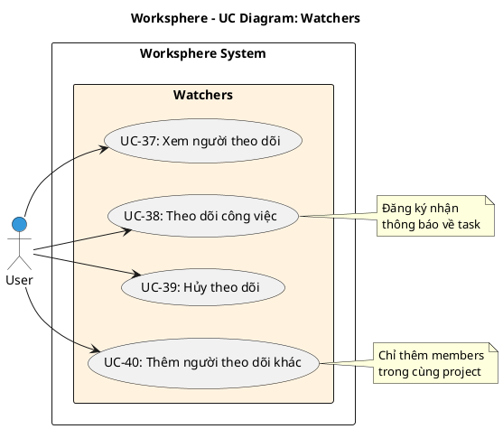

# Use Case Diagram 9: Theo dõi Công việc (Watchers)

> **Module**: Watchers | **Số UC**: 4 | **Ngày**: 2026-01-15

---

## 1. Actors

| Actor | Loại | Mô tả |
|-------|------|-------|
| **User** | Primary | Thành viên dự án |

---

## 2. Use Case Diagram (PlantUML)

---

## 3. Bảng mô tả Use Cases

| UC ID | Tên Use Case | Actor | Mô tả |
|-------|--------------|-------|-------|
| UC-37 | Xem người theo dõi | User | Xem danh sách watchers của task |
| UC-38 | Theo dõi công việc | User | Đăng ký watch task để nhận notifications |
| UC-39 | Hủy theo dõi | User | Hủy đăng ký watch task |
| UC-40 | Thêm người theo dõi khác | User | Thêm member khác làm watcher |

---

## 4. Luồng sự kiện - UC-38: Theo dõi công việc

**Tiền điều kiện:** User là member của project

**Luồng chính:**
1. User mở chi tiết task
2. User click nút "Watch" / "Theo dõi"
3. Hệ thống tạo Watcher record (userId, taskId)
4. Cập nhật UI hiển thị đang watch

**Hậu điều kiện:** User được thêm vào watchers, sẽ nhận notification

---

## 5. Business Rules

| ID | Rule |
|----|------|
| BR-01 | Watchers nhận notification khi task thay đổi |
| BR-02 | Chỉ members trong project mới được thêm làm watcher |
| BR-03 | Creator và assignee tự động là watchers |

---

*Ngày tạo: 2026-01-15*
