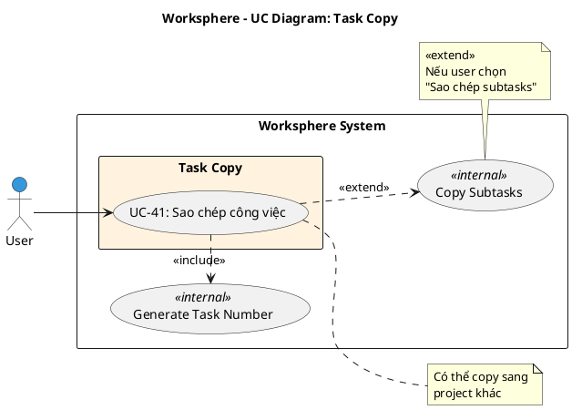

# Use Case Diagram 10: Sao chép Công việc (Task Copy)

> **Module**: Task Copy | **Số UC**: 1 | **Ngày**: 2026-01-15

---

## 1. Actors

| Actor | Loại | Mô tả |
|-------|------|-------|
| **User** | Primary | Người dùng có quyền `tasks.create` |

---

## 2. Use Case Diagram (PlantUML)

---

## 3. Bảng mô tả Use Cases

| UC ID | Tên Use Case | Actor | Mô tả |
|-------|--------------|-------|-------|
| UC-41 | Sao chép công việc | User | Copy task sang cùng/khác project, có thể copy subtasks |

---

## 4. Luồng sự kiện - UC-41: Sao chép công việc

**Tiền điều kiện:** User có quyền `tasks.create` trong project đích

**Luồng chính:**
1. User mở chi tiết task gốc
2. User click "Sao chép"
3. Hệ thống hiển thị form với dữ liệu điền sẵn từ task gốc
4. User chọn project đích
5. User có thể chỉnh sửa các trường
6. User check/uncheck "Sao chép công việc con"
7. User submit
8. <<include>> Generate Task Number: Tạo số hiệu mới
9. Hệ thống tạo task mới với dữ liệu đã chọn
10. [Extend] Nếu chọn copy subtasks: Sao chép tất cả subtasks
11. Redirect đến task mới

**Hậu điều kiện:** Task mới được tạo (có thể kèm subtasks)

---

## 5. Business Rules

| ID | Rule |
|----|------|
| BR-01 | Task mới có số hiệu riêng |
| BR-02 | Có thể copy sang project khác |
| BR-03 | Subtasks được copy nếu user chọn |
| BR-04 | Cần quyền `tasks.create` ở project đích |

---

*Ngày tạo: 2026-01-15*
