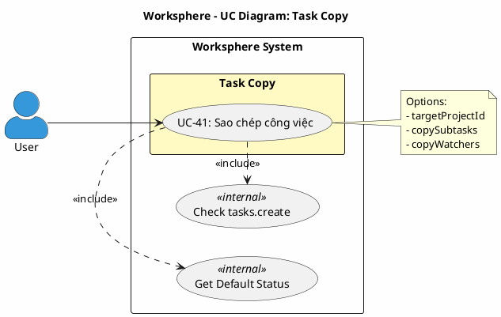

# Use Case Diagram 10: Sao chép Công việc (Task Copy)

> **Hệ thống**: Worksphere - Hệ thống Quản lý Công việc & Dự án  
> **Module**: Task Copy  
> **Phiên bản**: 1.1  
> **Ngày cập nhật**: 2026-01-16

---

## 1. Thông tin chung

| Thuộc tính | Giá trị |
|------------|---------|
| **Tên sơ đồ** | UC Diagram - Task Copy |
| **Mô tả** | Chức năng sao chép công việc |
| **Số Use Cases** | 1 |
| **Actors** | User |
| **Source Files** | `src/app/api/tasks/[id]/copy/route.ts` |

---

## 2. Use Case Diagram (PlantUML)

---

## 3. Đặc tả Use Case chi tiết

---

### USE CASE: UC-41 - Sao chép công việc

---

#### 1. Mô tả
Use Case này cho phép người dùng sao chép một công việc sang dự án (có thể khác dự án gốc). Công việc sao chép sẽ có tiêu đề với hậu tố "(Copy)", trạng thái mặc định, và một số trường được reset.

#### 2. Tác nhân chính
- **User**: Thành viên có quyền `tasks.create` trong dự án đích.

#### 3. Tác nhân phụ
- *Không có*

#### 4. Tiền điều kiện
- Người dùng đã đăng nhập vào hệ thống.
- Công việc gốc tồn tại.
- Người dùng có quyền `tasks.create` trong dự án đích.

#### 5. Đảm bảo tối thiểu (Minimal Guarantee)
- Nếu sao chép thất bại, không có công việc nào được tạo.

#### 6. Đảm bảo thành công (Success Guarantee)
- Công việc mới được tạo với thông tin sao chép từ công việc gốc.
- Tùy chọn sao chép subtasks và watchers được áp dụng.

#### 7. Chuỗi sự kiện chính (Main Flow)
1. Người dùng mở menu tùy chọn của công việc.
2. Người dùng chọn "Sao chép".
3. Hệ thống hiển thị dialog với các tùy chọn:
   - `targetProjectId`: Dự án đích (không có = dùng dự án gốc)
   - `copySubtasks`: Sao chép công việc con (boolean)
   - `copyWatchers`: Sao chép người theo dõi (boolean)
4. Người dùng chọn các tùy chọn và nhấn "Sao chép".
5. Hệ thống lấy thông tin công việc gốc bao gồm:
   - subtasks
   - watchers
   - attachments (chưa sử dụng)
6. Hệ thống xác định projectId đích:
   - targetProjectId nếu có
   - Hoặc originalTask.projectId
7. Hệ thống kiểm tra quyền `tasks.create` trong dự án đích:
   - Admin: cho phép ngay.
   - User: kiểm tra ProjectMember với role có permission key = 'tasks.create'.
8. Hệ thống lấy trạng thái mặc định (isDefault = true).
9. Hệ thống tạo công việc mới với:
   - title: `${originalTask.title} (Copy)`
   - description: sao chép
   - trackerId: sao chép
   - statusId: **defaultStatus.id** (reset)
   - priorityId: sao chép
   - projectId: dự án đích
   - creatorId: **session.user.id** (người copy)
   - estimatedHours: sao chép
   - doneRatio: **0** (reset)
   - startDate, dueDate: sao chép
   - isPrivate: sao chép
   - (KHÔNG copy: assigneeId, versionId, parentId)
10. Nếu `copyWatchers = true` và có watchers:
    - Hệ thống tạo watcher records với createMany.
    - Sử dụng `skipDuplicates: true`.
11. Nếu `copySubtasks = true` và có subtasks:
    - Đối với mỗi subtask, tạo task mới với:
      - title, description, trackerId, priorityId, estimatedHours: sao chép
      - statusId: defaultStatus.id
      - projectId: dự án đích
      - creatorId: session.user.id
      - parentId: copiedTask.id (liên kết với task mới)
      - doneRatio: 0
      - level: sao chép từ subtask gốc
12. Hệ thống lấy full task với includes (tracker, status, priority, project, _count).
13. Hệ thống trả về công việc vừa tạo.
14. Hệ thống chuyển người dùng đến chi tiết công việc mới.
15. Kết thúc Use Case.

#### 8. Luồng thay thế (Alternative Flow)

**A1: Sao chép sang dự án khác**
- Rẽ nhánh từ bước 3.
- Người dùng chọn targetProjectId khác.
- Tiếp tục từ bước 4.

#### 9. Luồng ngoại lệ (Exception Flow)

**E1: Công việc gốc không tồn tại**
- Rẽ nhánh từ bước 5.
- Hệ thống trả về mã lỗi 404.
- Hệ thống hiển thị: "Không tìm thấy công việc".
- Kết thúc Use Case.

**E2: Không có quyền tạo công việc trong dự án đích**
- Rẽ nhánh từ bước 7.
- Hệ thống từ chối với mã lỗi 403.
- Hệ thống hiển thị: "Bạn không có quyền tạo công việc trong dự án đích".
- Kết thúc Use Case.

**E3: Không tìm thấy trạng thái mặc định**
- Rẽ nhánh từ bước 8.
- Hệ thống hiển thị lỗi 500: "Hệ thống chưa cấu hình trạng thái mặc định".
- Kết thúc Use Case.

#### 10. Ghi chú
- Tiêu đề công việc mới có hậu tố " (Copy)".
- assigneeId và versionId KHÔNG được sao chép vì có thể không hợp lệ ở dự án đích.
- Attachments KHÔNG được sao chép trong triển khai hiện tại.
- Subtasks được copy với level giữ nguyên từ subtask gốc.
- path không được copy - sẽ được tính lại nếu cần.

---

## 7. Bảng tóm tắt: Fields được sao chép

| Field | Sao chép? | Ghi chú |
|-------|-----------|---------|
| title | ✅ | Thêm " (Copy)" |
| description | ✅ | |
| trackerId | ✅ | |
| statusId | ❌ | Reset về mặc định |
| priorityId | ✅ | |
| projectId | ✅/❌ | targetProjectId hoặc gốc |
| creatorId | ❌ | = session.user.id |
| assigneeId | ❌ | Không copy |
| versionId | ❌ | Không copy |
| estimatedHours | ✅ | |
| doneRatio | ❌ | Reset về 0 |
| startDate | ✅ | |
| dueDate | ✅ | |
| isPrivate | ✅ | |
| parentId | ❌ | Task mới là root |
| level | ❌ | Không set (mặc định) |

---

## 8. Business Rules

| ID | Rule | Mô tả |
|----|------|-------|
| BR-01 | Permission Check | Cần quyền `tasks.create` trong dự án ĐÍCH |
| BR-02 | Title Suffix | Tiêu đề được thêm hậu tố " (Copy)" |
| BR-03 | Reset Status | Trạng thái reset về mặc định |
| BR-04 | Reset DoneRatio | doneRatio reset về 0 |
| BR-05 | New Creator | creatorId là người thực hiện sao chép |
| BR-06 | No Assignee Copy | assigneeId không được sao chép |
| BR-07 | No Version Copy | versionId không được sao chép |
| BR-08 | No Attachment Copy | Attachments không được sao chép |
| BR-09 | Subtask Link | Subtasks được link với copiedTask.id |

---

## 9. Validation Checklist

- [x] Đã đối chiếu với `src/app/api/tasks/[id]/copy/route.ts` (139 dòng)
- [x] Confirmed: Permission check `tasks.create` (Line 42-53)
- [x] Confirmed: Title + " (Copy)" (Line 71)
- [x] Confirmed: statusId = defaultStatus.id (Line 74)
- [x] Confirmed: creatorId = session.user.id (Line 77)
- [x] Confirmed: doneRatio = 0 (Line 79)
- [x] Confirmed: copyWatchers với skipDuplicates (Line 93)
- [x] Confirmed: copySubtasks with parentId (Line 112)

---

*Tài liệu được tạo dựa trên phân tích mã nguồn Worksphere*  
*Ngày cập nhật: 2026-01-16*
