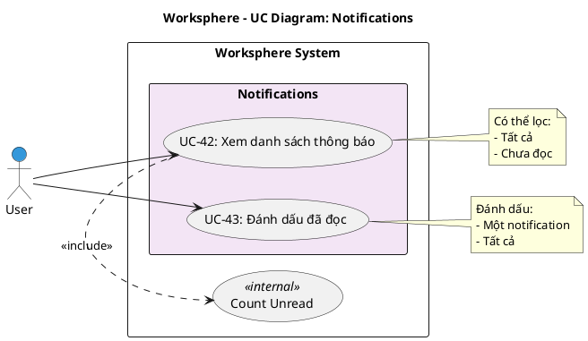

# Use Case Diagram 11: Thông báo (Notifications)

> **Module**: Notifications | **Số UC**: 2 | **Ngày**: 2026-01-15

---

## 1. Actors

| Actor | Loại | Mô tả |
|-------|------|-------|
| **User** | Primary | Người dùng đã đăng nhập |

---

## 2. Use Case Diagram (PlantUML)

---

## 3. Bảng mô tả Use Cases

| UC ID | Tên Use Case | Actor | Mô tả |
|-------|--------------|-------|-------|
| UC-42 | Xem danh sách thông báo | User | Xem notifications, lọc chưa đọc, hiển thị count |
| UC-43 | Đánh dấu đã đọc | User | Mark as read một hoặc tất cả notifications |

---

## 4. Luồng sự kiện - UC-42: Xem danh sách thông báo

**Tiền điều kiện:** User đã đăng nhập

**Luồng chính:**
1. User click icon notification
2. Hệ thống query notifications của user
3. <<include>> Count Unread: Đếm số chưa đọc
4. Hiển thị dropdown với danh sách notifications
5. User có thể click vào notification để đến task liên quan

**Hậu điều kiện:** Notifications được hiển thị

---

## 5. Business Rules

| ID | Rule |
|----|------|
| BR-01 | Notifications tự động tạo khi task thay đổi |
| BR-02 | Chỉ watchers mới nhận notification |
| BR-03 | Hiển thị count unread trên icon |

---

*Ngày tạo: 2026-01-15*
