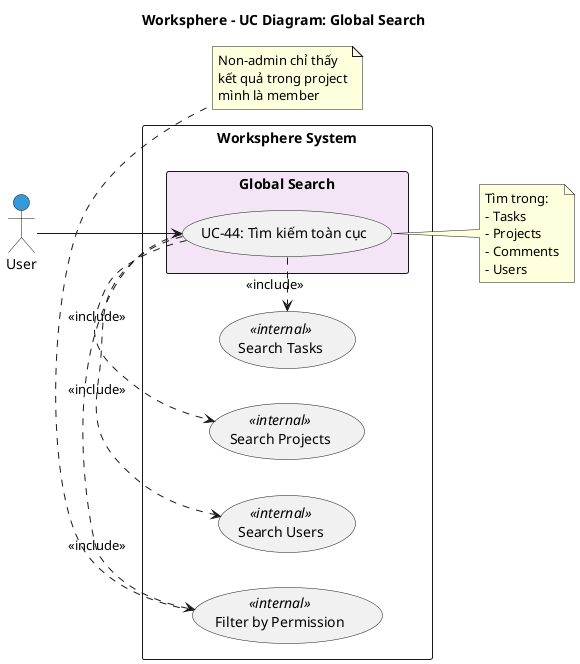

# Use Case Diagram 12: Tìm kiếm Toàn cục (Global Search)

> **Module**: Global Search | **Số UC**: 1 | **Ngày**: 2026-01-15

---

## 1. Actors

| Actor | Loại | Mô tả |
|-------|------|-------|
| **User** | Primary | Người dùng đã đăng nhập |

---

## 2. Use Case Diagram (PlantUML)

---

## 3. Bảng mô tả Use Cases

| UC ID | Tên Use Case | Actor | Mô tả |
|-------|--------------|-------|-------|
| UC-44 | Tìm kiếm toàn cục | User | Search trong tasks, projects, comments, users. Non-admin chỉ thấy kết quả trong projects của mình |

---

## 4. Luồng sự kiện - UC-44: Tìm kiếm toàn cục

**Tiền điều kiện:** User đã đăng nhập

**Luồng chính:**
1. User nhấn Ctrl+K hoặc click search icon
2. Hệ thống hiển thị search modal
3. User nhập từ khóa
4. Hệ thống search trong:
   - Tasks (title, description)
   - Projects (name, identifier)
   - Comments (content)
   - Users (name, email) - Admin only
5. <<include>> Filter by Permission: Lọc kết quả theo quyền
6. Hiển thị kết quả phân nhóm theo loại
7. User click vào kết quả để navigate

**Hậu điều kiện:** Kết quả tìm kiếm được hiển thị

---

## 5. Business Rules

| ID | Rule |
|----|------|
| BR-01 | Non-admin chỉ thấy kết quả trong projects là member |
| BR-02 | Admin thấy tất cả kết quả |
| BR-03 | Private tasks chỉ hiển thị cho creator/assignee |

---

*Ngày tạo: 2026-01-15*
