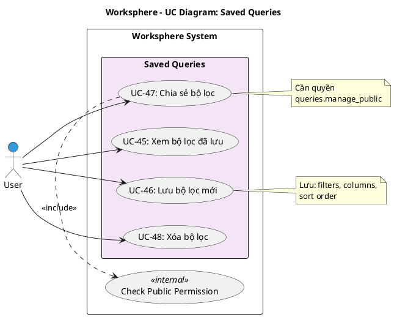

# Use Case Diagram 13: Bộ lọc đã lưu (Saved Queries)

> **Module**: Saved Queries | **Số UC**: 4 | **Ngày**: 2026-01-15

---

## 1. Actors

| Actor | Loại | Mô tả |
|-------|------|-------|
| **User** | Primary | Người dùng đã đăng nhập |

---

## 2. Use Case Diagram (PlantUML)

---

## 3. Bảng mô tả Use Cases

| UC ID | Tên Use Case | Actor | Mô tả |
|-------|--------------|-------|-------|
| UC-45 | Xem bộ lọc đã lưu | User | Xem queries của mình và public queries |
| UC-46 | Lưu bộ lọc mới | User | Lưu filter config: filters, columns, sort |
| UC-47 | Chia sẻ bộ lọc | User | Đặt query thành public (cần quyền) |
| UC-48 | Xóa bộ lọc | User | Xóa query (owner hoặc Admin) |

---

## 4. Luồng sự kiện - UC-46: Lưu bộ lọc mới

**Tiền điều kiện:** User đã đăng nhập

**Luồng chính:**
1. User ở trang tasks list với filters đã chọn
2. User click "Lưu bộ lọc"
3. Hệ thống hiển thị dialog nhập tên
4. User nhập tên và submit
5. Hệ thống lưu SavedQuery với:
   - name, userId
   - filters (JSON)
   - columns (JSON)
   - sortField, sortOrder
6. Query mới xuất hiện trong sidebar

**Hậu điều kiện:** Query được lưu

---

## 5. Business Rules

| ID | Rule |
|----|------|
| BR-01 | Query mặc định là private |
| BR-02 | Cần quyền `queries.manage_public` để tạo public query |
| BR-03 | Chỉ owner hoặc Admin mới được xóa |

---

*Ngày tạo: 2026-01-15*
