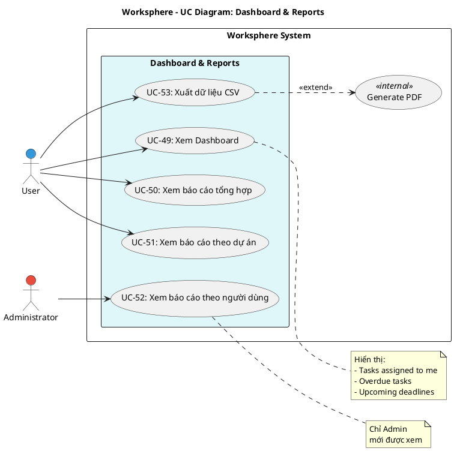

# Use Case Diagram 14: Dashboard & Báo cáo (Reports)

> **Module**: Dashboard & Reports | **Số UC**: 5 | **Ngày**: 2026-01-15

---

## 1. Actors

| Actor | Loại | Mô tả |
|-------|------|-------|
| **User** | Primary | Người dùng đã đăng nhập |
| **Administrator** | Primary | Admin có quyền xem báo cáo theo user |

---

## 2. Use Case Diagram (PlantUML)

---

## 3. Bảng mô tả Use Cases

| UC ID | Tên Use Case | Actor | Mô tả |
|-------|--------------|-------|-------|
| UC-49 | Xem Dashboard | User | Tổng quan: tasks, overdue, upcoming, recent activity |
| UC-50 | Xem báo cáo tổng hợp | User | Thống kê: tổng projects, tasks, % hoàn thành |
| UC-51 | Xem báo cáo theo dự án | User | Thống kê từng project |
| UC-52 | Xem báo cáo theo người dùng | Admin | Thống kê theo từng user |
| UC-53 | Xuất dữ liệu CSV | User | Export tasks ra CSV/PDF |

---

## 4. Luồng sự kiện - UC-49: Xem Dashboard

**Tiền điều kiện:** User đã đăng nhập

**Luồng chính:**
1. User truy cập Dashboard (`/`)
2. Hệ thống query:
   - Tasks assigned to me (open)
   - Overdue tasks
   - Tasks due within 7 days
   - Recent activity
   - Statistics (by status, by project)
3. Hiển thị cards và charts

**Hậu điều kiện:** Dashboard được hiển thị

---

## 5. Business Rules

| ID | Rule |
|----|------|
| BR-01 | Dashboard chỉ hiển thị data của user |
| BR-02 | Admin thấy thêm system-wide stats |
| BR-03 | Báo cáo theo user chỉ Admin được xem |

---

*Ngày tạo: 2026-01-15*
