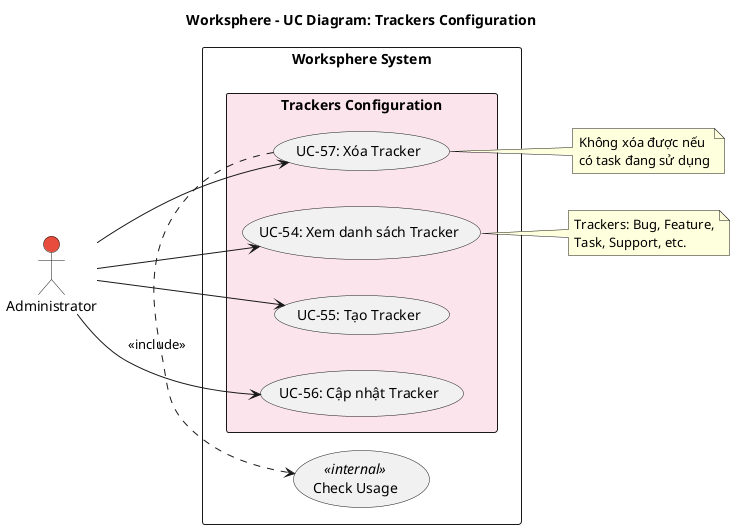

# Use Case Diagram 15: Cấu hình Trackers (Admin)

> **Module**: Trackers Configuration | **Số UC**: 4 | **Ngày**: 2026-01-15

---

## 1. Actors

| Actor | Loại | Mô tả |
|-------|------|-------|
| **Administrator** | Primary | Quản trị viên hệ thống |

---

## 2. Use Case Diagram (PlantUML)

---

## 3. Bảng mô tả Use Cases

| UC ID | Tên Use Case | Actor | Mô tả |
|-------|--------------|-------|-------|
| UC-54 | Xem danh sách Tracker | Admin | Xem tất cả loại công việc (Bug, Feature, Task...) |
| UC-55 | Tạo Tracker | Admin | Tạo loại công việc mới |
| UC-56 | Cập nhật Tracker | Admin | Chỉnh sửa tracker |
| UC-57 | Xóa Tracker | Admin | Xóa tracker (chỉ khi không có task dùng) |

---

## 4. Luồng sự kiện - UC-55: Tạo Tracker

**Tiền điều kiện:** User là Administrator

**Luồng chính:**
1. Admin vào Settings → Trackers
2. Admin click "Thêm Tracker"
3. Nhập: name, description, color (optional)
4. Submit
5. Hệ thống tạo Tracker record
6. Refresh danh sách

**Hậu điều kiện:** Tracker mới được tạo

---

## 5. Business Rules

| ID | Rule |
|----|------|
| BR-01 | Chỉ Admin mới truy cập được |
| BR-02 | Không thể xóa tracker đang có task sử dụng |
| BR-03 | Tracker name phải unique |

---

*Ngày tạo: 2026-01-15*
