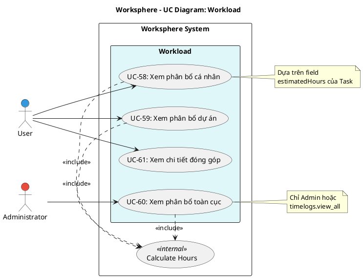

# Use Case Diagram 16: Phân bổ Công việc (Workload)

> **Module**: Workload | **Số UC**: 4 | **Ngày**: 2026-01-15

---

## 1. Actors

| Actor | Loại | Mô tả |
|-------|------|-------|
| **User** | Primary | Người dùng có quyền `timelogs.view_own` hoặc `timelogs.view_all` |
| **Administrator** | Primary | Admin có quyền xem toàn bộ |

---

## 2. Use Case Diagram (PlantUML)

---

## 3. Bảng mô tả Use Cases

| UC ID | Tên Use Case | Actor | Mô tả |
|-------|--------------|-------|-------|
| UC-58 | Xem phân bổ cá nhân | User | Xem tổng giờ dự kiến của mình |
| UC-59 | Xem phân bổ dự án | User | Xem workload của tất cả members trong project |
| UC-60 | Xem phân bổ toàn cục | Admin | Xem workload toàn hệ thống |
| UC-61 | Xem chi tiết đóng góp | User | Xem danh sách tasks đóng góp vào giờ |

---

## 4. Luồng sự kiện - UC-58: Xem phân bổ cá nhân

**Tiền điều kiện:** User có quyền `timelogs.view_own`

**Luồng chính:**
1. User vào Workload page
2. Hệ thống query tasks assigned to user
3. <<include>> Calculate Hours: Tổng estimatedHours
4. Hiển thị thống kê: tổng giờ, theo project, theo status
5. Hiển thị timeline hoặc chart

**Hậu điều kiện:** Workload cá nhân được hiển thị

---

## 5. Business Rules

| ID | Rule |
|----|------|
| BR-01 | Workload dựa trên field estimatedHours của Task |
| BR-02 | Cần quyền `timelogs.view_own` cho cá nhân |
| BR-03 | Cần quyền `timelogs.view_all` cho project/global |

---

*Ngày tạo: 2026-01-15*
