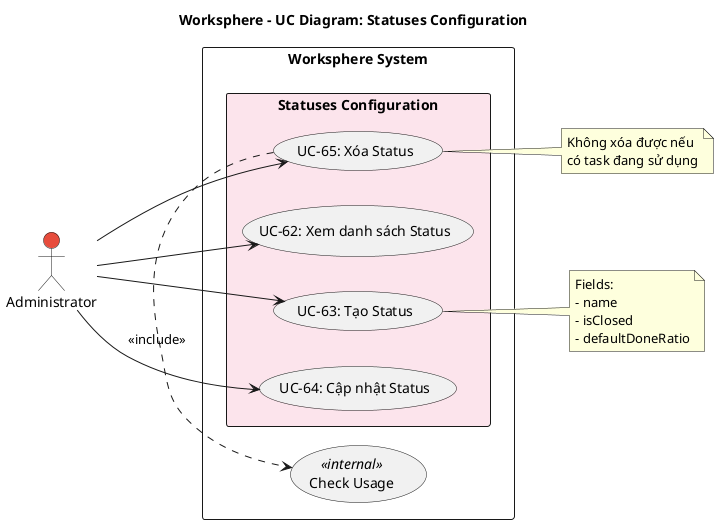

# Use Case Diagram 17: Cấu hình Statuses (Admin)

> **Module**: Statuses Configuration | **Số UC**: 4 | **Ngày**: 2026-01-15

---

## 1. Actors

| Actor | Loại | Mô tả |
|-------|------|-------|
| **Administrator** | Primary | Quản trị viên hệ thống |

---

## 2. Use Case Diagram (PlantUML)

---

## 3. Bảng mô tả Use Cases

| UC ID | Tên Use Case | Actor | Mô tả |
|-------|--------------|-------|-------|
| UC-62 | Xem danh sách Status | Admin | Xem tất cả statuses |
| UC-63 | Tạo Status | Admin | Tạo status với name, isClosed, defaultDoneRatio |
| UC-64 | Cập nhật Status | Admin | Chỉnh sửa status |
| UC-65 | Xóa Status | Admin | Xóa status (chỉ khi không có task dùng) |

---

## 4. Luồng sự kiện - UC-63: Tạo Status

**Tiền điều kiện:** User là Administrator

**Luồng chính:**
1. Admin vào Settings → Statuses
2. Admin click "Thêm Status"
3. Nhập: name, isClosed (checkbox), defaultDoneRatio (0-100)
4. Submit
5. Hệ thống tạo Status record
6. Refresh danh sách

**Hậu điều kiện:** Status mới được tạo

---

## 5. Business Rules

| ID | Rule |
|----|------|
| BR-01 | isClosed = true nghĩa là task đã hoàn thành |
| BR-02 | defaultDoneRatio tự động set khi task chuyển sang status này |
| BR-03 | Không thể xóa status đang có task sử dụng |

---

*Ngày tạo: 2026-01-15*
