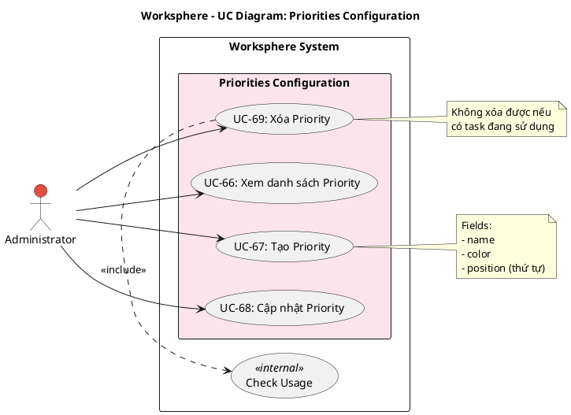

# Use Case Diagram 18: Cấu hình Priorities (Admin)

> **Module**: Priorities Configuration | **Số UC**: 4 | **Ngày**: 2026-01-15

---

## 1. Actors

| Actor | Loại | Mô tả |
|-------|------|-------|
| **Administrator** | Primary | Quản trị viên hệ thống |

---

## 2. Use Case Diagram (PlantUML)

---

## 3. Bảng mô tả Use Cases

| UC ID | Tên Use Case | Actor | Mô tả |
|-------|--------------|-------|-------|
| UC-66 | Xem danh sách Priority | Admin | Xem độ ưu tiên với màu sắc |
| UC-67 | Tạo Priority | Admin | Tạo priority mới |
| UC-68 | Cập nhật Priority | Admin | Chỉnh sửa priority |
| UC-69 | Xóa Priority | Admin | Xóa priority (chỉ khi không có task dùng) |

---

## 4. Luồng sự kiện - UC-67: Tạo Priority

**Tiền điều kiện:** User là Administrator

**Luồng chính:**
1. Admin vào Settings → Priorities
2. Admin click "Thêm Priority"
3. Nhập: name, color (hex), position
4. Submit
5. Hệ thống tạo Priority record
6. Refresh danh sách

**Hậu điều kiện:** Priority mới được tạo

---

## 5. Business Rules

| ID | Rule |
|----|------|
| BR-01 | Priority có color để phân biệt trực quan |
| BR-02 | Position dùng để sắp xếp thứ tự ưu tiên |
| BR-03 | Không thể xóa priority đang có task sử dụng |

---

*Ngày tạo: 2026-01-15*
