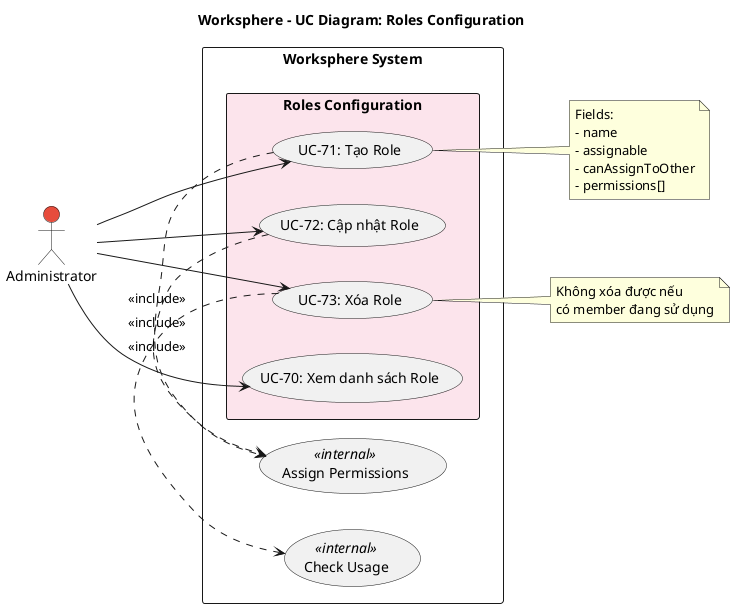

# Use Case Diagram 19: Cấu hình Roles (Admin)

> **Module**: Roles Configuration | **Số UC**: 4 | **Ngày**: 2026-01-15

---

## 1. Actors

| Actor | Loại | Mô tả |
|-------|------|-------|
| **Administrator** | Primary | Quản trị viên hệ thống |

---

## 2. Use Case Diagram (PlantUML)

---

## 3. Bảng mô tả Use Cases

| UC ID | Tên Use Case | Actor | Mô tả |
|-------|--------------|-------|-------|
| UC-70 | Xem danh sách Role | Admin | Xem roles kèm permissions |
| UC-71 | Tạo Role | Admin | Tạo role với name, assignable, canAssignToOther |
| UC-72 | Cập nhật Role | Admin | Chỉnh sửa role và gán permissions |
| UC-73 | Xóa Role | Admin | Xóa role (chỉ khi không có member dùng) |

---

## 4. Luồng sự kiện - UC-72: Cập nhật Role

**Tiền điều kiện:** User là Administrator

**Luồng chính:**
1. Admin vào Settings → Roles
2. Admin click "Sửa" trên một role
3. Hệ thống hiển thị form với permissions checklist
4. Admin chỉnh sửa thông tin và check/uncheck permissions
5. Submit
6. <<include>> Assign Permissions: Cập nhật RolePermission records
7. Refresh danh sách

**Hậu điều kiện:** Role và permissions được cập nhật

---

## 5. Business Rules

| ID | Rule |
|----|------|
| BR-01 | assignable = true: role này có thể được gán task |
| BR-02 | canAssignToOther = true: member có role này có thể gán task cho người khác |
| BR-03 | Không thể xóa role đang có member sử dụng |
| BR-04 | Permissions được lưu qua bảng RolePermission |

---

*Ngày tạo: 2026-01-15*
