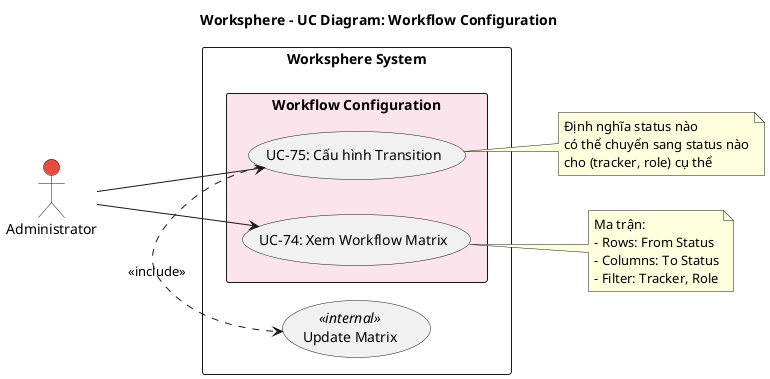

# Use Case Diagram 20: Cấu hình Workflow (Admin)

> **Module**: Workflow Configuration | **Số UC**: 2 | **Ngày**: 2026-01-15

---

## 1. Actors

| Actor | Loại | Mô tả |
|-------|------|-------|
| **Administrator** | Primary | Quản trị viên hệ thống |

---

## 2. Use Case Diagram (PlantUML)

---

## 3. Bảng mô tả Use Cases

| UC ID | Tên Use Case | Actor | Mô tả |
|-------|--------------|-------|-------|
| UC-74 | Xem Workflow Matrix | Admin | Xem ma trận workflow: trackers, statuses, roles, transitions |
| UC-75 | Cấu hình Transition | Admin | Định nghĩa chuyển đổi trạng thái cho (tracker, role) |

---

## 4. Luồng sự kiện - UC-75: Cấu hình Transition

**Tiền điều kiện:** User là Administrator

**Luồng chính:**
1. Admin vào Settings → Workflow
2. Admin chọn Tracker và Role từ dropdown
3. Hệ thống hiển thị ma trận status × status
4. Admin check/uncheck các ô để cho phép/cấm transition
5. Nếu check: FromStatus → ToStatus được phép
6. <<include>> Update Matrix: Tạo/xóa WorkflowTransition records
7. Lưu thay đổi

**Hậu điều kiện:** Workflow transitions được cập nhật

---

## 5. Business Rules

| ID | Rule |
|----|------|
| BR-01 | Workflow định nghĩa theo cặp (tracker, role) |
| BR-02 | Task chỉ chuyển status theo transitions đã định nghĩa |
| BR-03 | Nếu không có transition, không thể chuyển status |
| BR-04 | Admin có thể override workflow |

---

*Ngày tạo: 2026-01-15*
