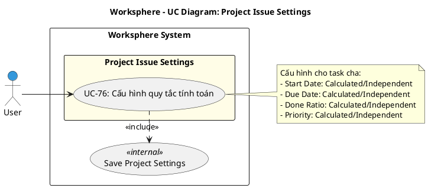

# Use Case Diagram 21: Cấu hình Issue Tracking (Project Settings)

> **Module**: Project Issue Settings | **Số UC**: 1 | **Ngày**: 2026-01-15

---

## 1. Actors

| Actor | Loại | Mô tả |
|-------|------|-------|
| **User** | Primary | Project Manager hoặc Creator |

---

## 2. Use Case Diagram (PlantUML)

---

## 3. Bảng mô tả Use Cases

| UC ID | Tên Use Case | Actor | Mô tả |
|-------|--------------|-------|-------|
| UC-76 | Cấu hình quy tắc tính toán | User (PM) | Thiết lập quy tắc tính toán (Calculated/Independent) cho thuộc tính Task cha |

---

## 4. Luồng sự kiện - UC-76: Cấu hình quy tắc tính toán

**Tiền điều kiện:** User là Project Creator hoặc có quyền manage project

**Luồng chính:**
1. User vào Project Settings → Issue Tracking
2. Hệ thống hiển thị form với các options:
   - Start Date: Calculated from subtasks / Independent
   - Due Date: Calculated from subtasks / Independent
   - Done Ratio: Calculated from subtasks / Independent
   - Priority: Calculated (max of subtasks) / Independent
3. User chọn options
4. User submit
5. <<include>> Save Project Settings: Lưu vào Project record
6. Hiển thị thông báo thành công

**Hậu điều kiện:** Quy tắc được lưu, áp dụng khi subtask thay đổi

---

## 5. Business Rules

| ID | Rule |
|----|------|
| BR-01 | Calculated: Tự động tính từ subtasks |
| BR-02 | Independent: Không bị ảnh hưởng bởi subtasks |
| BR-03 | Settings này override system defaults |
| BR-04 | Áp dụng khi subtask thay đổi |

---

*Ngày tạo: 2026-01-15*
