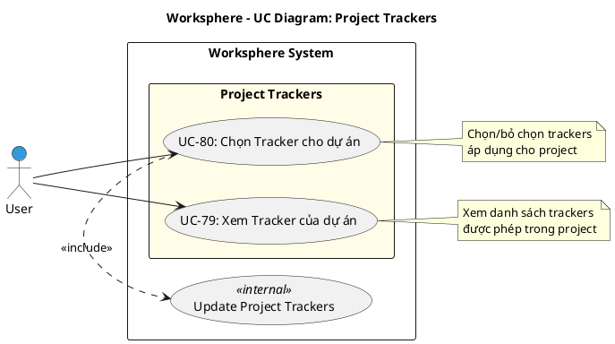

# Use Case Diagram 22: Cấu hình Trackers cho Dự án (Project Trackers)

> **Module**: Project Trackers | **Số UC**: 2 | **Ngày**: 2026-01-15

---

## 1. Actors

| Actor | Loại | Mô tả |
|-------|------|-------|
| **User** | Primary | Project Manager hoặc Creator |

---

## 2. Use Case Diagram (PlantUML)

---

## 3. Bảng mô tả Use Cases

| UC ID | Tên Use Case | Actor | Mô tả |
|-------|--------------|-------|-------|
| UC-79 | Xem Tracker của dự án | User | Xem danh sách trackers được phép sử dụng trong project |
| UC-80 | Chọn Tracker cho dự án | User (PM) | Chọn/bỏ chọn trackers áp dụng cho project |

---

## 4. Luồng sự kiện - UC-80: Chọn Tracker cho dự án

**Tiền điều kiện:** User là Project Manager hoặc Creator

**Luồng chính:**
1. User vào Project Settings → Trackers
2. Hệ thống hiển thị danh sách tất cả system trackers
3. Hiển thị checkbox đã check cho trackers đang được dùng
4. User check/uncheck trackers
5. User submit
6. <<include>> Update Project Trackers: Cập nhật ProjectTracker records
7. Hiển thị thông báo thành công

**Hậu điều kiện:** Project trackers được cập nhật

---

## 5. Business Rules

| ID | Rule |
|----|------|
| BR-01 | Project có thể giới hạn trackers được phép dùng |
| BR-02 | Mặc định: tất cả system trackers được cho phép |
| BR-03 | Sử dụng transaction delete-then-create |
| BR-04 | Cần quyền `projects.manage_trackers` hoặc Admin |

---

*Ngày tạo: 2026-01-15*
